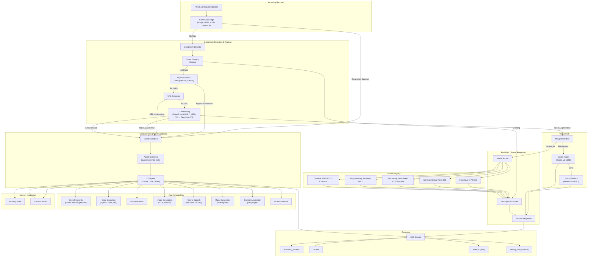

# Janus Baseline Agent CLI - Reference Implementation

Reference implementation for the Janus competitive intelligence network. This baseline demonstrates how to build a Janus-compatible intelligence engine using a CLI agent approach.

## Architecture Overview



## How It Works

1. **Request Reception**: Receives OpenAI-compatible chat completion requests
2. **Generation Flags**: Requests with explicit flags (image, video, audio, research) route directly to agent
3. **Complexity Detection** (multi-stage):
   - Trivial greeting bypass (hello, thanks, etc.)
   - Keyword-based detection (100+ patterns in English/German)
   - URL detection with interaction hints
   - LLM-based routing with fallbacks (Qwen3-Next-80B → MiMo-V2 → DeepSeek-V3)
4. **Vision Path**: Requests with images route to vision models (Qwen3-VL-235B with Mistral fallback)
5. **Path Selection**:
   - **Fast Path**: Simple queries go to task-specific models via the model router
   - **Complex Path**: Complex tasks route to Sandy sandbox with CLI agent
6. **Model Router**: Selects optimal model by task type (fast, general, reasoning, programming, creative)
7. **Agent Execution**: CLI agent (Claude Code/Aider) runs with full tool access and memory integration
8. **Response Streaming**: SSE stream with reasoning_content, artifacts, and optional debug_info

## Sandy agent-run checklist (Claude Code)

When the complex path uses Sandy’s `/agent/run`, make sure the following are true:

- Upload the `agent-pack/` folder into `/workspace/agent-pack`.
- Run `agent-pack/bootstrap.sh` to create `/workspace/CLAUDE.md` and prep the agent pack (it can start a local router, but prefer the shared Janus router when available).
- Call Sandy with `rawPrompt: true`, `apiBaseUrl` pointed at the Janus model router, and `systemPromptPath=/workspace/agent-pack/prompts/system.md`.
- Save binaries to `/workspace/artifacts` and return markdown links to `/artifacts/<file>` (do **not** print base64 blobs).
- The UI should cache sandbox artifacts into `/var/data/...` and serve them via `/api/artifacts/...` before the sandbox is terminated.
- If Claude Code emits `Output too large... tool-results/*.txt`, the baseline should read the tool-result file, decode any data URL images, and materialize them into `/workspace/artifacts`.

## Features

- OpenAI-compatible `/v1/chat/completions` endpoint
- Dual-path architecture (fast vs complex) with intelligent routing
- Multi-stage complexity detection (keywords, URL hints, LLM verification)
- Task-specific model routing (fast, general, reasoning, programming, creative)
- Vision model support with automatic fallback
- Sandy sandbox for secure agent execution
- SSE streaming with `reasoning_content` and `debug_info` fields
- Artifact generation for file outputs with server-side caching
- Memory integration for context persistence across sessions
- Full Chutes API integration:
  - LLM (multiple models with fallbacks)
  - Image generation (FLUX, Recraft)
  - Text-to-speech (Dia-1.6B, F5-TTS)
  - Music generation (DiffRhythm)
- Deep research via chutes-search with light/max modes and citations
- Browser automation via Playwright
- GUI/Desktop automation support

## CLI Agent Support Matrix

| Agent | Command | Capabilities | Notes |
| --- | --- | --- | --- |
| Claude Code | `claude` | Shell, Web, Downloads, Code | Default + most reliable |
| Roo Code CLI | `roo-code-cli` | TBD | Experimental |
| Cline CLI | `cline` | TBD | Experimental |
| OpenCode | `opencode` | TBD | Non-interactive run mode |
| Codex | `codex` | TBD | Output capture under investigation |
| Aider | `aider` | Code | Editor-style agent |
| OpenHands | `openhands` | TBD | Deferred (sandbox conflicts) |

Select an agent via `X-Baseline-Agent` header or `JANUS_BASELINE_AGENT`.

## Installation

```bash
# Create virtual environment
python -m venv .venv
source .venv/bin/activate

# Install with dev dependencies
pip install -e ".[dev]"
```

## Running

```bash
# Development mode
python -m janus_baseline_agent_cli.main

# Or with uvicorn directly
uvicorn janus_baseline_agent_cli.main:app --port 8080 --reload
```

## Testing

```bash
pytest
```

### E2E Tests

E2E tests exercise deployed gateway + baseline services and are disabled by default.

```bash
BASELINE_AGENT_CLI_E2E_ENABLED=true pytest tests/e2e
```

For tasks that require Chutes API access (image generation, TTS), set either
`BASELINE_AGENT_CLI_E2E_CHUTES_API_KEY` or `CHUTES_API_KEY` in the environment.

Optional overrides for deployed URLs:

```bash
BASELINE_AGENT_CLI_E2E_GATEWAY_URL=https://janus-gateway-bqou.onrender.com
BASELINE_AGENT_CLI_E2E_BASELINE_CLI_URL=https://janus-baseline-agent.onrender.com
```

## Environment Variables

Legacy `BASELINE_` prefixed environment variables are still accepted.

### Server Configuration

| Variable | Default | Description |
|----------|---------|-------------|
| `BASELINE_AGENT_CLI_HOST` | `0.0.0.0` | Server host |
| `BASELINE_AGENT_CLI_PORT` | `8080` | Server port |
| `BASELINE_AGENT_CLI_DEBUG` | `false` | Enable debug mode |

The service also honors `HOST`, `PORT`, `DEBUG`, and `LOG_LEVEL` for containerized deployments.

### Chutes API Configuration

The baseline uses [Chutes](https://chutes.ai) as the inference provider. Chutes provides an OpenAI-compatible API, so we use the OpenAI client library configured to point to Chutes.

| Variable | Default | Description |
|----------|---------|-------------|
| `BASELINE_AGENT_CLI_OPENAI_API_KEY` | - | **Chutes API key** (named for OpenAI client compatibility) |
| `BASELINE_AGENT_CLI_OPENAI_BASE_URL` | - | Legacy alias for the Chutes API URL |
| `BASELINE_AGENT_CLI_CHUTES_API_BASE` | `https://llm.chutes.ai/v1` | Chutes API base URL |
| `BASELINE_AGENT_CLI_CHUTES_SEARCH_URL` | `https://chutes-search.onrender.com` | Chutes search base URL |
| `BASELINE_AGENT_CLI_MODEL` | `janus-router` | Model name exposed to clients |
| `BASELINE_AGENT_CLI_DIRECT_MODEL` | `zai-org/GLM-4.7-TEE` | Direct model when router is disabled |

For container usage, `OPENAI_API_KEY` and `OPENAI_BASE_URL` are also accepted.

> **Note**: Despite the `OPENAI_` prefix, these variables configure access to **Chutes**, not OpenAI. The prefix exists because the implementation uses the OpenAI Python client library, which Chutes supports via its OpenAI-compatible API.

### Vision Configuration

| Variable | Default | Description |
|----------|---------|-------------|
| `BASELINE_AGENT_CLI_VISION_MODEL_PRIMARY` | `Qwen/Qwen3-VL-235B-A22B-Instruct` | Primary vision model for image understanding |
| `BASELINE_AGENT_CLI_VISION_MODEL_FALLBACK` | `chutesai/Mistral-Small-3.2-24B-Instruct-2506` | Fallback vision model for image understanding |
| `BASELINE_AGENT_CLI_VISION_MODEL_TIMEOUT` | `60.0` | Timeout for vision model requests (seconds) |
| `BASELINE_AGENT_CLI_ENABLE_VISION_ROUTING` | `true` | Route requests with images to vision models |

### Sandy Sandbox Configuration

| Variable | Default | Description |
|----------|---------|-------------|
| `SANDY_BASE_URL` | - | Sandy API base URL for agent execution |
| `SANDY_API_KEY` | - | Sandy API key |
| `BASELINE_AGENT_CLI_SANDY_TIMEOUT` | `300` | Sandbox timeout in seconds |
| `BASELINE_AGENT_CLI_SANDY_GIT_TIMEOUT` | `120` | Git clone timeout in seconds |
| `JANUS_ARTIFACT_PORT` | `5173` | Sandbox artifact server port (should match Sandy runtime port) |
| `JANUS_ARTIFACTS_DIR` | `/workspace/artifacts` | Directory for sandbox artifacts |
| `JANUS_ARTIFACT_GRACE_SECONDS` | `30` | Seconds to keep sandboxes alive after emitting artifacts |

### Agent Configuration

| Variable | Default | Description |
|----------|---------|-------------|
| `BASELINE_AGENT_CLI_AGENT_PACK_PATH` | `./agent-pack` | Path to agent documentation and prompts |
| `BASELINE_AGENT_CLI_SYSTEM_PROMPT_PATH` | `./agent-pack/prompts/system.md` | System prompt for the CLI agent |
| `BASELINE_AGENT_CLI_ENABLE_WEB_SEARCH` | `true` | Enable web search tools |
| `BASELINE_AGENT_CLI_ENABLE_CODE_EXECUTION` | `true` | Enable code execution tools |
| `BASELINE_AGENT_CLI_ENABLE_FILE_TOOLS` | `true` | Enable file tooling |
| `JANUS_BASELINE_AGENT` | `aider` | CLI agent command to run in the sandbox |

### Sandy + Claude Code Agent Wiring (Recommended)

When routing complex requests into Sandy, we run Claude Code (or other CLI agents) through Sandy's `/agent/run` API. The recommended wiring ensures the model router, system prompt, and agent pack are always in play:

- **Model router**: set `BASELINE_AGENT_CLI_USE_MODEL_ROUTER=true` and pass `apiBaseUrl` to Sandy `/agent/run` (public router URL if available). The model name should stay `janus-router` so the router can choose the best Chutes model + fallbacks.
- **System prompt + agent pack**: upload `agent-pack/` into `/workspace/agent-pack`, run `agent-pack/bootstrap.sh`, and point `JANUS_SYSTEM_PROMPT_PATH` at `agent-pack/prompts/system.md` (Claude Code uses `--append-system-prompt-file`).
- **Working directory**: run the CLI from `/workspace` and include `--add-dir /workspace` for tools that need file access.
- **Artifacts**: agents should save files into `/workspace/artifacts`. The baseline service emits Janus `artifacts` events with sandbox URLs; the UI caches them server-side (e.g., `/var/data/janus-artifacts`) and serves them via `/api/artifacts/...` for reliable rendering after sandbox teardown.

### E2E Testing Configuration

| Variable | Default | Description |
|----------|---------|-------------|
| `BASELINE_AGENT_CLI_E2E_ENABLED` | `false` | Enable E2E tests against deployed services |
| `BASELINE_AGENT_CLI_E2E_GATEWAY_URL` | `https://janus-gateway-bqou.onrender.com` | Gateway base URL for E2E tests |
| `BASELINE_AGENT_CLI_E2E_BASELINE_CLI_URL` | `https://janus-baseline-agent.onrender.com` | Baseline CLI base URL for E2E tests |
| `BASELINE_AGENT_CLI_E2E_CHUTES_API_KEY` | - | Chutes API key for E2E tasks that hit multimodal endpoints |

### Routing Configuration

| Variable | Default | Description |
|----------|---------|-------------|
| `BASELINE_AGENT_CLI_ALWAYS_USE_AGENT` | `false` | Always route requests to the agent path |
| `BASELINE_AGENT_CLI_LLM_ROUTING_MODEL` | `zai-org/GLM-4.7-Flash` | Fast model for routing decisions |
| `BASELINE_AGENT_CLI_LLM_ROUTING_TIMEOUT` | `3.0` | Timeout for routing check (seconds) |
| `BASELINE_AGENT_CLI_COMPLEXITY_THRESHOLD` | `100` | Token threshold for complexity detection |

> Note: LLM verification is always performed before using the fast path.

### Model Router Configuration

| Variable | Default | Description |
|----------|---------|-------------|
| `BASELINE_AGENT_CLI_USE_MODEL_ROUTER` | `true` | Enable the local composite model router |
| `BASELINE_AGENT_CLI_ROUTER_HOST` | `127.0.0.1` | Router host |
| `BASELINE_AGENT_CLI_ROUTER_PORT` | `8000` | Router port |

## Example Configuration

```bash
# .env file
BASELINE_AGENT_CLI_OPENAI_API_KEY=cpk_your_chutes_api_key
BASELINE_AGENT_CLI_CHUTES_API_BASE=https://llm.chutes.ai/v1
BASELINE_AGENT_CLI_USE_MODEL_ROUTER=true
BASELINE_AGENT_CLI_ROUTER_HOST=127.0.0.1
BASELINE_AGENT_CLI_ROUTER_PORT=8000
BASELINE_AGENT_CLI_MODEL=janus-router
BASELINE_AGENT_CLI_DIRECT_MODEL=zai-org/GLM-4.7-TEE
BASELINE_AGENT_CLI_VISION_MODEL_PRIMARY=Qwen/Qwen3-VL-235B-A22B-Instruct
BASELINE_AGENT_CLI_VISION_MODEL_FALLBACK=chutesai/Mistral-Small-3.2-24B-Instruct-2506
BASELINE_AGENT_CLI_VISION_MODEL_TIMEOUT=60.0
BASELINE_AGENT_CLI_ENABLE_VISION_ROUTING=true

SANDY_BASE_URL=https://sandy.example.com
SANDY_API_KEY=your_sandy_api_key

BASELINE_AGENT_CLI_ALWAYS_USE_AGENT=false
```

## Agent Pack

The `agent-pack/` directory contains:

- `models/` - Chutes API documentation for the agent
- `prompts/` - System prompts that define agent behavior
- `README.md` - Agent configuration documentation

The CLI agent (Claude Code) reads these files to understand available capabilities and how to use the Chutes APIs for image generation, TTS, and other tasks.

## Request Flow Example

```bash
# Simple request (fast path)
curl -X POST http://localhost:8080/v1/chat/completions \
  -H "Content-Type: application/json" \
  -d '{
    "model": "baseline",
    "messages": [{"role": "user", "content": "What is 2+2?"}],
    "stream": true
  }'

# Complex request (agent path)
curl -X POST http://localhost:8080/v1/chat/completions \
  -H "Content-Type: application/json" \
  -d '{
    "model": "baseline",
    "messages": [{"role": "user", "content": "Generate an image of a sunset and write Python code to analyze its colors"}],
    "stream": true
  }'
```

## Related Documentation

- [Janus Competition Specs](../specs/competition/) - Competition rules and scoring
- [Chutes API](https://chutes.ai/docs) - Inference provider documentation
- [Sandy Integration](../specs/08_sandy_integration.md) - Sandbox configuration
