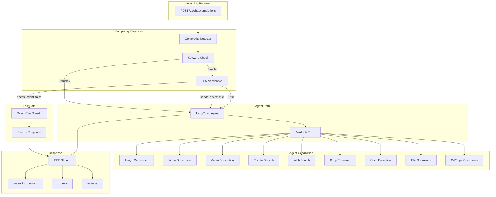

# Janus Baseline LangChain

An alternative Janus baseline implementation built on LangChain. This service runs fully in-process (no sandbox), exposes the OpenAI-compatible `/v1/chat/completions` endpoint, and uses tools for image generation, text-to-speech, web search, and safe code execution.

## Architecture

- **FastAPI API**: Handles OpenAI-compatible requests and SSE streaming.
- **Complexity Detection**: Routes simple requests to a fast path and complex requests to the agent.
- **LangChain Agent**: Uses `ChatOpenAI` with an OpenAI-tools agent for tool execution.
- **Tools**:
  - `image_generation`: Chutes image generation API
  - `text_to_speech`: Chutes Kokoro TTS API
  - `music_generation`: DiffRhythm music generation
  - `audio_generation`: Audio/sound generation
  - `video_generation`: Chutes video generation
  - `web_search`: Tavily search API
  - `deep_research`: Chutes search with citations
  - `code_execution`: LangChain Python REPL tool
  - `clone_repository`: Clone git repositories for analysis
  - `list_repository_files`: List files in cloned repositories
  - `read_repository_file`: Read files from cloned repositories
  - `write_file` / `read_file`: File operations for artifacts
  - `create_directory`: Create working directories for file operations
  - `investigate_memory`: Retrieve full memory content when memory references are present



## Baseline Comparison

| Aspect | Baseline Agent CLI | Baseline LangChain |
| --- | --- | --- |
| Execution | Sandy sandbox (Firecracker VM) | In-process Python |
| Isolation | OS-level sandbox | Process-level only |
| Git operations | Native git in sandbox | Subprocess git clone |
| File access | Full filesystem in sandbox | Scoped temp directories + artifacts |
| Security | High | Medium |
| Cold start | 10-30s (sandbox) | <1s |
| Best for | Complex/untrusted tasks | Fast, simple tool use |

## Environment Variables

| Variable | Description | Default |
|----------|-------------|---------|
| `BASELINE_LANGCHAIN_HOST` | Server host | `0.0.0.0` |
| `BASELINE_LANGCHAIN_PORT` | Server port | `8080` |
| `BASELINE_LANGCHAIN_DEBUG` | Enable debug mode | `false` |
| `BASELINE_LANGCHAIN_MODEL` | LLM model name | `gpt-4o-mini` |
| `BASELINE_LANGCHAIN_OPENAI_API_KEY` | OpenAI API key | - |
| `BASELINE_LANGCHAIN_OPENAI_BASE_URL` | OpenAI-compatible base URL | `https://api.openai.com/v1` |
| `BASELINE_LANGCHAIN_CHUTES_API_KEY` | Chutes API key (image/TTS) | - |
| `BASELINE_LANGCHAIN_CHUTES_API_BASE` | Chutes API base URL | `https://llm.chutes.ai/v1` |
| `BASELINE_LANGCHAIN_TAVILY_API_KEY` | Tavily API key (web search) | - |
| `BASELINE_LANGCHAIN_CHUTES_SEARCH_URL` | Chutes search base URL | `https://chutes-search.onrender.com` |
| `BASELINE_LANGCHAIN_VISION_MODEL_PRIMARY` | Primary vision model | `Qwen/Qwen3-VL-235B-A22B-Instruct` |
| `BASELINE_LANGCHAIN_VISION_MODEL_FALLBACK` | Fallback vision model | `chutesai/Mistral-Small-3.2-24B-Instruct-2506` |
| `BASELINE_LANGCHAIN_VISION_MODEL_TIMEOUT` | Vision request timeout (seconds) | `60.0` |
| `BASELINE_LANGCHAIN_ENABLE_VISION_ROUTING` | Enable vision routing | `true` |
| `BASELINE_LANGCHAIN_ARTIFACTS_DIR` | Local artifacts directory | `/tmp/janus_baseline_langchain_artifacts` |
| `BASELINE_LANGCHAIN_ARTIFACT_BASE_URL` | Base URL for served artifacts | `/artifacts` |
| `BASELINE_LANGCHAIN_COMPLEXITY_THRESHOLD` | Token threshold for agent routing | `100` |
| `BASELINE_LANGCHAIN_ALWAYS_USE_AGENT` | Force agent routing | `false` |

For container usage, `HOST`, `PORT`, `DEBUG`, `LOG_LEVEL`, `OPENAI_API_KEY`, `OPENAI_BASE_URL`, `CHUTES_API_KEY`, and `TAVILY_API_KEY` are also accepted.

## Run Locally

```bash
cd baseline-langchain
python -m venv .venv
source .venv/bin/activate
pip install -e ".[dev]"
python -m janus_baseline_langchain.main
```

The service listens on `http://localhost:8080`.

## Example Request

```bash
curl -N -X POST http://localhost:8080/v1/chat/completions \
  -H "Content-Type: application/json" \
  -d '{"model": "baseline-langchain", "messages": [{"role": "user", "content": "Generate an image of a cat"}], "stream": true}'
```
