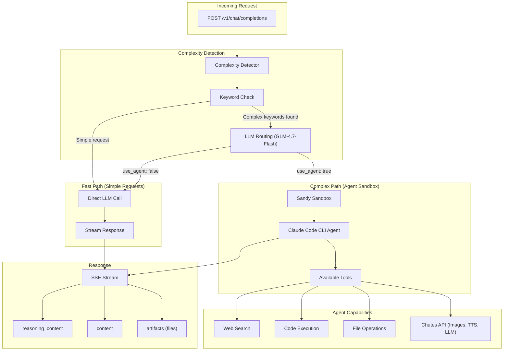

# Janus Baseline - Agent CLI Reference Implementation

Reference implementation for the Janus competitive intelligence network. This baseline demonstrates how to build a Janus-compatible intelligence engine using a CLI agent approach.

## Architecture Overview



## How It Works

1. **Request Reception**: Receives OpenAI-compatible chat completion requests
2. **Complexity Detection**:
   - First pass: Keyword-based detection (research, code, images, etc.)
   - Second pass: LLM-based routing using fast model (GLM-4.7-Flash)
3. **Path Selection**:
   - **Fast Path**: Simple queries go directly to Chutes LLM
   - **Complex Path**: Complex tasks route to Sandy sandbox with CLI agent
4. **Agent Execution**: Claude Code agent runs with full tool access
5. **Response Streaming**: SSE stream with reasoning_content and artifacts

## Features

- OpenAI-compatible `/v1/chat/completions` endpoint
- Dual-path architecture (fast vs complex)
- LLM-based intelligent routing
- Sandy sandbox for secure agent execution
- SSE streaming with `reasoning_content` field
- Artifact generation for file outputs
- Full Chutes API integration (LLM, images, TTS, search)

## Installation

```bash
# Create virtual environment
python -m venv .venv
source .venv/bin/activate

# Install with dev dependencies
pip install -e ".[dev]"
```

## Running

```bash
# Development mode
python -m janus_baseline.main

# Or with uvicorn directly
uvicorn janus_baseline.main:app --port 8001 --reload
```

## Testing

```bash
pytest
```

## Environment Variables

### Server Configuration

| Variable | Default | Description |
|----------|---------|-------------|
| `BASELINE_HOST` | `0.0.0.0` | Server host |
| `BASELINE_PORT` | `8001` | Server port |
| `BASELINE_DEBUG` | `false` | Enable debug mode |

### Chutes API Configuration

The baseline uses [Chutes](https://chutes.ai) as the inference provider. Chutes provides an OpenAI-compatible API, so we use the OpenAI client library configured to point to Chutes.

| Variable | Default | Description |
|----------|---------|-------------|
| `BASELINE_OPENAI_API_KEY` | - | **Chutes API key** (named for OpenAI client compatibility) |
| `BASELINE_OPENAI_BASE_URL` | - | Chutes API URL: `https://api.chutes.ai/v1` |
| `BASELINE_MODEL` | `gpt-4o-mini` | Model for fast path (must be available on Chutes) |

> **Note**: Despite the `OPENAI_` prefix, these variables configure access to **Chutes**, not OpenAI. The prefix exists because the implementation uses the OpenAI Python client library, which Chutes supports via its OpenAI-compatible API.

### Sandy Sandbox Configuration

| Variable | Default | Description |
|----------|---------|-------------|
| `SANDY_BASE_URL` | - | Sandy API base URL for agent execution |
| `SANDY_API_KEY` | - | Sandy API key |
| `BASELINE_SANDY_TIMEOUT` | `300` | Sandbox timeout in seconds |

### Agent Configuration

| Variable | Default | Description |
|----------|---------|-------------|
| `BASELINE_AGENT_PACK_PATH` | `./agent-pack` | Path to agent documentation and prompts |
| `BASELINE_SYSTEM_PROMPT_PATH` | `./agent-pack/prompts/system.md` | System prompt for the CLI agent |
| `BASELINE_ENABLE_WEB_SEARCH` | `true` | Enable web search tools |
| `BASELINE_ENABLE_CODE_EXECUTION` | `true` | Enable code execution tools |
| `BASELINE_ENABLE_FILE_TOOLS` | `true` | Enable file tooling |

### Routing Configuration

| Variable | Default | Description |
|----------|---------|-------------|
| `BASELINE_ALWAYS_USE_AGENT` | `false` | Always route requests to the agent path |
| `BASELINE_ENABLE_LLM_ROUTING` | `true` | Enable LLM-based complexity detection |
| `BASELINE_LLM_ROUTING_MODEL` | `zai-org/GLM-4.7-Flash` | Fast model for routing decisions |
| `BASELINE_LLM_ROUTING_TIMEOUT` | `3.0` | Timeout for routing check (seconds) |
| `BASELINE_COMPLEXITY_THRESHOLD` | `100` | Token threshold for complexity detection |

## Example Configuration

```bash
# .env file
BASELINE_OPENAI_API_KEY=cpk_your_chutes_api_key
BASELINE_OPENAI_BASE_URL=https://api.chutes.ai/v1
BASELINE_MODEL=gpt-4o-mini

SANDY_BASE_URL=https://sandy.example.com
SANDY_API_KEY=your_sandy_api_key

BASELINE_ALWAYS_USE_AGENT=false
BASELINE_ENABLE_LLM_ROUTING=true
```

## Agent Pack

The `agent-pack/` directory contains:

- `models/` - Chutes API documentation for the agent
- `prompts/` - System prompts that define agent behavior
- `README.md` - Agent configuration documentation

The CLI agent (Claude Code) reads these files to understand available capabilities and how to use the Chutes APIs for image generation, TTS, and other tasks.

## Request Flow Example

```bash
# Simple request (fast path)
curl -X POST http://localhost:8001/v1/chat/completions \
  -H "Content-Type: application/json" \
  -d '{
    "model": "baseline",
    "messages": [{"role": "user", "content": "What is 2+2?"}],
    "stream": true
  }'

# Complex request (agent path)
curl -X POST http://localhost:8001/v1/chat/completions \
  -H "Content-Type: application/json" \
  -d '{
    "model": "baseline",
    "messages": [{"role": "user", "content": "Generate an image of a sunset and write Python code to analyze its colors"}],
    "stream": true
  }'
```

## Related Documentation

- [Janus Competition Specs](../specs/competition/) - Competition rules and scoring
- [Chutes API](https://chutes.ai/docs) - Inference provider documentation
- [Sandy Integration](../specs/08_sandy_integration.md) - Sandbox configuration
