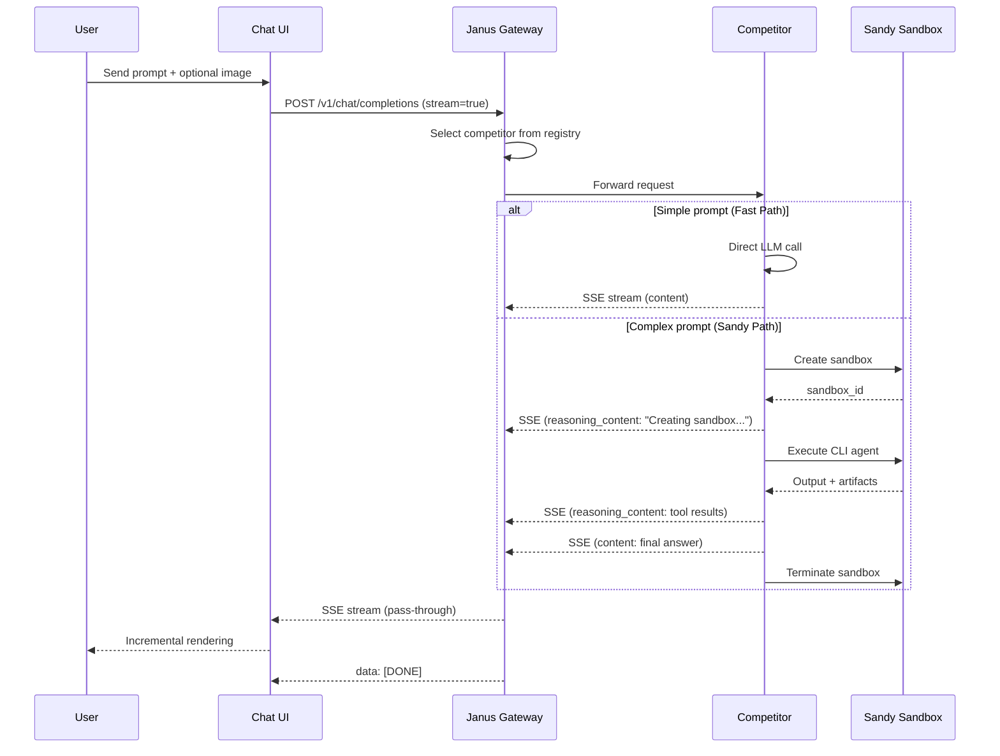
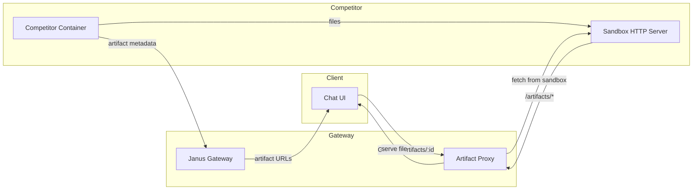

# Janus PoC Architecture

This document describes the architecture of the Janus Proof-of-Concept system.

## Overview

Janus is a competitive, OpenAI-compatible intelligence API where miners submit containers that expose `/v1/chat/completions` and stream continuously. The PoC demonstrates the end-to-end flow with a ChatGPT-like UI, a gateway that routes to competitor containers, a baseline reference implementation, and a minimal evaluation harness.

## Components

| Component | Technology | Port | Description |
|-----------|------------|------|-------------|
| Chat UI | Next.js | 3000 | ChatGPT-like interface with streaming |
| Gateway | FastAPI | 8000 | OpenAI-compatible proxy and routing |
| Baseline (Agent CLI) | FastAPI | 8001 | Reference competitor implementation |
| Baseline (LangChain) | FastAPI | 8002 | LangChain-based baseline competitor |
| Sandy | - | - | Sandbox-as-a-service for CLI agents |
| Bench Runner | CLI | - | Evaluation harness |

## Request Flow

### Chat Completion Flow



### Artifact Retrieval Flow



### Benchmarking Flow

```mermaid
flowchart TD
    subgraph "Benchmark Runner"
        CLI[janus-bench CLI]
        LOAD[Dataset Loader]
        SCORE[Scorers]
        REPORT[Report Generator]
    end

    subgraph "Janus System"
        GW[Gateway]
        COMP[Competitor]
    end

    CLI -->|load tasks| LOAD
    LOAD -->|public/dev suite| CLI

    loop For each task
        CLI -->|POST /v1/chat/completions| GW
        GW -->|forward| COMP
        COMP -->|SSE stream| GW
        GW -->|SSE stream| CLI
        CLI -->|measure TTFT, gaps| SCORE
    end

    SCORE -->|quality, speed, cost, streaming| REPORT
    REPORT -->|JSON + console table| CLI
```

## Data Models

### OpenAI Compatibility

The gateway and competitors implement the OpenAI Chat Completions API with extensions:

- **Request**: Standard OpenAI request + optional `competitor_id`
- **Response**: Standard OpenAI response + `artifacts[]` array
- **Streaming**: SSE chunks with `delta.reasoning_content` for intermediate steps

### Janus Extensions

```json
{
  "choices": [{
    "delta": {
      "content": "...",
      "reasoning_content": "Thinking about the problem...",
      "janus": {
        "event": "sandbox_start",
        "payload": { "sandbox_id": "sb_123" }
      }
    }
  }],
  "usage": {
    "prompt_tokens": 100,
    "completion_tokens": 200,
    "total_tokens": 300,
    "cost_usd": 0.01,
    "sandbox_seconds": 30
  }
}
```

### Artifact Schema

```json
{
  "id": "artf_123",
  "type": "file",
  "mime_type": "text/plain",
  "display_name": "output.txt",
  "size_bytes": 1024,
  "sha256": "abc...",
  "created_at": "2026-01-22T12:00:00Z",
  "ttl_seconds": 3600,
  "url": "http://sandbox-host:8787/artifacts/artf_123"
}
```

## Network Topology

### Local Development

```
┌─────────────────────────────────────────────────────────┐
│                     localhost                           │
│                                                         │
│  ┌──────────┐    ┌──────────┐    ┌──────────┐          │
│  │  UI      │───▶│  Gateway │───▶│ Baseline │          │
│  │  :3000   │    │  :8000   │    │  :8001   │          │
│  └──────────┘    └──────────┘    └──────────┘          │
│                         │                               │
│                         ▼                               │
│                  ┌──────────┐                           │
│                  │  Sandy   │ (external service)        │
│                  └──────────┘                           │
└─────────────────────────────────────────────────────────┘
```

### Production (Render)

```
┌─────────────────────────────────────────────────────────┐
│                 Render Services                         │
│                                                         │
│  ┌──────────┐    ┌──────────┐    ┌──────────┐          │
│  │  UI      │───▶│  Gateway │───▶│ Baseline │          │
│  │ (static) │    │ (web)    │    │ (web)    │          │
│  └──────────┘    └──────────┘    └──────────┘          │
│                         │                               │
│                         ▼                               │
│                  ┌──────────┐                           │
│                  │  Sandy   │ (shared service)          │
│                  └──────────┘                           │
└─────────────────────────────────────────────────────────┘
```

## Security Considerations

### Guardrails (PoC)

- **Network**: Competitors have no direct internet egress (stubbed in PoC)
- **Egress**: Only allowed to platform services via proxy endpoints
- **Secrets**: No external API keys exposed to competitors
- **Artifacts**: Only accessible via gateway proxy
- **Benchmarks**: Private test data never mounted in containers

### Future (Production)

- TEE-based isolation for competitors
- Signed artifact bundles
- Rate limiting and quota enforcement
- Full egress policy enforcement

## Configuration

See individual component READMEs for environment variables:

- [gateway/README.md](../gateway/README.md)
- [ui/README.md](../ui/README.md)
- [baseline-agent-cli/README.md](../baseline-agent-cli/README.md)
- [bench/README.md](../bench/README.md)
