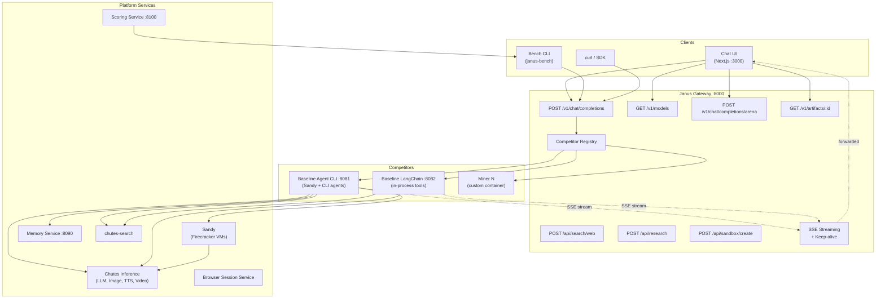
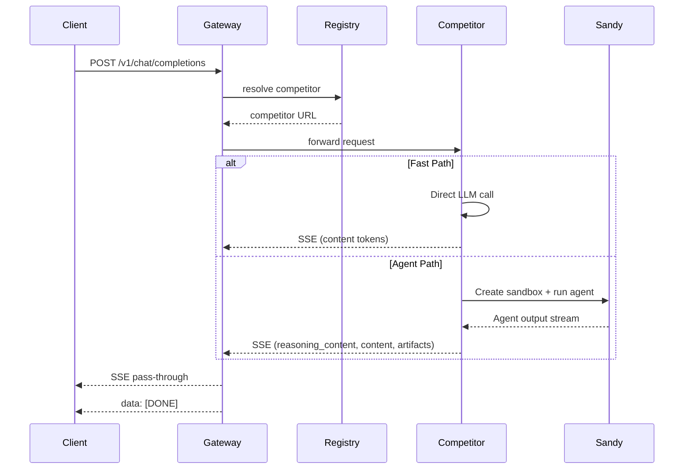
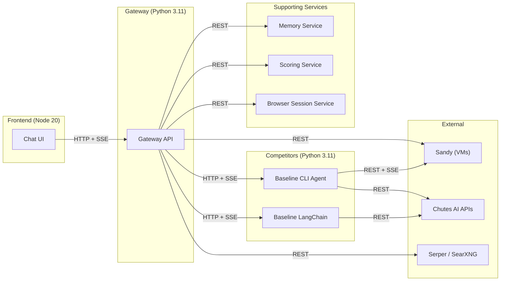
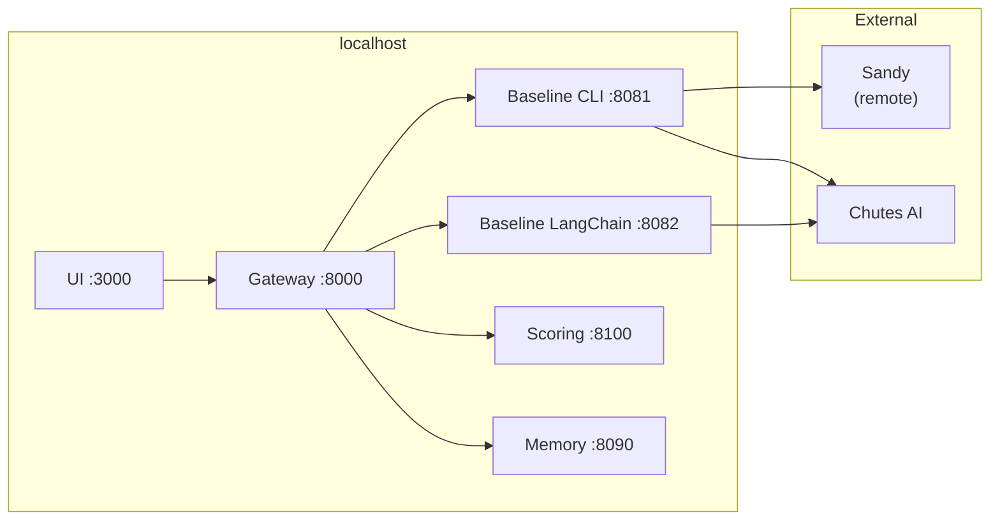
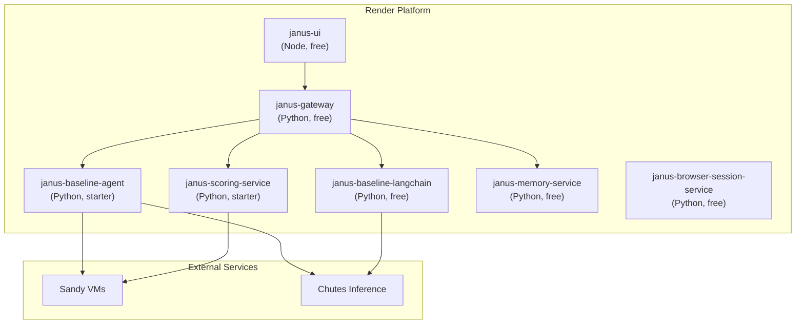
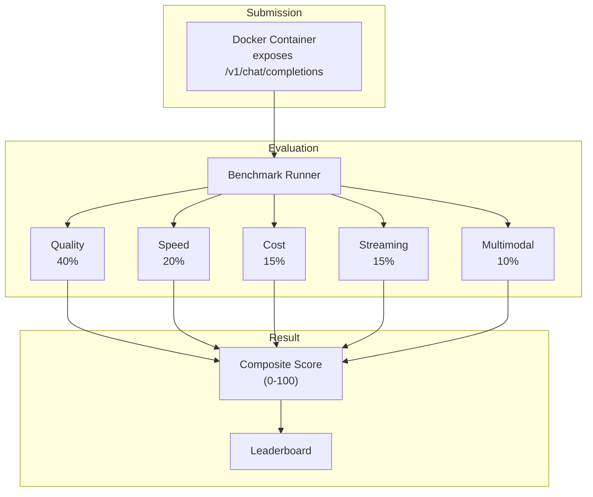

# Janus PoC -- Architecture Overview

Janus is a competitive, OpenAI-compatible intelligence API where miners (competitors) submit Docker containers that expose a Chat Completions endpoint. The platform evaluates them on quality, speed, cost, streaming continuity, and multimodal handling. A composite score determines the leaderboard ranking.

Live at **[janus.rodeo](https://janus-ui.onrender.com)**.

---

## System Map



---

## Core Data Flow

Every request follows the same path regardless of client:

```
Client --> Gateway --> Competitor --> [Sandy / LLM] --> SSE stream back
```

1. **Client** sends an OpenAI-compatible `POST /v1/chat/completions` request.
2. **Gateway** resolves the target competitor via the registry (explicit `competitor_id`, model name match, or default).
3. **Gateway** proxies the request to the competitor's `/v1/chat/completions` endpoint.
4. **Competitor** decides internally whether the request is simple (fast path -- direct LLM) or complex (agent path -- Sandy sandbox with CLI agent).
5. **Competitor** streams SSE chunks back, including `reasoning_content` for intermediate steps and `content` for the final answer.
6. **Gateway** transparently forwards every SSE chunk, injecting keep-alive pings on idle intervals.
7. **Client** renders tokens incrementally.



---

## OpenAI Chat Completions API Compatibility

The gateway and all competitors implement the standard OpenAI Chat Completions API with the following extensions:

| Standard OpenAI | Janus Extension |
|-----------------|-----------------|
| `delta.content` | `delta.reasoning_content` -- intermediate thinking / tool traces |
| `usage.prompt_tokens` | `usage.cost_usd` -- estimated USD cost |
| `usage.completion_tokens` | `usage.sandbox_seconds` -- sandbox execution time |
| -- | `artifacts[]` array on response chunks |
| -- | `metadata.routing_decision` -- pin routing path and model |
| -- | `generation_flags` -- request image/video/audio/research generation |
| -- | `debug: true` -- enable debug trace events |
| -- | `competitor_id` -- explicit competitor routing |

All streaming uses Server-Sent Events (SSE) with the standard `data: {json}\n\n` format and `data: [DONE]\n\n` termination.

---

## Component Boundaries



### Component Summary

| Component | Technology | Port | Purpose |
|-----------|-----------|------|---------|
| **Chat UI** | Next.js 14, Zustand, Tailwind | 3000 | ChatGPT-style frontend with SSE streaming, reasoning traces, artifacts, arena mode |
| **Gateway** | FastAPI, httpx, structlog | 8000 | OpenAI-compatible proxy, competitor routing, artifact storage, web search, transcription |
| **Baseline Agent CLI** | FastAPI, Sandy SDK | 8081 | Reference competitor: dual-path routing, CLI agents in Firecracker VMs |
| **Baseline LangChain** | FastAPI, LangChain | 8082 | Alternative competitor: in-process LangChain tools agent |
| **Bench** | CLI (Click), httpx | -- | Benchmark runner measuring quality, speed, cost, streaming, multimodal |
| **Scoring Service** | FastAPI, SQLAlchemy | 8100 | Executes benchmark suites, stores results, provides leaderboard |
| **Memory Service** | FastAPI, PostgreSQL | 8090 | Memory extraction and context recall across sessions |
| **Browser Session Service** | FastAPI | -- | Secure browser session storage for authenticated browsing |

---

## Deployment Topology

### Local Development

All services run on localhost with distinct ports:



```bash
# Terminal 1: Gateway
cd gateway && python -m janus_gateway.main

# Terminal 2: Baseline CLI Agent
cd baseline-agent-cli && python -m janus_baseline_agent_cli.main

# Terminal 3: Baseline LangChain (optional)
cd baseline-langchain && python -m janus_baseline_langchain.main

# Terminal 4: Chat UI
cd ui && npm run dev
```

### Production (Render)

Deployed via `render.yaml` as separate web services in the Oregon region:



| Service | Render URL | Plan |
|---------|-----------|------|
| Chat UI | https://janus-ui.onrender.com | free |
| Gateway | https://janus-gateway-bqou.onrender.com | free |
| Baseline Agent | https://janus-baseline-agent.onrender.com | starter |
| Baseline LangChain | https://janus-baseline-langchain.onrender.com | free |
| Scoring Service | https://janus-scoring-service.onrender.com | starter |
| Memory Service | https://janus-memory-service.onrender.com | free |

The baseline agent uses the "starter" plan because it handles long-running Sandy sandbox sessions that require more compute and longer timeouts.

---

## The Competition Model

Janus is both a competition and a product:

1. **Miners/Competitors** submit Docker containers exposing the OpenAI Chat Completions API.
2. Containers can implement any strategy: CLI agents, n8n workflows, multi-model chains, RAG pipelines, or custom logic.
3. The platform enforces the API contract, continuous streaming, and guardrails.
4. A **composite score** across five dimensions determines rankings:
   - Quality (40%) -- response correctness
   - Speed (20%) -- TTFT and throughput
   - Cost (15%) -- token and sandbox efficiency
   - Streaming (15%) -- continuity and gap metrics
   - Multimodal (10%) -- image/vision/media handling
5. The best implementations earn rewards.



---

## Key Design Decisions

1. **OpenAI API as the universal contract** -- competitors only need to implement `/v1/chat/completions` with SSE streaming. This makes any OpenAI-compatible service a potential competitor.

2. **Gateway is a thin proxy** -- the gateway does not process or transform AI content. It resolves the competitor, forwards the request, relays SSE chunks with keep-alives, and stores artifacts. All intelligence lives in the competitors.

3. **Dual-path architecture in the reference baseline** -- simple questions hit fast LLMs directly (sub-second); complex tasks spin up a full Sandy sandbox with a CLI agent (Claude Code, Aider). This demonstrates the power of the "anything in, anything out" approach.

4. **Continuous streaming is mandatory** -- competitors must produce SSE events continuously. Keep-alive pings (`": ping\n\n"`) bridge idle periods. The benchmark measures streaming gaps and penalizes stalls.

5. **Sandbox isolation via Sandy** -- complex tasks run in Firecracker micro-VMs with full Linux environments. Agents have shell access, package installation, browser automation, and file creation -- all safely isolated.
