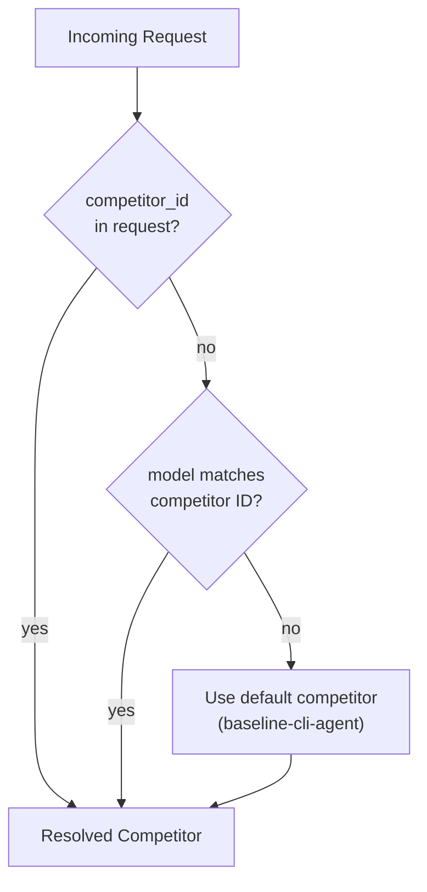
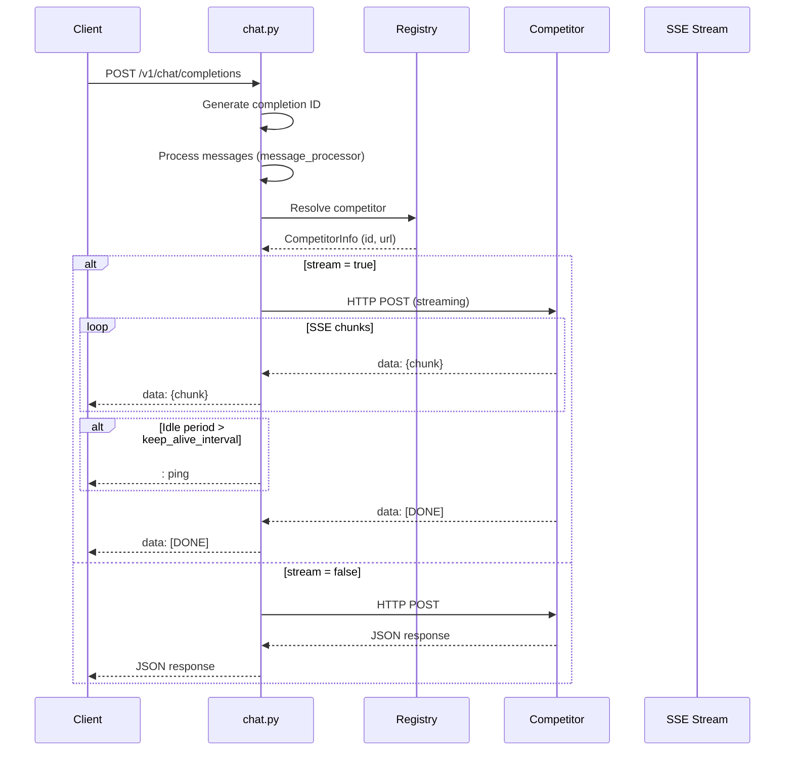
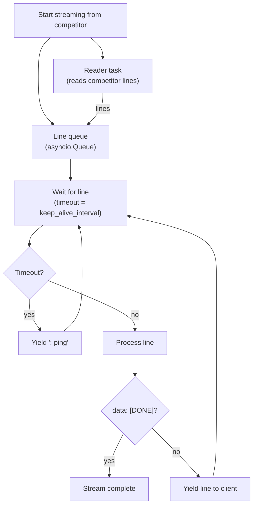
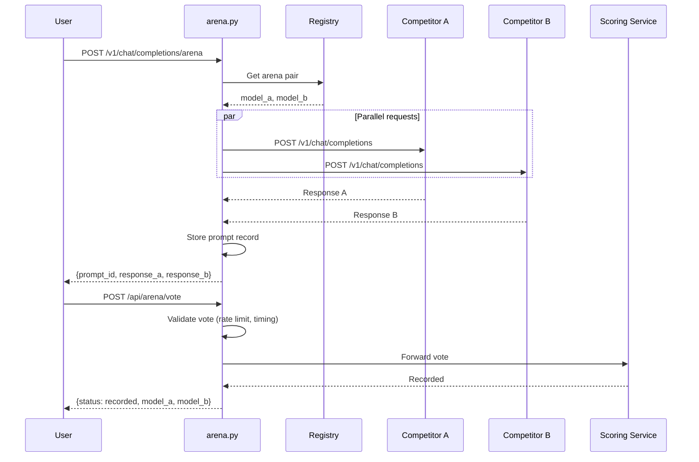

# Janus Gateway -- Deep Dive

The gateway is a FastAPI application that acts as the central OpenAI-compatible proxy for the Janus network. It accepts client requests, routes them to competitor containers, relays SSE streams with keep-alives, and provides supporting services (artifacts, search, transcription, arena, memory).

**Source**: `gateway/janus_gateway/`

---

## Application Structure

```
gateway/janus_gateway/
  config/
    settings.py          # Pydantic settings from environment
  middleware/
    logging.py           # Request/response logging
    tracing.py           # RequestTracingMiddleware (correlation + request IDs)
    pre_release_password.py  # Optional password gate
  models/
    openai.py            # OpenAI request/response Pydantic models
    janus.py             # Janus extension models (CompetitorInfo, etc.)
    arena.py             # Arena models
    streaming.py         # SSE chunk helpers
  routers/
    chat.py              # POST /v1/chat/completions
    models.py            # GET /v1/models
    artifacts.py         # GET /v1/artifacts/:id
    arena.py             # POST /v1/chat/completions/arena, POST /api/arena/vote
    sandbox.py           # POST /api/sandbox/create, capture, delete
    search.py            # POST /api/search/web
    research.py          # POST /api/research (deep research)
    transcription.py     # POST /api/transcribe
    tts.py               # POST /api/tts
    memories.py          # Memory service proxy
    sessions.py          # Browser session proxy
    health.py            # GET /health
    debug.py             # Debug event streams
    logs.py              # Log retrieval
  services/
    competitor_registry.py   # Competitor registry
    competitor_runner.py     # SandyCompetitorRunner (sandbox-based competitors)
    streaming.py             # SSE format/parse helpers
    artifact_store.py        # Local artifact storage
    arena.py                 # Arena pairing and prompt store
    debug_registry.py        # Debug request tracking
    file_extractor.py        # File content extraction
    message_processor.py     # Message preprocessing
    web_search.py            # Serper / SearXNG web search
  main.py                  # App creation, middleware, router inclusion
```

---

## Competitor Registry and Routing

The `CompetitorRegistry` class (`services/competitor_registry.py`) manages registered competitors. On startup, it automatically registers two baselines:

1. **baseline-cli-agent** -- the Sandy-based CLI agent reference (default)
2. **baseline-langchain** -- the LangChain in-process baseline (if URL configured)



### Routing Logic

The `chat_completions` handler in `routers/chat.py` resolves the target competitor:

1. If `competitor_id` is explicitly set on the request, use that competitor.
2. Otherwise, if the `model` field matches a registered competitor ID, use that competitor.
3. Otherwise, fall back to the default competitor (the first registered, typically `baseline-cli-agent`).

The routing reason is logged: `explicit_competitor_id`, `model_based`, or `default_fallback`.

### URL Normalization

Competitor URLs undergo normalization:
- `localhost` and `127.0.0.1` get `http://`
- Private IP ranges (10.x, 172.16-31.x, 192.168.x) get `http://`
- URLs with ports get `http://`
- Everything else gets `https://`

---

## Chat Completions Endpoint

`POST /v1/chat/completions`

This is the primary endpoint. It accepts the standard OpenAI Chat Completions request body with Janus extensions.

### Request Flow



### Janus-Specific Request Fields

| Field | Type | Description |
|-------|------|-------------|
| `competitor_id` | string | Explicit competitor routing |
| `metadata` | object | Arbitrary metadata passed through to competitor |
| `metadata.routing_decision` | string | Pin routing path and model (e.g., `fast_qwen`, `agent_kimi`) |
| `generation_flags` | object | Request specific generation types |
| `generation_flags.generate_image` | bool | Request image generation |
| `generation_flags.generate_video` | bool | Request video generation |
| `generation_flags.generate_audio` | bool | Request audio generation |
| `generation_flags.deep_research` | bool | Request deep research mode |
| `debug` | bool | Enable debug trace events |
| `user_id` | string | User ID for memory and rate limiting |
| `enable_memory` | bool | Enable memory context injection |

---

## SSE Streaming with Keep-Alives

The gateway implements a robust SSE proxy with keep-alive support via `stream_from_competitor()`:



Key design points:

- **Keep-alive interval**: Configurable via `JANUS_KEEP_ALIVE_INTERVAL` (default 1.5 seconds). When no data arrives within this window, a `: ping\n\n` SSE comment is sent to keep the connection alive.
- **Reader task**: A background asyncio task reads lines from the competitor HTTP stream and puts them on a queue. This decouples reading from the timeout logic.
- **Error handling**: Timeouts, connection errors, and non-200 responses are all converted to SSE error chunks with `finish_reason: stop`.
- **Chunk logging**: The first 3 chunks plus every 50th chunk are logged. Important events (`done`, `artifact`) are always logged.
- **`data: [DONE]` guarantee**: If the competitor stream ends without sending `[DONE]`, the gateway appends it.

### Request Timeout

The default request timeout is 300 seconds (5 minutes), configurable via `JANUS_REQUEST_TIMEOUT`. Deep research requests have a separate 1200-second (20-minute) timeout.

---

## Arena Mode (A/B Testing)

The arena mode sends the same prompt to two randomly selected competitors and presents both responses side-by-side for user voting.

`POST /v1/chat/completions/arena`



### Vote Anti-Fraud Protections

- **Minimum view time**: Votes submitted within 5 seconds of receiving responses are rejected.
- **Rate limiting**: 50 votes per user per hour.
- **Session age**: Accounts less than 1 hour old cannot vote.
- **Duplicate detection**: Each prompt can only be voted on once.
- **Elo scoring**: Votes are forwarded to the scoring service which maintains Elo ratings.

---

## Sandbox Proxy

The gateway provides a proxy for Sandy sandbox operations:

| Endpoint | Description |
|----------|-------------|
| `POST /api/sandbox/create` | Create a sandbox with optional VNC |
| `POST /api/sandbox/{id}/capture-session` | Capture browser session (cookies, localStorage) |
| `DELETE /api/sandbox/{id}` | Terminate and clean up a sandbox |

The `SandyCompetitorRunner` class (`services/competitor_runner.py`) manages the full lifecycle for sandbox-based competitors:

1. Create a Sandy sandbox with CPU, memory, and disk resources
2. Pull and start the competitor Docker image inside the sandbox
3. Wait for the `/health` endpoint to become ready
4. Proxy requests through `{sandy_url}/api/sandboxes/{id}/proxy/{port}/v1/chat/completions`
5. Terminate the sandbox when done

---

## Authentication and Middleware

### Request Tracing

The `RequestTracingMiddleware` injects and propagates:
- `X-Request-ID` -- unique per request
- `X-Correlation-ID` -- shared across related requests in a chain

These IDs are propagated to competitors and logged with every event for distributed tracing.

### Pre-Release Password

When `CHUTES_JANUS_PRE_RELEASE_PWD` is set, the `PreReleasePasswordMiddleware` gates all API access behind a password. This is used for staged rollouts.

### CORS

All origins are allowed (`*`) in the current configuration. The gateway uses `CORSMiddleware` from FastAPI.

### Authentication (current state)

The gateway is currently open access. The README notes "API keys coming soon." The UI supports OAuth via Chutes IDP for user identification and rate limiting.

---

## Additional Endpoints

| Endpoint | Method | Description |
|----------|--------|-------------|
| `/health` | GET | Health check |
| `/v1/models` | GET | List registered competitors as OpenAI models |
| `/v1/artifacts/{id}` | GET | Retrieve stored artifacts |
| `/api/search/web` | POST | Web search via Serper or SearXNG |
| `/api/research` | POST | Deep research with streaming progress |
| `/api/transcribe` | POST | Whisper transcription via Chutes |
| `/api/tts` | POST | Text-to-speech |
| `/api/memories/*` | * | Memory service proxy |
| `/api/sessions/*` | * | Browser session service proxy |
| `/api/debug/stream/{request_id}` | GET | Debug event stream |
| `/api/docs` | GET | Swagger UI |
| `/api/redoc` | GET | ReDoc documentation |

---

## Configuration Reference

Settings are loaded from environment variables with `JANUS_` prefix via Pydantic Settings.

| Variable | Default | Description |
|----------|---------|-------------|
| `JANUS_HOST` | `0.0.0.0` | Server host |
| `JANUS_PORT` | `8000` | Server port |
| `JANUS_DEBUG` | `false` | Enable debug mode (hot reload) |
| `JANUS_REQUEST_TIMEOUT` | `300` | Request timeout in seconds |
| `JANUS_KEEP_ALIVE_INTERVAL` | `1.5` | SSE keep-alive ping interval (seconds) |
| `JANUS_DEEP_RESEARCH_TIMEOUT` | `1200` | Deep research timeout (seconds) |
| `JANUS_BASELINE_URL` | Render URL | Baseline CLI agent URL |
| `JANUS_BASELINE_LANGCHAIN_URL` | `http://localhost:8082` | Baseline LangChain URL |
| `JANUS_DEFAULT_COMPETITOR` | `baseline-cli-agent` | Default competitor ID |
| `SANDY_BASE_URL` | -- | Sandy API URL |
| `SANDY_API_KEY` | -- | Sandy API key |
| `CHUTES_API_KEY` | -- | Chutes API key (transcription, etc.) |
| `SERPER_API_KEY` | -- | Serper API key for web search |
| `SEARXNG_API_URL` | -- | SearXNG fallback URL |
| `JANUS_MEMORY_SERVICE_URL` | Render URL | Memory service URL |
| `JANUS_SCORING_SERVICE_URL` | Render URL | Scoring service URL |
| `JANUS_LOG_LEVEL` | `INFO` | Log level |
| `JANUS_LOG_FORMAT` | `json` | Log format (`json` or `console`) |

Aliases are supported: `BASELINE_AGENT_CLI_URL`, `BASELINE_URL`, `COMPETITOR_URL` all resolve to the baseline URL.
