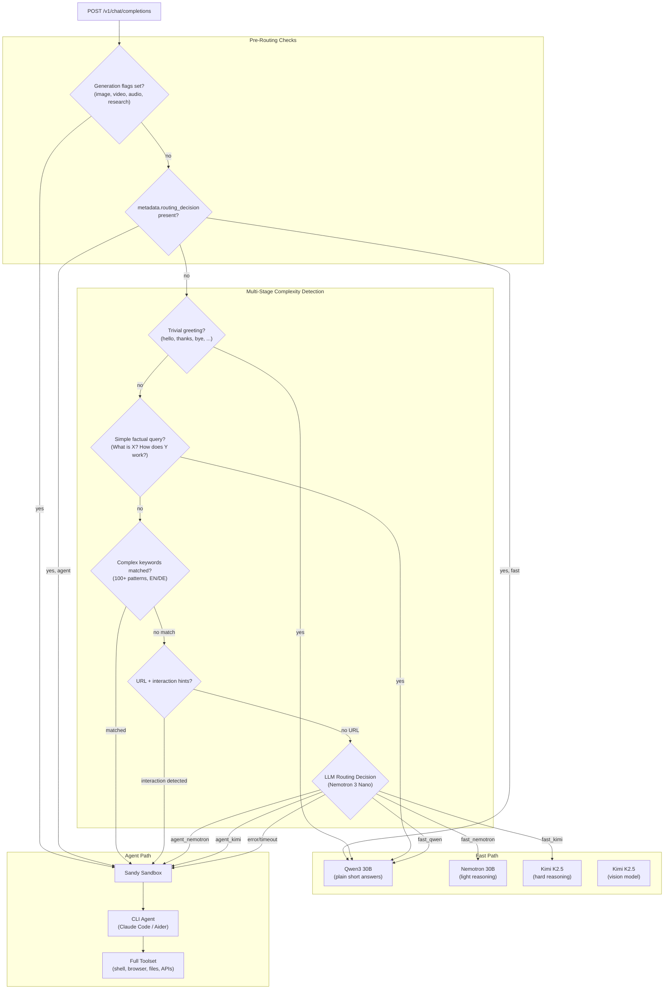
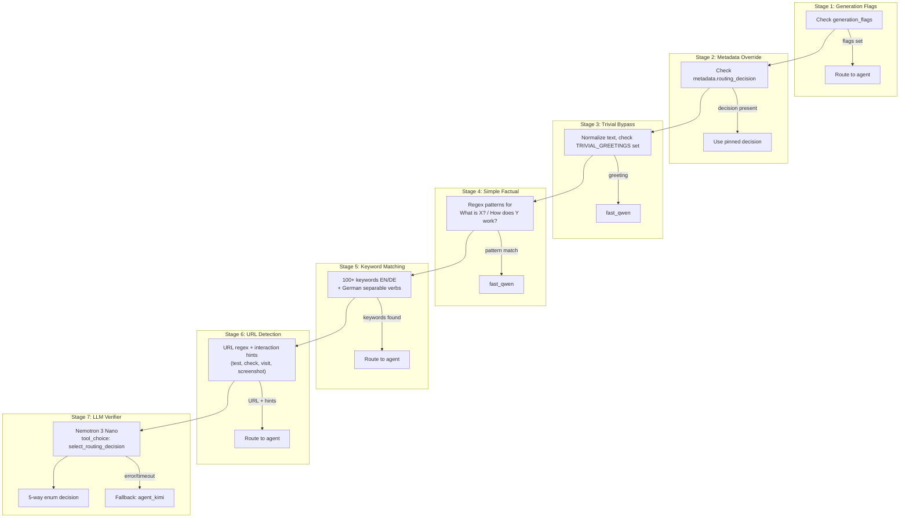
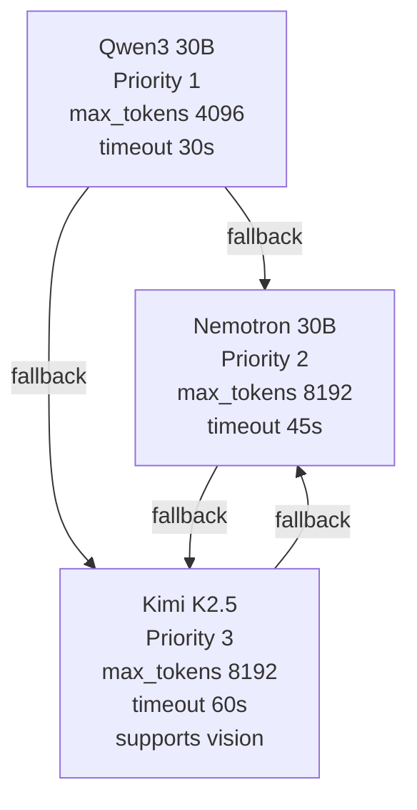
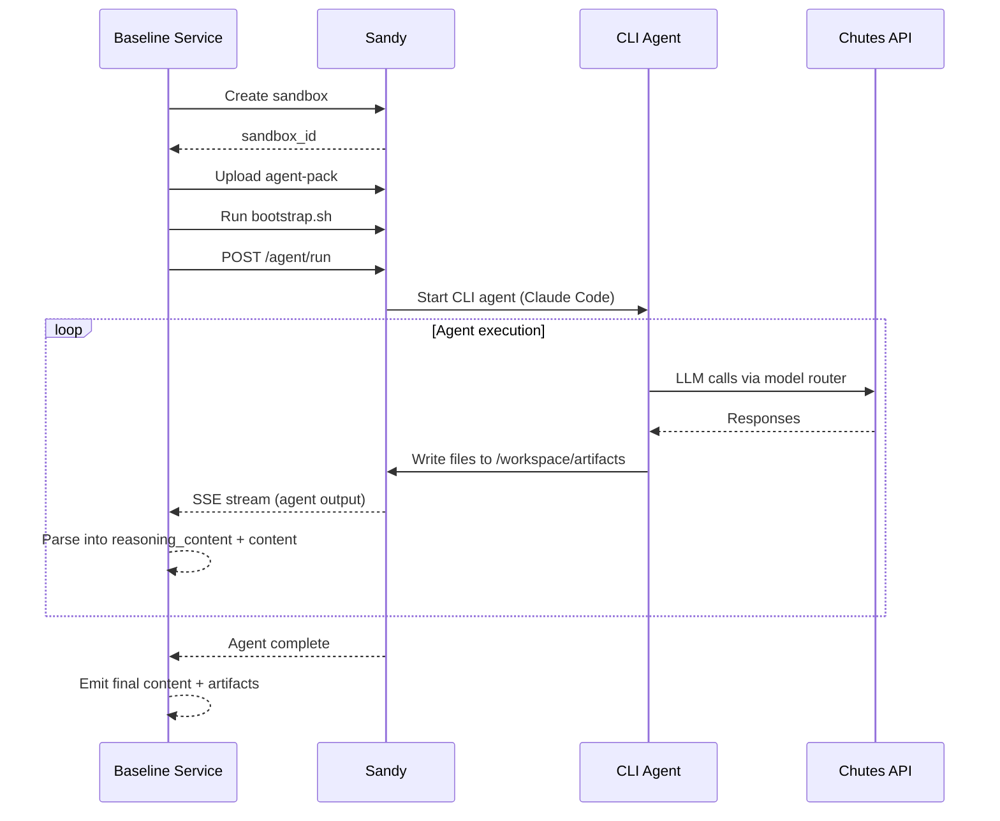
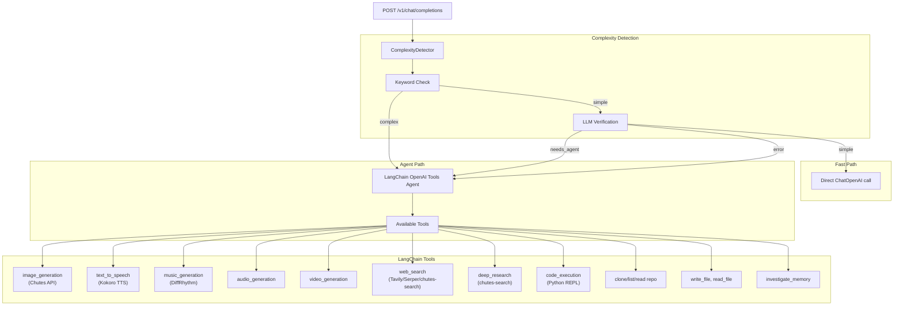

# Baseline Competitor Implementations

The Janus project ships two reference competitors that demonstrate different architectural approaches. Both implement the same OpenAI-compatible `/v1/chat/completions` endpoint but differ in how they handle complex requests.

| Aspect | Baseline Agent CLI | Baseline LangChain |
|--------|-------------------|-------------------|
| Execution | Sandy sandbox (Firecracker VM) | In-process Python |
| Isolation | OS-level (micro-VM) | Process-level only |
| Agent | Claude Code, Aider, etc. | LangChain tools agent |
| Git operations | Native git in sandbox | Subprocess git clone |
| File access | Full filesystem | Scoped temp directories |
| Security | High | Medium |
| Cold start | 10-30s (sandbox creation) | <1s |
| Best for | Complex, untrusted tasks | Fast, simple tool use |

---

## Baseline Agent CLI

**Source**: `baseline-agent-cli/janus_baseline_agent_cli/`
**Port**: 8081

The primary reference competitor. It uses a dual-path architecture: simple requests go directly to a fast LLM, while complex requests spin up a full Sandy sandbox with a CLI agent (Claude Code or Aider).

### Routing Architecture



### Routing Decisions

The routing system maps each request to one of five decisions, each specifying a path (fast or agent) and a model:

| Decision | Path | Model | Use Case |
|----------|------|-------|----------|
| `fast_qwen` | fast | Qwen/Qwen3-30B-A3B-Instruct-2507 | Plain short answers, greetings |
| `fast_nemotron` | fast | nvidia/NVIDIA-Nemotron-3-Nano-30B-A3B-BF16 | Light reasoning, longer answers |
| `fast_kimi` | fast | moonshotai/Kimi-K2.5-TEE | Hard reasoning without tools |
| `agent_nemotron` | agent | nvidia/NVIDIA-Nemotron-3-Nano-30B-A3B-BF16 | Simple agent tasks |
| `agent_kimi` | agent | moonshotai/Kimi-K2.5-TEE | General agent tasks |

Vision requests (images in input) are always pinned to Kimi K2.5.

### Complexity Detection Pipeline

The `ComplexityDetector` class (`services/complexity.py`) performs multi-stage analysis:



Key details:

- **100+ complex keywords** in English and German, including separable German verbs like "lade...herunter" (download).
- **LLM routing** uses Nemotron 3 Nano with a structured tool call (`select_routing_decision`) that returns exactly one of the five decisions. Fallback models: Qwen3 30B.
- **Conservative defaults**: on LLM failure, the system defaults to `agent_kimi` (agent path with the strongest model).
- **Override coercion**: if keyword matching says "agent" but LLM says "fast", the agent path wins.
- **`metadata.routing_decision`**: clients can pin a specific decision, bypassing all detection.
- **`BASELINE_AGENT_CLI_ALWAYS_USE_AGENT=true`**: forces all requests to the agent path.

### Model Registry and Fallbacks

Defined in `router/models.py`:



All models are accessed through the Chutes inference API (`https://llm.chutes.ai/v1`) using the OpenAI client library.

### Sandy Integration

When the agent path is selected, the baseline creates a Sandy sandbox and runs a CLI agent. The `SandyService` class (`services/sandy.py`) handles:

1. **Sandbox creation** via Sandy's `/api/sandboxes` endpoint
2. **Agent pack upload**: the `agent-pack/` directory is uploaded to `/workspace/agent-pack` in the sandbox
3. **Bootstrap**: `agent-pack/bootstrap.sh` prepares the workspace, creating `/workspace/CLAUDE.md`
4. **Agent execution**: via Sandy's `/agent/run` API with:
   - `rawPrompt: true`
   - `apiBaseUrl` pointed at the Janus model router
   - `systemPromptPath=/workspace/agent-pack/prompts/system.md`
5. **Artifact collection**: files in `/workspace/artifacts` are served via the sandbox HTTP server
6. **Stream relay**: agent output is parsed into SSE chunks with `reasoning_content` and `content`



### Supported CLI Agents

Selected via `X-Baseline-Agent` header or `JANUS_BASELINE_AGENT` environment variable:

| Agent | Binary | Status |
|-------|--------|--------|
| Claude Code | `claude` | Default, most reliable |
| Aider | `aider` | Editor-style agent |
| Roo Code CLI | `roo-code-cli` | Experimental |
| Cline | `cline` | Experimental |
| OpenCode | `opencode` | Non-interactive run mode |
| Codex | `codex` | Output capture under investigation |

### Warm Pool

The baseline supports a warm pool of pre-created Sandy sandboxes for reduced cold start times:

- `BASELINE_AGENT_CLI_WARM_POOL_ENABLED=true`
- `BASELINE_AGENT_CLI_WARM_POOL_SIZE=2` (number of warm sandboxes)
- `BASELINE_AGENT_CLI_WARM_POOL_MAX_AGE=600` (max age in seconds)
- `BASELINE_AGENT_CLI_WARM_POOL_MAX_REQUESTS=5` (requests per sandbox before recycling)

### Memory Integration

When `BASELINE_AGENT_CLI_ENABLE_MEMORY_FEATURE=true`:

1. Before processing, the service calls the Memory Service to retrieve relevant context for the user.
2. Memory context is injected into the last user message.
3. After response completion, the conversation is sent to the Memory Service for extraction.
4. An `investigate_memory` tool is made available for the agent to query full memory content.

---

## Baseline LangChain

**Source**: `baseline-langchain/janus_baseline_langchain/`
**Port**: 8082

An alternative competitor that runs entirely in-process using LangChain's agent framework. No sandbox is needed -- all tools execute in the Python process.

### Architecture



### Key Differences from CLI Agent Baseline

1. **No sandbox** -- all code execution happens in-process via LangChain's Python REPL tool. This is faster but less isolated.
2. **LangChain agent** -- uses `ChatOpenAI` with the OpenAI tools agent pattern for structured tool calling.
3. **Scoped file access** -- artifacts are stored in a local temp directory (`/tmp/janus_baseline_langchain_artifacts`), not a full sandbox filesystem.
4. **Git operations** -- uses subprocess `git clone` into temp directories rather than native git in a sandbox.
5. **Vision routing** -- uses Qwen3 VL 235B as the primary vision model with Mistral Small 3.2 as fallback.

### Tool Implementations

All tools are in `tools/`:

| Tool | File | Description |
|------|------|-------------|
| `image_generation` | `image_gen.py` | Chutes image API (FLUX, Recraft) |
| `text_to_speech` | `tts.py` | Chutes Kokoro TTS |
| `music_generation` | `music_gen.py` | DiffRhythm music generation |
| `audio_generation` | `audio.py` | General audio generation |
| `video_generation` | `video.py` | Chutes video generation |
| `web_search` | `web_search.py` | Tavily, Serper, or chutes-search |
| `deep_research` | `deep_research.py` | Chutes search with citations |
| `code_execution` | `code_exec.py` | LangChain Python REPL |
| `clone_repository` | `git_tools.py` | Git clone into temp dirs |
| `list_repository_files` | `git_tools.py` | List files in cloned repos |
| `read_repository_file` | `git_tools.py` | Read files from cloned repos |
| `write_file` / `read_file` | `files.py` | File operations for artifacts |
| `create_directory` | `files.py` | Create working directories |
| `investigate_memory` | `memory.py` | Retrieve full memory content |

---

## Agent Pack and System Prompt

The agent pack (`baseline-agent-cli/agent-pack/`) is uploaded into every Sandy sandbox and defines the agent's capabilities and behavior:

```
agent-pack/
  bootstrap.sh         # Workspace preparation script
  prompts/
    system.md          # Main system prompt for CLI agents
  models/
    text-to-image.md   # Chutes image generation API docs
    text-to-speech.md  # Kokoro TTS API docs
    music-generation.md # DiffRhythm API docs
    text-to-video.md   # Video generation API docs
    lip-sync.md        # MuseTalk API docs
    vision.md          # Vision model docs
    llm.md             # LLM endpoint docs
    data-visualization.md # Data viz patterns
```

### System Prompt Highlights

The system prompt (`agent-pack/prompts/system.md`) defines the agent as a "Janus intelligence agent" with full sandbox access. Key sections:

1. **Research & Discovery** -- web search, git clone, URL fetching, source code reading
2. **Code Execution** -- write and run code in any language, install packages
3. **File Operations** -- create, read, and serve files via `/workspace/artifacts`
4. **Media Generation** -- Chutes APIs for images, TTS, music, and video (with explicit instructions to use real APIs, not SVG/ASCII art)
5. **Deep Research** -- light mode (2-5 min) and max mode (10-18 min) via chutes-search
6. **Browser Automation** -- Playwright-based browsing with screenshot streaming
7. **Generative UI** -- `html-gen-ui` code fences for interactive widgets in chat
8. **Authenticated Sessions** -- browser profile injection for logged-in browsing

The prompt emphasizes saving binary outputs (images, audio, video) to `/workspace/artifacts` and linking them via markdown -- never printing base64 blobs, which would be truncated.

---

## Response Streaming

Both baselines implement the same SSE streaming format:

```
data: {"id":"chatcmpl-...","model":"...","choices":[{"delta":{"role":"assistant"}}]}\n\n
data: {"id":"chatcmpl-...","model":"...","choices":[{"delta":{"reasoning_content":"Thinking..."}}]}\n\n
data: {"id":"chatcmpl-...","model":"...","choices":[{"delta":{"content":"Here is the answer"}}]}\n\n
data: {"id":"chatcmpl-...","model":"...","choices":[{"delta":{},"finish_reason":"stop"}]}\n\n
data: [DONE]\n\n
```

The `reasoning_content` field carries intermediate thinking, tool traces, and progress updates from the agent path. The `content` field carries the final response. Artifacts are emitted as dedicated events with metadata including `id`, `type`, `mime_type`, `display_name`, and `url`.

Both baselines use keep-alive mechanisms:
- **Agent path**: emits `reasoning_content: "Working...\n"` during idle periods
- **Fast path**: emits SSE comments (`": keepalive\n\n"`) to avoid polluting the response
