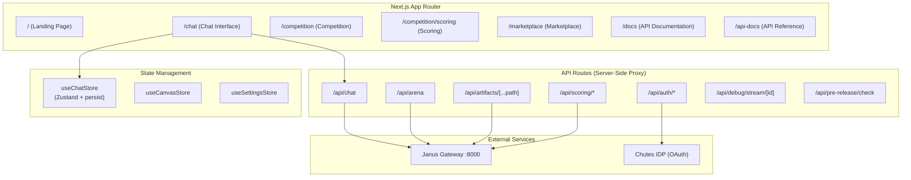
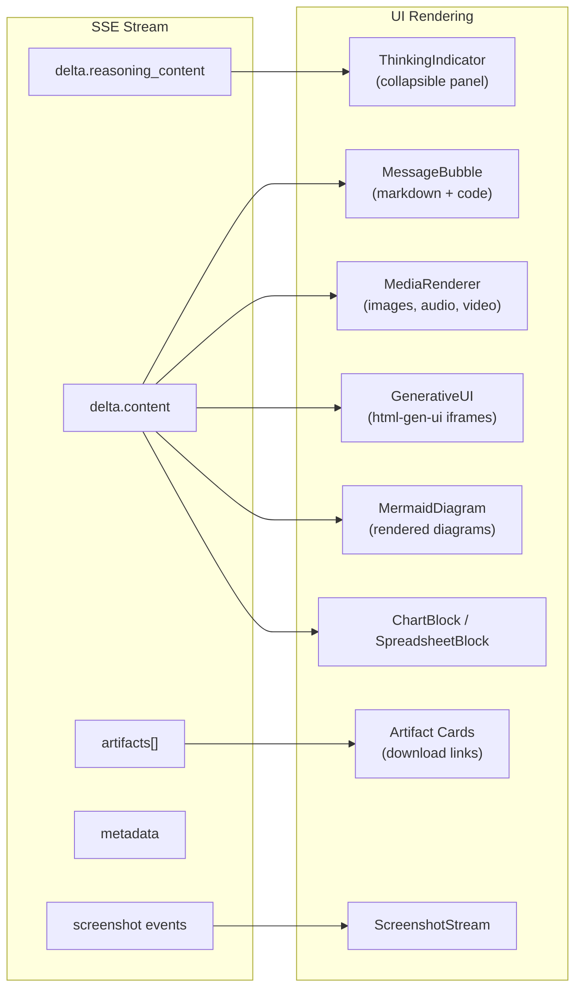
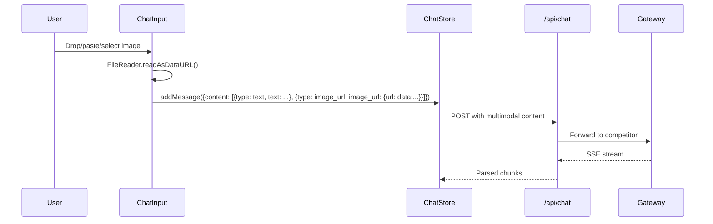
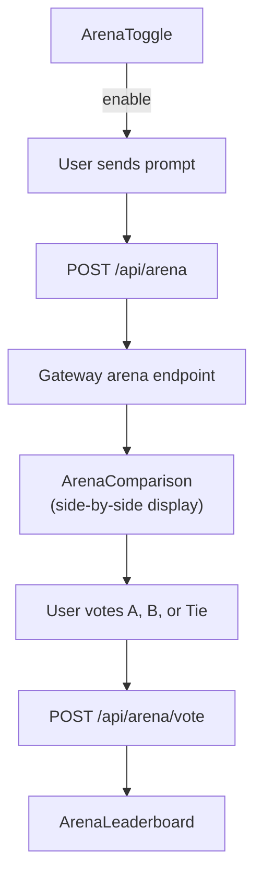

# Chat UI Documentation

The Janus Chat UI is a Next.js 14 application that provides a ChatGPT-style interface with SSE streaming, reasoning traces, competitor selection, image upload, voice input, arena mode, and artifact rendering.

**Source**: `ui/src/`
**Port**: 3000

---

## Application Architecture



### Pages

| Route | Component | Description |
|-------|-----------|-------------|
| `/` | `page.tsx` | Landing page with hero, features, how-it-works |
| `/chat` | `chat/page.tsx` | Main chat interface |
| `/competition` | `competition/page.tsx` | Competition overview, leaderboard, submission |
| `/competition/scoring` | `competition/scoring/page.tsx` | Benchmark runs and scoring UI |
| `/competition/scoring/runs/[id]` | Run detail | Individual run results with radar charts |
| `/marketplace` | `marketplace/page.tsx` | Component marketplace |
| `/docs` | `docs/page.tsx` | Documentation pages |
| `/api-docs` | `api-docs/page.tsx` | Interactive API reference |
| `/auth/error` | Error page | OAuth error handling |

---

## SSE Streaming with Reasoning Traces

The UI consumes SSE streams from the gateway and renders three types of content:



### Streaming Implementation

The `streamChatCompletion()` async generator in `lib/api.ts` handles the SSE protocol:

1. **POST** to `/api/chat` (server-side proxy that forwards to the gateway)
2. Read the response body as a stream using `ReadableStream` and `TextDecoder`
3. Buffer partial lines, split on `\n`
4. Parse each `data:` line as JSON, yielding `ChatStreamEvent` objects
5. Handle `data: [DONE]` as stream termination
6. Ignore `: ping` and other SSE comments

The proxy at `/api/chat` passes through to `{GATEWAY_URL}/v1/chat/completions` with credentials and rate limit headers.

### Timeouts and Retries

| Setting | Value | Description |
|---------|-------|-------------|
| Default timeout | 30 seconds | For non-streaming requests |
| Stream timeout | 600 seconds (10 min) | For SSE streaming (long agentic tasks) |
| Retries | 2 | With exponential backoff |
| Retryable status codes | 408, 425, 429, 500, 502, 503, 504 | |

### Rate Limiting

The UI implements client-side rate limiting. When a 429 response is received, a `RateLimitError` is thrown with details about usage, remaining quota, and whether login is required.

---

## State Management

### Chat Store (`store/chat.ts`)

Uses Zustand with `persist` middleware (localStorage) for chat state:

```typescript
interface ChatState {
  sessions: Session[];
  currentSessionId: string | null;
  isStreaming: boolean;
  showReasoning: boolean;

  // Session actions
  createSession(): string;
  selectSession(id: string): void;
  deleteSession(id: string): void;

  // Message actions
  addMessage(message): void;
  updateLastMessage(updates): void;
  appendToLastMessage(content, reasoning): void;
  appendArtifacts(artifacts): void;

  // UI state
  setStreaming(streaming): void;
  toggleReasoning(): void;
}
```

Key behaviors:
- Sessions are persisted to localStorage under `janus-chat-storage`
- The first user message sets the session title (truncated to 50 chars)
- `appendToLastMessage` cleans `(no content)` markers and deduplicates heartbeat messages
- Artifacts are merged by ID to avoid duplicates

### Canvas Store (`store/canvas.ts`)

Manages the code canvas/editor panel for artifact editing.

### Settings Store (`store/settings.ts`)

User preferences including model selection, debug mode, and voice input settings.

---

## Key Components

### Competitor / Model Selector

`ModelSelector.tsx` fetches available competitors from `GET /v1/models` and presents them as a dropdown. The selected model ID is sent as the `model` field in chat requests.

### Chat Input (`ChatInput.tsx`)

Rich input area with:
- Text input with auto-resize
- Image upload (base64 data URLs via `FileReader`)
- File attachment processing (`file-processor.ts`)
- Voice input button (when enabled)
- Plus menu for generation tags (image, video, audio, research, web search)
- Selected tags display (`SelectedTags.tsx`)

### Message Bubble (`MessageBubble.tsx`)

Renders assistant messages with:
- Markdown rendering (`markdown-renderer.tsx`) with syntax highlighting
- Code blocks with copy buttons (`CodeBlock.tsx`)
- Mermaid diagram rendering (`MermaidDiagram.tsx`)
- Generative UI iframes (`GenerativeUI.tsx`)
- Audio/video playback (`MediaRenderer.tsx`, `AudioPlayer.tsx`)
- Citation links (`Citation.tsx`)
- Rich data visualization (`ChartBlock.tsx`, `SpreadsheetBlock.tsx`)
- Deep research progress (`DeepResearchProgress.tsx`)
- Artifact download cards
- Message actions (copy, share, etc.)

### Thinking Indicator (`ThinkingIndicator.tsx`)

Displays `reasoning_content` in a collapsible panel. Shows intermediate agent thinking, tool calls, and progress updates during streaming.

### Sidebar (`Sidebar.tsx`)

Session list with:
- New chat button
- Session history with titles
- Session deletion
- Memory toggle (`MemoryToggle.tsx`)
- User menu with auth (`UserMenu.tsx`)

---

## Image Upload and Artifacts

### Image Upload Flow



Images are sent as base64 data URLs in the OpenAI multipart content format:
```json
{
  "role": "user",
  "content": [
    {"type": "text", "text": "What is in this image?"},
    {"type": "image_url", "image_url": {"url": "data:image/png;base64,..."}}
  ]
}
```

### Artifact Rendering

Artifacts emitted by competitors are rendered based on type:

| Artifact Type | Rendering |
|--------------|-----------|
| Image (png, jpg, gif) | Inline `` with lightbox |
| Audio (wav, mp3, ogg) | `AudioPlayer` component |
| Video (mp4, webm) | `<video>` with controls |
| PDF | Download link |
| Code files | Code block with syntax highlighting |
| HTML (`html-gen-ui`) | Sandboxed iframe |
| Other | Download link with file icon |

Artifact URLs are cached server-side at `/api/artifacts/cache` and served through `/api/artifacts/[...path]` to survive sandbox teardown.

---

## Voice Input

When `NEXT_PUBLIC_ENABLE_VOICE_INPUT=true`:

1. `VoiceInputButton.tsx` shows a microphone icon in the chat input
2. Click to start recording via the Web Audio API (`useAudioRecorder.ts`)
3. `MicrophonePermissionDialog.tsx` handles browser permission prompts
4. Recorded audio is sent to the gateway's transcription endpoint
5. Transcription library (`lib/transcription.ts`) handles the Whisper API call
6. Transcribed text is inserted into the chat input

---

## Arena Mode

The UI supports side-by-side comparison of two competitors:



Components:
- `ArenaToggle.tsx` -- toggle arena mode on/off
- `ArenaComparison.tsx` -- side-by-side response display
- `ArenaLeaderboard.tsx` -- Elo-based leaderboard

---

## Debug Panel

When `debug: true` is set on a request:

1. The gateway returns an `X-Debug-Request-Id` header
2. `useDebug.ts` hook subscribes to `/api/debug/stream/{request_id}`
3. `DebugPanel.tsx` renders debug events in a collapsible panel:
   - `DebugFlowDiagram.tsx` -- visual flow of routing decisions
   - `DebugLog.tsx` -- timestamped event log
   - `DebugFiles.tsx` -- files created during execution

Debug event types include: `REQUEST_RECEIVED`, `COMPLEXITY_CHECK_START`, `COMPLEXITY_CHECK_KEYWORD`, `COMPLEXITY_CHECK_LLM`, `ROUTING_DECISION`, `FAST_PATH_START`, `AGENT_PATH_START`, `RESPONSE_COMPLETE`, `ERROR`.

---

## Authentication

The UI supports "Sign in with Chutes" via OAuth 2.0 + PKCE:

| Route | Purpose |
|-------|---------|
| `/api/auth/login` | Redirect to Chutes IDP |
| `/api/auth/callback` | Handle OAuth callback |
| `/api/auth/me` | Get current user info |
| `/api/auth/logout` | Clear session |
| `/api/auth/health` | Check auth service status |

Auth is implemented in `lib/auth/` with PKCE support, session management via encrypted cookies, and a `useAuth()` hook for components.

`SignInGateDialog.tsx` prompts anonymous users to sign in when they hit rate limits.

---

## Environment Variables

| Variable | Default | Description |
|----------|---------|-------------|
| `NEXT_PUBLIC_GATEWAY_URL` | `http://localhost:8000` | Janus gateway URL |
| `NEXT_PUBLIC_ENABLE_VOICE_INPUT` | `false` | Toggle voice input |
| `CHUTES_OAUTH_CLIENT_ID` | -- | Chutes OAuth client ID |
| `CHUTES_OAUTH_CLIENT_SECRET` | -- | Chutes OAuth client secret |
| `CHUTES_OAUTH_REDIRECT_URI` | `http://localhost:3000/api/auth/callback` | OAuth callback URL |
| `CHUTES_OAUTH_COOKIE_SECRET` | -- | Secret for OAuth cookie encryption |
| `CHUTES_JANUS_PRE_RELEASE_PWD` | -- | Pre-release password for gated access |

---

## Project Structure

```
ui/src/
  app/
    page.tsx                    # Landing page
    layout.tsx                  # Root layout (fonts, providers)
    chat/
      page.tsx                  # Chat interface
      layout.tsx                # Chat layout (sidebar)
    competition/
      page.tsx                  # Competition overview
      scoring/                  # Scoring pages
    marketplace/                # Marketplace pages
    docs/                       # Documentation pages
    api-docs/                   # API reference page
    api/                        # Server-side API routes
      chat/route.ts             # Chat proxy to gateway
      arena/                    # Arena proxy routes
      artifacts/                # Artifact caching and serving
      auth/                     # OAuth routes
      scoring/                  # Scoring proxy routes
      debug/                    # Debug stream proxy
  components/
    ChatArea.tsx                # Main chat display
    ChatInput.tsx               # Message input
    MessageBubble.tsx           # Message rendering
    Sidebar.tsx                 # Session sidebar
    ModelSelector.tsx           # Competitor selector
    ThinkingIndicator.tsx       # Reasoning panel
    MermaidDiagram.tsx          # Mermaid rendering
    GenerativeUI.tsx            # html-gen-ui iframes
    MediaRenderer.tsx           # Image/audio/video
    VoiceInputButton.tsx        # Voice input
    arena/                      # Arena components
    auth/                       # Auth components
    canvas/                     # Code canvas
    chat/                       # Chat sub-components
    debug/                      # Debug panel
    docs/                       # Documentation components
    landing/                    # Landing page sections
    memory/                     # Memory management
    sessions/                   # Session management
    viz/                        # Data visualization
  hooks/
    useChat.ts                  # Chat hook
    useDebug.ts                 # Debug stream hook
    useArena.ts                 # Arena hook
    useAuth.ts                  # Authentication hook
    useMemories.ts              # Memory hook
    useSessions.ts              # Session management
    useAudioRecorder.ts         # Voice recording
    useSmartScroll.ts           # Auto-scroll management
  lib/
    api.ts                      # Gateway API client
    artifact-cache.ts           # Server-side artifact caching
    markdown-renderer.tsx       # Markdown + code rendering
    transcription.ts            # Whisper transcription
    tts.ts                      # Text-to-speech
    auth/                       # OAuth utilities
  store/
    chat.ts                     # Zustand chat store
    canvas.ts                   # Canvas store
    settings.ts                 # Settings store
  types/
    chat.ts                     # Chat TypeScript types
    debug.ts                    # Debug types
    generation.ts               # Generation flag types
```
