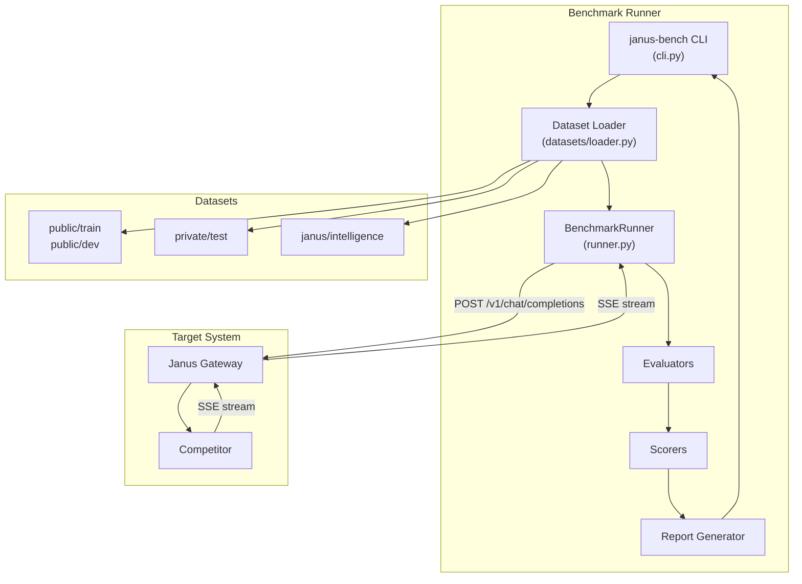
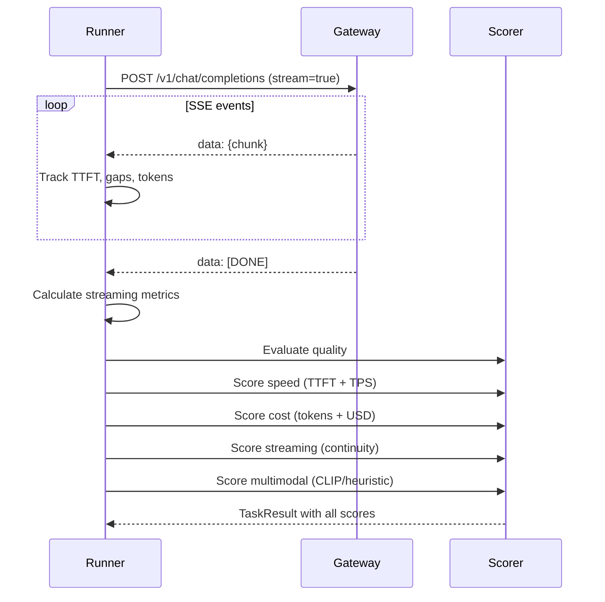
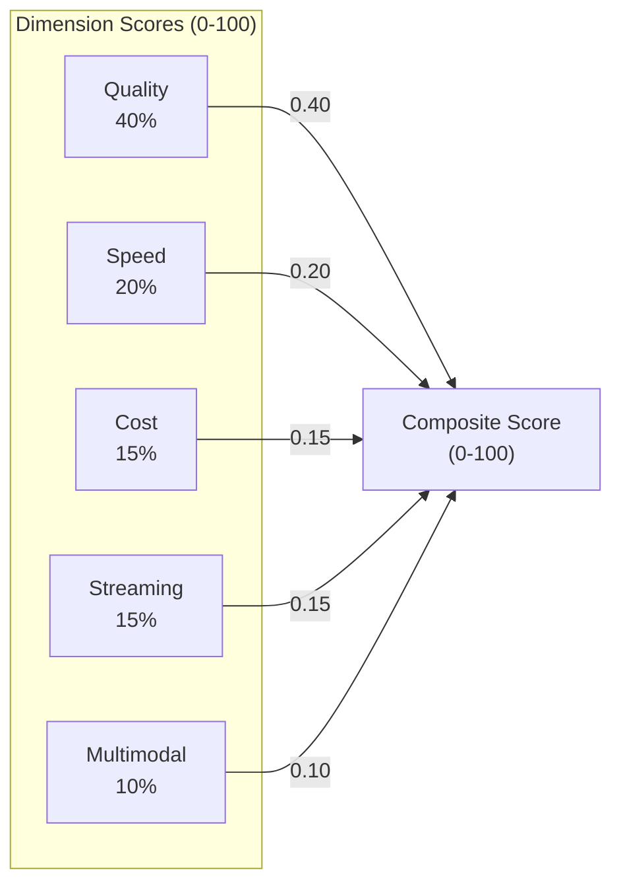
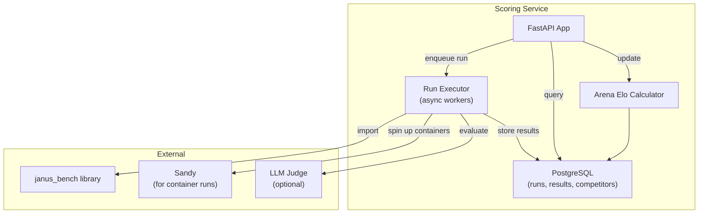

# Benchmarking and Scoring

The Janus benchmarking system evaluates competitor implementations across five dimensions: quality, speed, cost, streaming continuity, and multimodal handling. It consists of a CLI-based benchmark runner (`bench/`) and a web-based scoring service (`scoring-service/`).

---

## Benchmark Runner (`janus-bench`)

**Source**: `bench/janus_bench/`
**Install**: `pip install -e ".[dev]"` (optional: `.[dev,multimodal]` for CLIP scoring)

### CLI Usage

```bash
# Run a benchmark suite
janus-bench run --target http://localhost:8000 --suite public/dev

# Run specific benchmark within a suite
janus-bench run --target http://localhost:8000 --suite janus/intelligence --benchmark janus_streaming

# Run with subset and seed for reproducibility
janus-bench run --target http://localhost:8000 --suite public/dev --subset 10 --seed 42

# List available suites and benchmarks
janus-bench list-suites
janus-bench list-benchmarks

# View a saved report
janus-bench show results.json
```

### Runner Architecture



### Task Execution Flow

For each task, the `BenchmarkRunner.run_task()` method:

1. Builds the request payload from the task (prompt, images, tools, metadata)
2. Sends a streaming `POST /v1/chat/completions` to the target gateway
3. Parses SSE events, tracking:
   - Time to first token (TTFT)
   - Max gap between events
   - Token chunks and timestamps (for TPS calculation)
   - Reasoning content presence
   - Tool call accumulation
   - Usage data (tokens, cost, sandbox seconds)
4. Calculates streaming metrics (continuity score, TPS, gap analysis)
5. Evaluates the response based on task type:
   - Research tasks: key fact matching + optional LLM judge
   - Tool use tasks: tool call correctness scoring
   - Cost tasks: efficiency scoring
   - Other tasks: expected answer/keyword matching
6. Computes per-task quality, speed, cost, streaming, and multimodal scores



---

## Composite Scoring

The composite score (0-100) is a weighted average of five dimension scores:



### Quality Score (40%)

Measures response correctness across task types:

| Evaluator | File | Method |
|-----------|------|--------|
| Text evaluator | `evaluators/text_evaluator.py` | Expected answer / keyword matching |
| Code evaluator | `evaluators/code_evaluator.py` | Code quality heuristics |
| Citation evaluator | `evaluators/citation_evaluator.py` | Source citation presence |
| Multimodal evaluator | `evaluators/multimodal_evaluator.py` | Image generation quality |
| Research scorer | `scorers/research.py` | Key fact matching + LLM judge |
| Tool use scorer | `scorers/tool_use.py` | Tool call correctness |

For research tasks, quality can be computed via:
1. **LLM judge** (if `JUDGE_URL` configured) -- sends the response to a judge model with a structured scoring prompt
2. **Key fact matching** -- checks for expected facts/topics in the response
3. **Heuristic fallback** -- basic quality scoring when no judge or facts available

Final research quality = 0.7 * judge_score + 0.3 * key_fact_score (when both available).

### Speed Score (20%)

Based on two metrics:
- **TTFT** (Time to First Token) -- lower is better
- **TPS** (Tokens Per Second) -- higher is better

Calculated by `scorers/speed.py` using the streaming metrics from each task.

### Cost Score (15%)

Evaluates token efficiency:
- **Token usage** -- prompt_tokens, completion_tokens, total_tokens
- **USD cost** -- when reported by the competitor
- **Sandbox seconds** -- execution time in sandboxes

Computed by `scorers/cost.py` and `scorers/cost_efficiency.py`.

### Streaming Score (15%)

Measures continuous streaming quality:
- **Continuity score** -- based on inter-event timing consistency
- **Gap count** -- number of gaps exceeding threshold
- **Max gap** -- longest pause between events
- **Coefficient of variation** -- timing consistency metric

Calculated by `streaming_metrics.py`:
- `calculate_tps()` -- tokens per second (average, peak, min)
- `calculate_continuity()` -- gap analysis and continuity scoring

### Multimodal Score (10%)

Evaluates image/media handling:
- **Image generation** -- CLIP score when available (prompt-image similarity)
- **Vision understanding** -- correctness of image analysis
- **Mixed media routing** -- proper handling of multimodal inputs

Computed by `scorers/multimodal.py` with optional CLIP scoring via `scorers/clip_evaluator.py`.

---

## Benchmark Suites

### Dataset Organization

```
bench/datasets/
  public/
    train/          # Visible training data for iteration
      chat.jsonl
      research.jsonl
      code.jsonl
      multimodal.jsonl
      agentic.jsonl
      deep_research.jsonl
    dev/            # Visible dev data, scored
      (same structure)
  private/
    test/           # Hidden test data (stubs in PoC)
      README.md
```

### Suite Mapping

| Suite | Internal Name | Benchmark Filter | Tasks |
|-------|--------------|-----------------|-------|
| `public/train` | Public training | -- | Visible iteration data |
| `public/dev` | Public dev | -- | Scored development data |
| `private/test` | Private test | -- | Hidden evaluation (stubs) |
| `janus/intelligence` | Janus Intelligence | -- | Full benchmark suite |

### Janus Intelligence Benchmarks

| Benchmark | Description | Tasks |
|-----------|-------------|-------|
| `janus_research` | Web search and synthesis | ~100 |
| `janus_tool_use` | Function calling and tools | ~80 |
| `janus_multimodal` | Image and vision tasks | ~60 |
| `janus_streaming` | Streaming quality metrics | ~50 |
| `janus_cost` | Token efficiency evaluation | ~40 |

Each benchmark has an adapter in `adapters/` that customizes task generation and evaluation:

```
bench/janus_bench/adapters/
  base.py              # Base adapter interface
  registry.py          # Adapter registry
  janus_research.py    # Research benchmark adapter
  janus_tool_use.py    # Tool use benchmark adapter
  janus_multimodal.py  # Multimodal benchmark adapter
  janus_streaming.py   # Streaming benchmark adapter
  janus_cost.py        # Cost benchmark adapter
```

---

## Task Types

| Type | Key | Description |
|------|-----|-------------|
| Chat quality | `chat_quality` | Simple Q&A for quality measurement |
| Research | `research` | Fact-finding and synthesis tasks |
| Tool use | `tool_use` | Function calling and tool integration |
| Coding | `coding` | Code generation tasks |
| Streaming | `streaming` | Tasks that stress streaming continuity |
| Multimodal | `multimodal` | Image generation, vision, mixed media |
| Cost | `cost` | Token efficiency tasks |

---

## Scoring Service

**Source**: `scoring-service/scoring_service/`
**Port**: 8100

The scoring service is a FastAPI application that manages benchmark runs, stores results in PostgreSQL, and provides a leaderboard.

### Architecture



### Endpoints

| Endpoint | Method | Description |
|----------|--------|-------------|
| `POST /api/runs` | Create | Start a new benchmark run |
| `GET /api/runs` | List | List all runs |
| `GET /api/runs/{id}` | Get | Get run details |
| `GET /api/runs/{id}/stream` | SSE | Stream progress updates |
| `GET /api/runs/{id}/results` | Get | Get task results |
| `GET /api/runs/{id}/summary` | Get | Get score summary |
| `DELETE /api/runs/{id}` | Delete | Cancel/delete a run |
| `GET /api/competitors` | List | List registered competitors |
| `GET /api/leaderboard` | Get | Get leaderboard (sorted by composite score) |
| `POST /api/arena/vote` | Create | Record an arena vote |
| `GET /health` | Get | Health check |

### Run Execution

The `executor.py` module manages concurrent benchmark execution:

1. **Run queue**: async queue with configurable concurrent workers (default: 5)
2. **Target resolution**: supports three target types:
   - `url` -- direct URL to a running competitor
   - `container` -- Docker image started in a Sandy sandbox
   - `competitor_id` -- registered competitor's container image
3. **Sandy integration**: for container targets, the executor:
   - Starts the container in a Sandy sandbox
   - Waits for health check
   - Runs the benchmark suite against the sandbox
   - Cleans up the sandbox afterward
4. **Progress tracking**: updates run progress in the database as tasks complete
5. **Score normalization**: composite scores are normalized to 0-1 range for database storage

### Arena Elo Rating

The `arena_elo.py` module implements Elo rating calculations for the arena A/B testing:

- Starting Elo: 1500
- K-factor: configurable
- Handles wins, losses, and ties
- Maintains per-competitor Elo history

---

## Report Format

Benchmark results are saved as JSON:

```json
{
  "run_id": "abc12345",
  "suite": "public/dev",
  "target_url": "http://localhost:8000",
  "model": "janus-baseline-agent-cli",
  "started_at": "2026-01-22T12:00:00Z",
  "completed_at": "2026-01-22T12:05:00Z",
  "composite_score": 85.5,
  "quality_score": 90.0,
  "speed_score": 80.0,
  "cost_score": 85.0,
  "streaming_score": 75.0,
  "multimodal_score": 90.0,
  "total_tasks": 10,
  "passed_tasks": 9,
  "failed_tasks": 1,
  "avg_latency_seconds": 2.5,
  "p50_latency_seconds": 2.0,
  "avg_ttft_seconds": 0.8,
  "max_gap_seconds": 1.5,
  "total_tokens": 5000,
  "total_cost_usd": 0.05,
  "weights": {
    "quality": 0.40,
    "speed": 0.20,
    "cost": 0.15,
    "streaming": 0.15,
    "multimodal": 0.10
  },
  "benchmark_scores": {
    "janus_research": 88.0,
    "janus_tool_use": 82.0,
    "janus_streaming": 75.0
  },
  "results": [
    {
      "task_id": "task_001",
      "benchmark": "janus_research",
      "task_type": "research",
      "success": true,
      "response_text": "...",
      "latency_seconds": 3.2,
      "streaming_metrics": {
        "ttft_seconds": 0.5,
        "max_gap_seconds": 1.2,
        "total_chunks": 45,
        "avg_tps": 12.5,
        "continuity_score": 0.85
      },
      "quality_score": 0.92,
      "metadata": {
        "research_task_type": "research",
        "search_used": true,
        "citation_used": true
      }
    }
  ]
}
```

---

## Configuration Reference

### Benchmark Runner

| Variable | Default | Description |
|----------|---------|-------------|
| `JANUS_BENCH_TARGET_URL` | `http://localhost:8000` | Target gateway URL |
| `JANUS_BENCH_MODEL` | `janus-baseline-agent-cli` | Model name for requests |
| `JANUS_BENCH_REQUEST_TIMEOUT` | `300` | Request timeout (seconds) |
| `JANUS_BENCH_SEED` | `42` | Random seed |
| `JANUS_BENCH_SUBSET_PERCENT` | `100` | Task subset percentage |

### Scoring Service

| Variable | Default | Description |
|----------|---------|-------------|
| `DATABASE_URL` | -- | PostgreSQL connection string |
| `SANDY_API_URL` | `https://sandbox.janus.rodeo` | Sandy API for container runs |
| `JUDGE_URL` | -- | LLM judge base URL |
| `JUDGE_API_KEY` | -- | Judge API key |
| `JUDGE_MODEL` | -- | Judge model name |
| `SCORING_MAX_CONCURRENT_RUNS` | `5` | Max parallel benchmark runs |
| `SCORING_SSE_POLL_INTERVAL` | `2.0` | Progress SSE poll interval |
| `SCORING_RUN_RATE_LIMIT` | `5` | Rate limit (runs per window) |
| `SCORING_RUN_RATE_WINDOW_SECONDS` | `60` | Rate limit window |
| `SCORING_INIT_DB` | `false` | Auto-create tables on startup |

---

## Analysis Tools

The `bench/janus_bench/analysis/` directory contains tools for comparing results:

- **`compare_baselines.py`** -- compare benchmark results between two runs
- **`performance_report.py`** -- generate detailed performance reports
