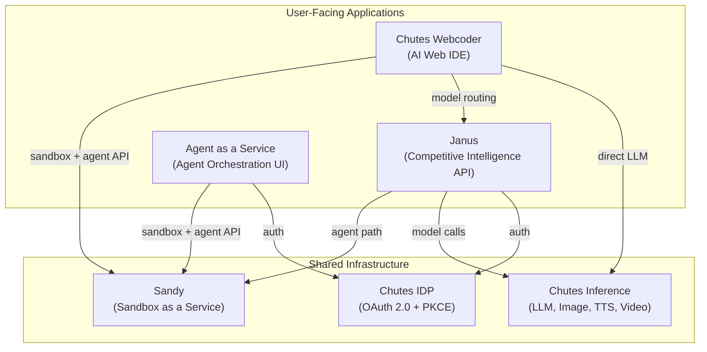

# Related Projects

Janus is part of the Chutes ecosystem. The projects below provide the infrastructure and frontend layers that Janus depends on or integrates with.

---

## Sandy -- Sandbox as a Service

**Repository**: `sandy/`
**Documentation**: [sandy/docs2/](../../sandy/docs2/)

Sandy is the sandbox-as-a-service platform that provides isolated execution environments for AI agents, code execution, and web development. It is the core infrastructure that powers the Janus agent path -- when a competitor determines a request is complex enough to require a full agent, it creates a Sandy sandbox (Firecracker micro-VM or Docker container) and runs a CLI agent inside it.

Sandy runs as a FastAPI application on port 7330 with a controller/worker architecture. The controller load-balances across worker nodes, each of which manages container sandboxes via the Quixand runtime. Sandy provides APIs for sandbox creation, file operations, command execution, agent orchestration, VNC access, and HTTP proxying into sandboxes.

**Janus uses Sandy for**:
- Running CLI agents (Claude Code, Aider, Codex, etc.) in isolated sandboxes during the agent path
- Serving artifacts created by agents via the sandbox HTTP server
- Warm pool of pre-created sandboxes for reduced cold start times
- Running competitor Docker containers for benchmark evaluation in the scoring service

**Documentation index**:

| File | Description |
|------|-------------|
| [01-architecture-overview.md](../../sandy/docs2/01-architecture-overview.md) | Controller/worker architecture, routing, upstream management |
| [02-security-model.md](../../sandy/docs2/02-security-model.md) | Isolation layers, authentication, network security |
| [03-sandbox-lifecycle.md](../../sandy/docs2/03-sandbox-lifecycle.md) | Creation, execution, teardown, resource limits |
| [04-agent-system.md](../../sandy/docs2/04-agent-system.md) | Agent orchestration, CLI agent support, streaming protocol |
| [05-model-router.md](../../sandy/docs2/05-model-router.md) | LLM model routing within Sandy |
| [06-ecosystem.md](../../sandy/docs2/06-ecosystem.md) | Integration with Chutes services and downstream consumers |
| [07-streaming-protocol.md](../../sandy/docs2/07-streaming-protocol.md) | SSE streaming format, event types, keep-alives |

---

## Agent as a Service -- Agent Orchestration Web UI

**Repository**: `agent-as-a-service-web/`
**Documentation**: [agent-as-a-service-web/docs2/](../../agent-as-a-service-web/docs2/)

Agent as a Service is the agent orchestration frontend for the Chutes ecosystem, live at [agent-as-a-service.online](https://agent-as-a-service.online). It wraps the Sandy sandbox infrastructure into a ready agent runtime, letting users launch Claude Code, Codex, Aider, and other AI agents inside hardened sandboxes with a single click.

The project is a zero-build static site (HTML + JS + CSS) deployed to Render. It provides two main pages: a marketing landing page and an authenticated ops console for managing sandboxes and agents. It communicates directly with the Sandy API and Chutes IDP for OAuth 2.0 + PKCE authentication.

**Relationship to Janus**: Agent as a Service provides a direct user-facing interface for the same Sandy sandbox infrastructure that Janus competitors use internally. While Janus abstracts agent execution behind the OpenAI Chat Completions API, Agent as a Service exposes the full sandbox and agent lifecycle to users.

**Documentation index**:

| File | Description |
|------|-------------|
| [01-architecture-overview.md](../../agent-as-a-service-web/docs2/01-architecture-overview.md) | Static site architecture, Sandy API integration, auth flow |
| [02-agent-orchestration.md](../../agent-as-a-service-web/docs2/02-agent-orchestration.md) | Agent launch, streaming, file management, VNC |
| [03-ops-console.md](../../agent-as-a-service-web/docs2/03-ops-console.md) | Authenticated admin console for sandbox management |

---

## Chutes Webcoder -- AI Web IDE

**Repository**: `chutes-webcoder/`
**Documentation**: [chutes-webcoder/docs2/](../../chutes-webcoder/docs2/)

Chutes Webcoder is an AI-powered web development IDE forked from [Open Lovable by Firecrawl](https://github.com/firecrawl/open-lovable). Users describe a React application in natural language, and the system generates code via multiple AI agents running inside Sandy sandboxes, rendering a live preview of the result -- all within a single-page Next.js application.

The project uses Next.js API routes to communicate with the Sandy API for sandbox creation, agent execution, file management, and live preview proxying. It supports multiple agent backends (Claude Code, Codex, Aider) and routes LLM calls through either the Janus model router or the Chutes LLM platform.

**Relationship to Janus**: Webcoder shares the same Sandy sandbox infrastructure and agent execution model as Janus competitors. It also uses the Janus model router for LLM calls when configured, making it both a consumer of Janus services and a parallel demonstration of the Sandy agent execution pattern.

**Documentation index**:

| File | Description |
|------|-------------|
| [01-architecture-overview.md](../../chutes-webcoder/docs2/01-architecture-overview.md) | Next.js architecture, Sandy integration, model routing |
| [02-sandbox-integration.md](../../chutes-webcoder/docs2/02-sandbox-integration.md) | Sandbox lifecycle, file sync, live preview proxying |
| [03-agent-system.md](../../chutes-webcoder/docs2/03-agent-system.md) | Agent backends, streaming, code application |

---

## Ecosystem Diagram

All three applications build on Sandy for isolated agent execution and Chutes for inference. Janus differentiates itself by adding the competition layer -- evaluating and ranking multiple implementations of the same API contract -- while Agent as a Service and Webcoder provide direct user access to the underlying agent infrastructure.
