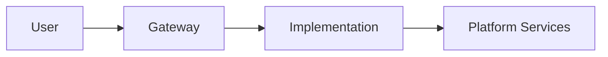

# Spec Generator Reference

This document captures all the context and patterns from a comprehensive spec-writing session. Use it as a reference when creating new specs for the Janus project.

## How to Use This File

When starting a new Claude Code session to add specs:
1. Reference this file: "Read spec_generator.md for context on how to write specs"
2. The agent will understand the project structure, terminology, and spec format
3. Follow the patterns established here for consistency

---

## Project Context

### What is Janus?

**Janus** is a competitive, decentralized intelligence platform built on Bittensor (Subnet 64). Key concepts:

- **Intelligence Engine**: An implementation that responds to user requests via an OpenAI-compatible API
- **The Rodeo**: The competition where miners submit implementations to compete for rewards
- **Janus Chat**: ChatGPT-like UI that calls the Janus API
- **Baseline**: Reference implementation that other miners improve upon

### Key Terminology

| Term | Meaning |
|------|---------|
| Intelligence engine | A Janus submission (NOT "agent") |
| Implementation | Docker container exposing OpenAI-compatible API |
| Miner | Developer who submits an implementation |
| The Rodeo | The Janus competition |
| Prize pool | Accumulating rewards claimed when someone takes #1 |
| Baseline | Reference implementation others build upon |
| Fast path | Direct LLM call for simple requests |
| Complex path | Agent sandbox with tools for complex requests |
| Sandy | Sandbox-as-a-service for code execution |
| Chutes | Decentralized AI compute platform (parent company) |

### Project Structure

```
janus-poc/
├── gateway/           # FastAPI gateway (routes to competitors)
├── baseline-agent-cli/ # Reference implementation
│   ├── janus_baseline_agent_cli/
│   │   ├── services/
│   │   │   ├── llm.py          # Direct LLM calls
│   │   │   ├── complexity.py   # Routes fast vs complex path
│   │   │   └── sandy.py        # Agent sandbox execution
│   │   └── main.py
│   └── agent-pack/    # Docs and scripts for agent sandbox
│       ├── models/    # Chutes API documentation
│       └── prompts/   # System prompts
├── ui/                # Next.js frontend
│   ├── src/
│   │   ├── app/       # Pages (/, /chat, /competition, /marketplace)
│   │   └── components/
│   └── public/        # Static assets
├── specs/             # Implementation specifications
│   ├── competition/   # Competition page overhaul specs
│   └── *.md           # Individual feature specs
└── scripts/           # Automation (Ralph loop)
```

---

## Spec Writing Patterns

### Spec File Format

Every spec should follow this structure:

```markdown
# Spec [NUMBER]: [Title]

## Status: DRAFT | IN_PROGRESS | COMPLETE

## Context / Why
[Why this change is needed. Background. Problem statement.]

## Goals
- [What we want to achieve]
- [Bullet list of objectives]

## Non-Goals
- [What we explicitly won't do]
- [Scope boundaries]

## Functional Requirements

### FR-1: [Requirement Name]
[Detailed description with code examples if applicable]

### FR-2: [Another Requirement]
...

## Non-Functional Requirements

### NFR-1: [Performance/Security/etc]
...

## API / Contracts (if applicable)
[Endpoint definitions, request/response formats]

## Acceptance Criteria
- [ ] [Testable criterion 1]
- [ ] [Testable criterion 2]
...

## Open Questions / Risks
1. [Unresolved question]
2. [Potential risk]

## Related Specs
- [Link to related spec]
```

### Mermaid Diagrams

Use Mermaid for flows and architecture:

```markdown

```

### Code Examples

Include copy-paste ready examples:

```markdown
```python
# Example: Complexity detection
if self._is_multimodal_request(text):
    return True, "multimodal_request"
```
```

---

## Session Summary: What Was Built

This session covered the following work:

### 1. Chat 404 Error Fix

**Problem**: Chat returned "model not found: baseline" error

**Root Cause**: `baseline-agent-cli/janus_baseline_agent_cli/services/llm.py` was passing `request.model` ("baseline") to the upstream LLM instead of `self._settings.model` ("gpt-4o-mini")

**Fix**: Changed lines 91 and 196 to always use `self._settings.model` for upstream API calls

### 2. Hero Image Update

Changed hero image from `hero-img.png` to `hero-img2.png` in:
- `ui/src/components/landing/HeroSection.tsx`
- Moved file to `ui/public/hero-img2.png`

### 3. Competition Page Overhaul Specs

Created 7 spec files in `specs/competition/`:

| File | Content |
|------|---------|
| `00_index.md` | Overview and implementation order |
| `01_competition_overview.md` | "The Rodeo" branding, intelligence terminology |
| `02_description_and_scoring.md` | Expanded scoring model, leaderboard columns |
| `03_steps_and_prize_pool.md` | 5 steps (Build→Earn), prize pool mechanism |
| `04_submission_and_open_source.md` | Submission requirements, open source, Bittensor hotkey |
| `05_architecture_overview.md` | Request flow, platform services, TEE security |
| `06_faq_and_marketplace.md` | Updated FAQ, component marketplace |

**Key themes captured:**
1. Intelligence, not agents — Replace "agent" with "intelligence implementation"
2. The Rodeo — Competition branding tied to janus.rodeo domain
3. Prize pool — Daily accumulation, claim on #1 change, transparent on-chain
4. Open source — Mandatory OSI license for all submissions
5. Bittensor integration — Hotkey required for attribution and payout
6. Clear architecture — Mermaid diagrams for request flow
7. Marketplace — Component developers earn when implementations use their work

### 4. Multimodal Routing Fix (Spec 24)

**Problem**: Requests like "generate me an image of a cat" went to fast path (direct LLM) instead of agent sandbox with image generation tools

**Root Cause**:
1. Complexity detector only had coding keywords, missing multimodal keywords
2. Sandy sandbox not configured in production

**Solution** (in `specs/24_multimodal_routing.md`):
1. Expand `COMPLEX_KEYWORDS` with image/audio/video/research terms
2. Add `_is_multimodal_request()` detection method
3. Configure `SANDY_BASE_URL` on Render
4. Optional "always agent" mode for full capabilities

---

## Prompts Reference

The user provided these key prompts during the session:

### Competition Page Overhaul Prompt

> Create a new folder inside this repo at `janus-poc/specs/competition/`. Generate multiple spec files (Markdown) that capture all required changes for overhauling the `janus.rodeo/competition` page.

Themes to cover:
1. Naming: "Janus Competition – The Rodeo"
2. Terminology: "Intelligence" not "agent"
3. Description: OpenAI-compatible API endpoint, not "miner"
4. Scoring: Expanded categories (chat, research, coding, multimodal)
5. Steps: Build, Evaluate, Submit, Compete, **Earn**
6. Prize pool: Accumulating mechanism, claim on #1 change
7. Open source: All submissions must be open source
8. Architecture: Flow diagrams, platform services
9. FAQ and Marketplace: Updated content

### Image Generation Investigation Prompt

> I tried "can you generate me an image of a cat?" and it said it can't generate images. Find out why this doesn't work and then send me a telegram message that explains it and create a spec to fix it.

Key investigation steps:
1. Check complexity detector keywords
2. Check Sandy configuration
3. Trace request flow through baseline
4. Verify agent-pack has the right docs

---

## Style Guidelines

### Terminology Rules

| Use This | NOT This |
|----------|----------|
| intelligence engine | AI agent |
| implementation | agent |
| Janus submission | miner's agent |
| The Rodeo | the competition (sometimes) |
| intelligence | artificial intelligence (verbose) |

### Tone

- **Bold**: Confident statements
- **Inclusive**: Welcome all implementation approaches
- **Exciting**: Convey stakes and competition energy
- **Technical**: Precise when describing APIs/architecture

### Diagram Style

Use Mermaid with clear labels:
- `flowchart TB` for vertical flows
- `flowchart LR` for horizontal flows
- `sequenceDiagram` for request/response flows
- Subgraphs for grouping related components

---

## Useful Commands

### Telegram Notifications

```bash
curl -s -X POST "https://api.telegram.org/bot$TG_BOT_TOKEN/sendMessage" \
  -d chat_id="$TG_CHAT_ID" \
  --data-urlencode text="Your message here"
```

### Render Deployment

Specs deployed automatically on push. Check status via Render MCP tools:
- `mcp__render__list_services` - List all services
- `mcp__render__list_deploys` - Check deployment status

### Testing

```bash
# Backend tests
cd baseline-agent-cli && pytest

# Frontend tests
cd ui && npm test

# Type checking
cd gateway && mypy janus_gateway
cd ui && npm run typecheck
```

---

## Future Spec Ideas

Based on this session, potential future specs:

1. **Agent Pack Expansion** - More Chutes model docs, better prompts
2. **Sandy Integration** - Production Sandy configuration, fallback handling
3. **Multimodal Response Handling** - Returning images/audio in chat responses
4. **Prize Pool Implementation** - On-chain mechanics, smart contracts
5. **Decentralized Review** - Validator panel for submissions
6. **Component Marketplace** - Submission portal, reward distribution

---

## Contact

For questions about Janus specs or this document:
- Discord: Check project channels
- GitHub: fstandhartinger/janus-poc
- Telegram: Use configured bot for updates
