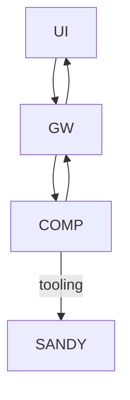

# Janus PoC Scope (MVP)

## Context / Why
We need a narrow MVP that proves the Janus concept end-to-end without implementing the
full competitive network or production security posture. This document enumerates what is
in scope and out of scope for the PoC.

## Goals
- Define the smallest viable feature set that demonstrates Janus end-to-end.
- Keep the scope compatible with current Chutes tooling and infrastructure.
- Ensure MVP requirements are testable and unambiguous.

## Non-goals
- Public marketplace for components.
- Production-grade TEE enforcement and attestation.
- Full billing, quota enforcement, or payments.
- Rich multimodal outputs beyond artifact links.

## Functional requirements
- **UI**: Chat UI with session list, streaming messages, markdown rendering, and image uploads.
- **Gateway**: Single stable endpoint, competitor selection, streaming proxy, artifact proxy.
- **Baseline competitor**: Fast-path for simple Q&A; CLI agent path for complex tasks.
- **Sandboxing**: Sandy-based sandbox for CLI agent execution.
- **Benchmarking**: Minimal suite with public train/dev and private test stubs.
- **Guardrails**: Egress only via platform services; enforced or stubbed but documented.

## Non-functional requirements
- Local dev must run on a single machine without distributed dependencies.
- The UI should remain responsive during long-running streamed requests.
- Baseline competitor should be deterministic enough for repeated tests.

## API/contracts
- Gateway provides `/v1/chat/completions` and `/v1/models` (minimal) for UI.
- Competitor must expose `/v1/chat/completions` and `/health`.
- Streaming must follow SSE conventions and emit `reasoning_content` updates.

## Data flow

## Acceptance criteria
- MVP includes exactly one selectable competitor (baseline), but the registry can list more.
- UI can send a prompt with an image attachment and render streamed responses.
- Gateway returns a valid OpenAI-compatible SSE stream end-to-end.
- Benchmark runner can execute against the gateway and output a composite score.

## Open questions / risks
- Is a minimal `/v1/models` endpoint needed for UI convenience?
- Should the gateway enforce timeouts, or only surface competitor timeouts?
