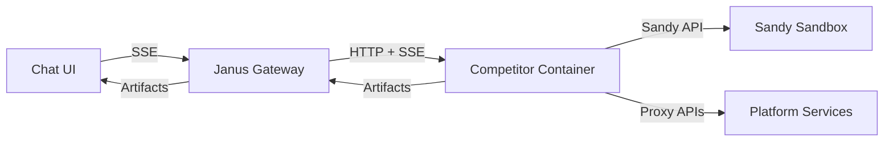

# Janus PoC Architecture

## Status: COMPLETE

## Context / Why
The PoC must reflect the eventual production architecture: competitor containers run in
isolated environments with controlled egress, while a gateway enforces contracts and
exposes a stable API to clients. This spec outlines the core components, boundaries, and
flows.

## Goals
- Define the runtime topology and component boundaries.
- Preserve OpenAI Chat Completions compatibility.
- Make Sandy the sandboxing backbone for agent execution.
- Align with established Chutes conventions (FastAPI, Next.js, env-based config).

## Non-goals
- Full distributed scheduling across multiple nodes.
- Production-grade TEE enforcement.
- Full multi-tenant auth and billing.

## Functional requirements
- The UI talks only to the Gateway.
- The Gateway forwards requests to the selected competitor container.
- Competitors may call platform services via whitelisted endpoints.
- The baseline competitor uses Sandy to run a CLI agent when needed.
- Artifact links are retrievable via a sandbox file server or base64 links (gateway may proxy).

## Non-functional requirements
- Gateway must be stateless and horizontally scalable.
- Competitor containers must run with strict resource limits.
- Streaming must be continuous with keep-alives.
- Observability is required (logs + basic metrics).

## API/contracts
- OpenAI-compatible `/v1/chat/completions` at the gateway.
- Competitor contract defined in `specs/10_competitor_submission.md`.
- Platform services are accessed via gateway-approved base URLs.

## Data flow

## Architecture notes
- **Gateway**: FastAPI service similar to `chutes-bench-runner` backend patterns (pydantic
  settings, env-based config, structured logging).
- **UI**: Next.js app modeled on `chutes-knowledge-agent` (React 19, Tailwind, markdown
  rendering via `react-markdown` + `remark-gfm`).
- **Sandboxing**: Use Sandy for CLI agent execution (see `specs/08_sandy_integration.md`).
- **Benchmark runner**: Reuse `chutes-bench-runner` patterns for runs, scoring, and reporting.
- **Squad patterns** (if present in the monorepo) are optional and must not be required for
  competitor submissions.

## Acceptance criteria
- Architecture clearly separates UI, gateway, competitor containers, and Sandy.
- Each boundary has a defined API contract.
- The diagram matches the required data flow.
- An agent can trace a request across components using logs and headers.

## Open questions / risks
- How will competitor images be distributed to Sandy in a production-like setup?
- Should the gateway include a lightweight scheduler for sandbox capacity?
