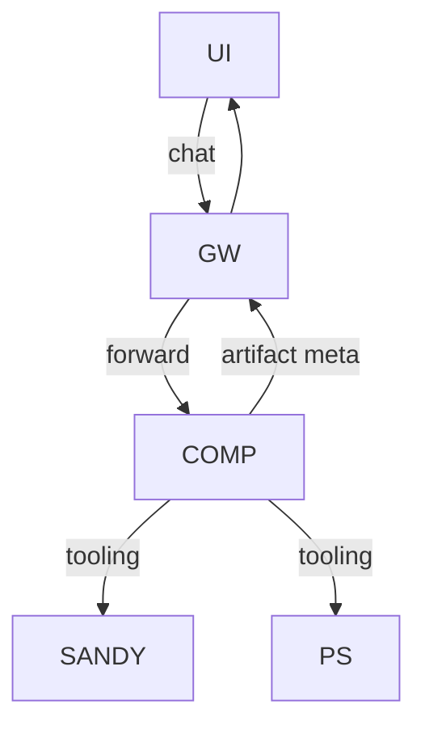

# Janus PoC Components

## Status: COMPLETE

## Context / Why
This PoC is composed of several services that must interoperate cleanly. This document
defines each component's responsibilities and interfaces.

## Goals
- Provide clear ownership and interfaces for each component.
- Enable a coding agent to implement each piece independently.

## Non-goals
- Full production deployment topology.
- Multi-tenant account management.

## Functional requirements
- **Chat UI**: session list, chat view, streaming, attachments, artifact links.
- **Janus Gateway**: OpenAI-compatible API, competitor registry, streaming proxy, artifact proxy.
- **Competitor Container**: implements `/v1/chat/completions` with streaming and `/health`.
- **Baseline Competitor**: CLI agent + Sandy integration, tool calls, artifacts.
- **Platform Services**: web proxy/search, vector search, Chutes inference proxy, Sandy API.
- **Benchmark Runner**: CLI + report outputs; optional UI later.

## Non-functional requirements
- Gateway and competitor containers should be stateless.
- All components must be configurable via environment variables.
- Logs should be structured and machine-readable.

## API/contracts
- UI -> Gateway: OpenAI `/v1/chat/completions` + optional `/v1/models`.
- Gateway -> Competitor: OpenAI `/v1/chat/completions`.
- Competitor -> Platform services: whitelisted base URLs only.
- Gateway -> UI: SSE streaming, artifact proxy.

## Data flow

## Component details
- **Chat UI (Next.js)**
  - Reuse layout and markdown rendering patterns from `chutes-knowledge-agent`.
  - Expose an optional "Thinking" panel that renders `reasoning_content` stream.

- **Janus Gateway (FastAPI)**
  - Reuse env-based config patterns from `chutes-bench-runner`.
  - Maintain a simple registry of competitors with IDs and target URLs.
  - Start/stop competitor containers for local dev (Docker) or a Sandy-backed mode.
  - Stream pass-through with optional gap keep-alives.

- **Competitor Containers**
  - Must obey OpenAI request/response schemas and Janus streaming contract.
  - Should emit artifact descriptors for non-text outputs.

- **Baseline Competitor (CLI agent)**
  - Uses Sandy to run a CLI agent inside a sandbox.
  - Implements a fast-path for simple prompts without sandbox usage.
  - Runs a sandbox file server for artifact URLs or emits base64 `data:` URLs.

- **Benchmark Runner**
  - Mirrors `chutes-bench-runner` worker pattern: deterministic subsets and structured results.

## Acceptance criteria
- Each component has a clear interface and ownership scope.
- Reuse of Sandy, knowledge-agent, and bench-runner patterns is explicit.
- An agent can map each component to a test category (unit, integration, UI, smoke).

## Open questions / risks
- What minimum set of platform services must be available for the baseline to be competitive?
