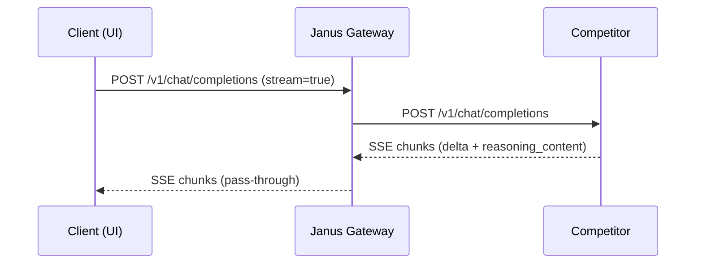

# OpenAI API Compatibility

## Context / Why
Janus competitors must be OpenAI Chat Completions compatible to reduce friction for
clients and to reuse existing tooling. This document defines the supported subset and
Janus-specific extensions.

## Goals
- Maintain request/response compatibility with OpenAI Chat Completions.
- Specify supported fields and known differences.
- Define Janus extensions for streaming and artifacts.

## Non-goals
- Full compatibility with OpenAI Assistants API.
- Full support for all tool schemas or new response formats.

## Functional requirements
- Support `POST /v1/chat/completions` with OpenAI-compatible schema.
- Support message content as a string or as a list of content parts.
- Support `stream: true` with SSE chunks.
- Emit `reasoning_content` (or Janus extension) for intermediate steps.
- Include artifact descriptors in responses when non-text output is produced.

## Non-functional requirements
- Validation must be strict enough to reject malformed payloads.
- Requests and responses should be JSON-serializable and stable across versions.

## API/contracts
### Supported request fields
- `model` (string, required)
- `messages` (array, required)
- `temperature` (number, optional)
- `top_p` (number, optional)
- `max_tokens` (number, optional)
- `stream` (boolean, optional)
- `stream_options.include_usage` (boolean, optional)
- `tools` (array, optional)
- `tool_choice` (string | object, optional)
- `response_format` (object, optional)
- `user` (string, optional)
- `metadata` (object, optional)

### Supported message roles
- `system`, `user`, `assistant`, `tool`

### Supported content parts
- `text`
- `image_url` (for multimodal input)

### Janus extensions
- `assistant.message.artifacts` (array of artifact descriptors)
- `choices[].delta.reasoning_content` (streaming intermediate steps)
- `choices[].delta.janus` (optional structured event envelope)

### Known differences from OpenAI
- `reasoning_content` is emitted even for non-reasoning models (may be empty).
- `artifacts` are included as a structured array rather than inline markdown.

## Data flow

## Acceptance criteria
- Requests with text-only and text+image content are accepted.
- Streaming responses contain valid OpenAI-style chunk envelopes.
- Responses can include artifacts via the Janus extension.

## Open questions / risks
- Should we support `response_format: { type: "json_schema" }` in PoC?
