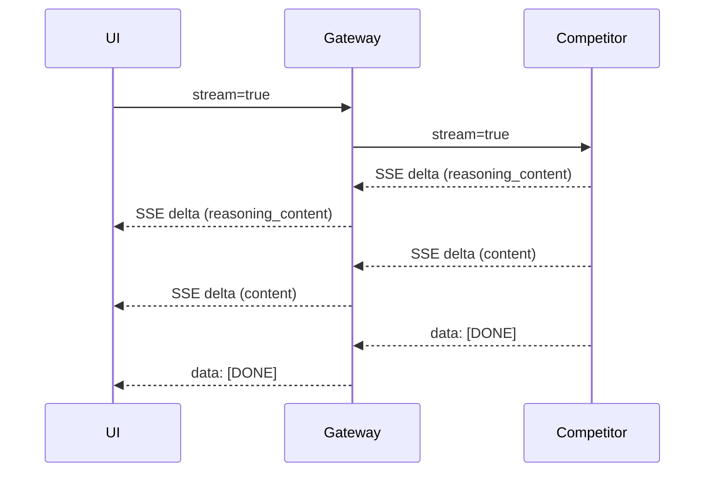

# Streaming Contract

## Context / Why
Janus differentiates itself by requiring continuous streaming during internal processing.
Intermediate reasoning, tool activity, and sandbox lifecycle events must be observable in
real time while the final user response streams as normal `content` tokens.

## Goals
- Define a strict, testable streaming requirement.
- Keep SSE payloads OpenAI-compatible.
- Provide a structured extension for tool and sandbox events.

## Non-goals
- A custom websocket protocol.
- Full support for OpenAI Realtime API.

## Functional requirements
- Use Server-Sent Events (`text/event-stream`) for streaming.
- Emit incremental chunks using OpenAI `chat.completion.chunk` format.
- Stream `reasoning_content` during tool use and long-running steps.
- Emit keep-alive events if no output is available.
- End the stream with a final `data: [DONE]`.

## Non-functional requirements
- **Time-to-first-token (TTFT):** <= 2s (local dev target).
- **Max gap:** <= 2s between SSE events; keep-alives count.
- **Reliability:** Gateway must not buffer; it must stream pass-through.
 - **Timeout:** Streams may run up to 5 minutes by default without gateway termination.

## API/contracts
### Chunk envelope (OpenAI-compatible)
Each SSE `data:` line contains JSON with fields:
- `id`, `object: "chat.completion.chunk"`, `created`, `model`
- `choices[0].delta.content` for final response text
- `choices[0].delta.reasoning_content` for intermediate steps
- Optional `choices[0].delta.janus` for structured event payloads

### Keep-alive
Use SSE comment frames:
```
: ping

```

### Structured event extension (optional)
If emitting structured events, use:
```
"janus": {
  "event": "tool_start" | "tool_end" | "sandbox_start" | "sandbox_end",
  "payload": { ... }
}
```

## Data flow


## Acceptance criteria
- A long-running tool call still yields SSE updates at least every 2 seconds.
- `reasoning_content` appears during tool calls and sandbox lifecycle events.
- Stream termination uses `[DONE]` and includes usage if requested.
 - An integration test verifies a 3-5 minute stream stays open and emits keep-alives.

## Open questions / risks
- Should we allow competitors to emit `event:` frames, or only OpenAI-compatible `data:`?
