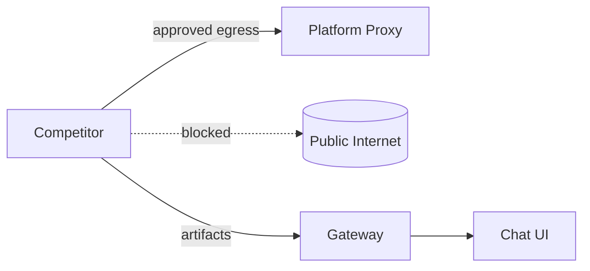

# Security and Guardrails

## Status: COMPLETE

## Context / Why
Competitor containers are untrusted. The PoC must outline guardrails for network egress,
resource usage, and artifact handling, while acknowledging that production-grade controls
(e.g., CPU TEEs) are out of scope for now.

## Goals
- Define minimal PoC guardrails and the production direction.
- Prevent direct access to external paid APIs.
- Reduce risk of benchmark leakage or artifact exfiltration.

## Non-goals
- Full TEE attestation.
- Complete malware scanning and binary analysis.

## Functional requirements
- All outbound requests from competitors must go through platform proxies.
- Competitors must not have direct internet egress by default.
- Artifacts must be retrievable only via the gateway.
- Gateway must enforce per-request timeouts and size limits.

## Non-functional requirements
- Guardrails must be documented even if enforcement is stubbed in PoC.
- Security logging should capture violations and unusual egress attempts.

## API/contracts
- Platform proxy endpoints (web/search/vector/sandbox) are the only allowed egress.
- Competitor responses must include `usage` and optional cost estimates.

## Data flow

## Guardrail policies
- **Network**: deny all outbound except proxy allowlist.
- **Secrets**: no external API keys exposed to competitors.
- **Artifacts**: only gateway-hosted URLs; no direct external links.
- **Benchmarks**: private test data stored offline; never mounted into competitor containers.
- **Sandbox**: CLI agents run in Sandy with resource limits and short TTLs.

## Acceptance criteria
- Specs define explicit allowlist endpoints and enforcement points.
- Risk areas (benchmark leakage, exfiltration) have mitigation strategies.
- A smoke test confirms direct outbound HTTP is blocked while proxy endpoints succeed.

## Open questions / risks
- Can we safely allow limited outbound HTTPS to a curated allowlist in PoC?
- How to detect and rate-limit prompt injection attempts to bypass proxies?
