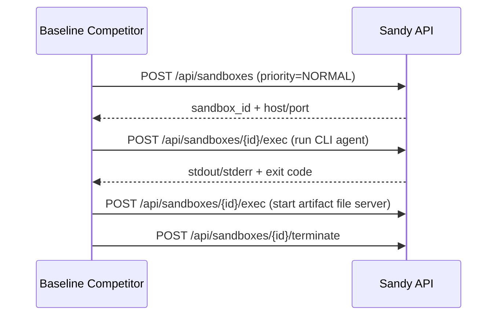

# Sandy Integration

## Status: COMPLETE

## Context / Why
Sandy is the sandbox-as-a-service used across Chutes projects. Janus PoC should reuse
Sandy for CLI agent execution and treat it as the PoC stand-in for TEE-like isolation.

## Goals
- Reuse Sandy API for sandbox creation, exec, and file operations.
- Align with Sandy configuration and priority model.
- Make sandbox usage explicit in the baseline competitor.

## Non-goals
- Replacing Sandy with a custom sandbox implementation.
- Running competitor containers directly inside Sandy for PoC (optional extension).

## Functional requirements
- Baseline competitor can create a Sandy sandbox on-demand.
- Baseline competitor can run a CLI agent inside the sandbox via `/api/sandboxes/{id}/exec` or
  `/api/sandboxes/{id}/agent/run`.
- Sandbox resources and TTL are enforced via Sandy settings.
- Sandbox events (create, exec, terminate) are surfaced in `reasoning_content`.
- Sandboxes run a lightweight HTTP server that exposes `/artifacts/*` from the sandbox filesystem.
 - Artifact server port is configurable via `JANUS_ARTIFACT_PORT` (default 8787).

## Non-functional requirements
- Sandbox startup time should be < 10s in local dev.
- Sandboxes must be preemptable for low priority benchmark runs.
 - Sandbox job timeout defaults to **5 minutes** and is configurable via env.

## API/contracts
### Required Sandy endpoints
- `POST /api/sandboxes` (create)
- `POST /api/sandboxes/{sandbox_id}/exec`
- `POST /api/sandboxes/{sandbox_id}/files/write`
- `GET /api/sandboxes/{sandbox_id}/files/read`
- `POST /api/sandboxes/{sandbox_id}/terminate`

### Environment variables (gateway / competitor)
- `SANDY_BASE_URL`
- `SANDY_API_KEY`
- `SANDY_PREFERRED_UPSTREAM` (optional)
- `SANDY_DOCKER_UPSTREAM` (optional, for docker socket workflows)

## Data flow

## Integration notes
- Sandy uses a FastAPI service with Docker-based sandboxes.
- For CLI agent workflows, use Sandy's `agent/run` if available; otherwise shell out via `exec`.
- For future TEE-like isolation, map Sandy sandboxes to TEE nodes (conceptual alignment).
- The artifact file server should bind to a known port and path, and be reachable via the
  Sandy proxy URL.

## Acceptance criteria
- Baseline competitor can run a CLI agent in a Sandy sandbox and return results.
- Sandbox lifecycle events are streamed in `reasoning_content`.
- A smoke test fetches `http(s)://<sandbox>/artifacts/<file>` and validates the payload.

## Open questions / risks
- Should the gateway manage sandbox lifecycles, or should competitors manage their own?
- Do we need `enableDockerSocket` for any PoC use cases?
