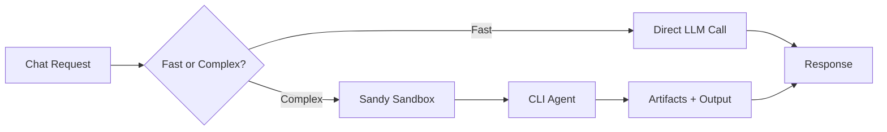

# Reference Implementation: CLI Agent Baseline

## Status: COMPLETE

## Context / Why
The baseline competitor sets the minimum bar for miners. It must be strong enough to
handle simple chat tasks quickly and complex tasks via a CLI agent inside Sandy.

## Goals
- Provide a competitive, reproducible baseline.
- Demonstrate tool use, artifacts, and streaming reasoning.
- Keep the implementation aligned with existing Chutes tooling.

## Non-goals
- A state-of-the-art autonomous agent or multi-agent system.
- Support for proprietary closed-source agent frameworks only.

## Functional requirements
- Expose `/v1/chat/completions` and `/health`.
- Implement a **fast path** for short, simple prompts (no sandbox).
- Implement a **complex path** that:
  1) Creates a Sandy sandbox.
  2) Runs a CLI agent with an "agent pack".
  3) Collects outputs and artifacts.
- Stream intermediate steps via `reasoning_content`.
- Generate artifact descriptors for files produced in the sandbox.

## Non-functional requirements
- Sandbox runs should be bounded by a configurable timeout (default **5 minutes**).
- The baseline should be deterministic enough for scoring in benchmarks.

## API/contracts
- OpenAI-compatible request/response with Janus extensions.
- Uses platform services for web search, vector search, and model calls.

## Baseline agent selection
- **Default agent**: Aider CLI (open source, configurable).
- **Fallback**: OpenHands or OpenCode CLI if Aider is unavailable.
- **Config**: Agent choice set via `JANUS_BASELINE_AGENT` env var.

## Agent pack concept
- A versioned directory containing:
  - system prompt
  - tool definitions (MCP or CLI wrappers)
  - sandbox bootstrap scripts
  - model config (Chutes model IDs)
- The agent pack is mounted or copied into the Sandy sandbox before execution.
- The sandbox starts a lightweight file server for artifacts (see `specs/06_artifacts_and_files.md`).
 - Artifact server port is configurable via `JANUS_ARTIFACT_PORT`.

## Data flow

## Acceptance criteria
- **Fast path**: A unit test sends a short prompt and verifies no Sandy API calls were made.
- **Complex path**: An integration test triggers the sandbox path and verifies:
  - `POST /api/sandboxes` is called.
  - Aider runs inside the sandbox and produces at least one file artifact.
  - The response includes `artifacts[]` with valid URLs or base64 links.
- **Streaming**: An SSE test verifies `reasoning_content` includes sandbox lifecycle events.
- **Timeout**: A test configures a 5-minute timeout and confirms a long task is terminated at ~300s.

## Open questions / risks
- How to detect "complex" prompts reliably without adding latency?
