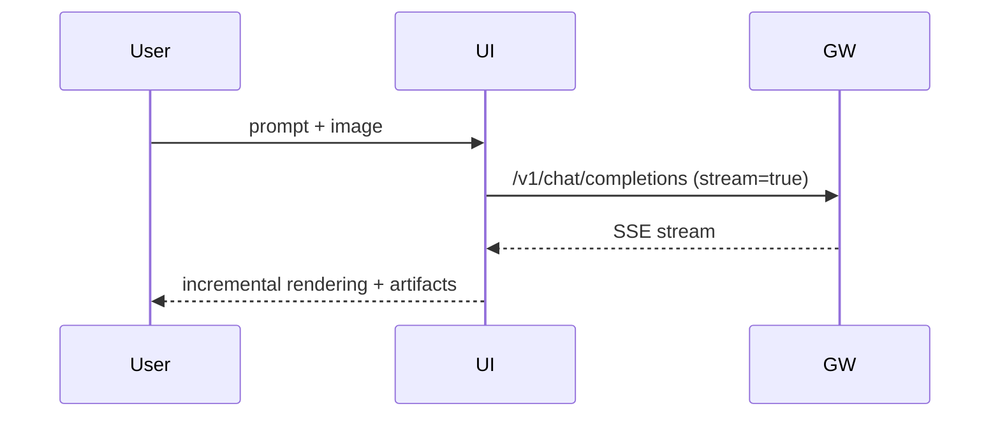

# Chat UI (MVP)

## Status: COMPLETE

## Context / Why
The PoC needs a minimal but polished ChatGPT-like UI to demo the Janus experience and
streaming behavior. The UI should reuse patterns from `chutes-knowledge-agent`.

**Note**: The Chat UI is now one section of the larger Janus application. It lives at `/chat`
while the root `/` is the Landing Page (spec 18). Other pages include Competition (spec 19)
and Marketplace (spec 20). The chat app may be referred to as "Manus Chat" in the UI.

## Goals
- Provide a clean, minimal chat UX with streaming.
- Support multimodal input (text + image upload).
- Surface reasoning/steps in a collapsible panel.
- Follow the Chutes style guide for premium dark mode aesthetic.

## Non-goals
- Full user accounts or cloud sync.
- Advanced multi-modal rendering beyond artifact links.

## Functional requirements
- Left sidebar with session list (new chat, history).
- Main chat area with message bubbles and markdown rendering.
- Real-time streaming with incremental rendering.
- Upload attachments (image files). Convert to data URL or use gateway upload endpoint.
- Render artifact links with filename and size.
 - Support artifact links that are either HTTP URLs or base64 `data:` URLs.
- Toggle "Thinking" panel to show streamed `reasoning_content`.
- Dropdown or pill selector for competitor choice (baseline only in MVP).

## Non-functional requirements
- UI must remain responsive for long responses.
- Reasoning panel should be optional and collapsed by default.

## API/contracts
- Calls `POST /v1/chat/completions` on the gateway.
- Uses SSE for streaming.
- Accepts artifact URLs from gateway.

## Data flow


## UI implementation notes
- Use Next.js (React 19) patterns from `chutes-knowledge-agent`.
- Use `react-markdown` + `remark-gfm` for markdown rendering.
- Follow the Chutes style guide (`/home/flori/Dev/chutes/style/chutes_style.md`):
  - Dark background with aurora gradient overlays
  - Glass morphism cards and inputs
  - Tomato Grotesk typography
  - Moss green (`#63D297`) for primary accents
  - Chat input styling per the style guide's `.chat-input-container`

## Page structure
The chat app lives at `/chat` within the Janus application:

```
/app
  /page.tsx          → Landing page (spec 18)
  /chat
    /page.tsx        → Chat app (this spec)
  /competition
    /page.tsx        → Competition page (spec 19)
  /marketplace
    /page.tsx        → Marketplace page (spec 20)
```

The chat page should include:
- Shared navigation header (links to all pages)
- Full-height chat interface with sidebar
- Aurora background gradient (as shown in chutes_chat_page.png)

## Acceptance criteria
- A Playwright test uploads an image and submits a prompt.
- Streaming responses appear incrementally in the chat area (validated by DOM updates).
- Reasoning panel shows streamed intermediate steps and can be toggled.
- Artifact links are visible and downloadable; clicking a link triggers a successful fetch.

## Open questions / risks
- Should attachments be uploaded to the gateway first or inlined as data URLs?
- How to handle very large markdown outputs without UI lag?
