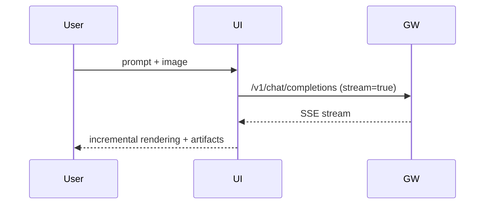

# Chat UI (MVP)

## Context / Why
The PoC needs a minimal but polished ChatGPT-like UI to demo the Janus experience and
streaming behavior. The UI should reuse patterns from `chutes-knowledge-agent`.

## Goals
- Provide a clean, minimal chat UX with streaming.
- Support multimodal input (text + image upload).
- Surface reasoning/steps in a collapsible panel.

## Non-goals
- Full user accounts or cloud sync.
- Advanced multi-modal rendering beyond artifact links.

## Functional requirements
- Left sidebar with session list (new chat, history).
- Main chat area with message bubbles and markdown rendering.
- Real-time streaming with incremental rendering.
- Upload attachments (image files). Convert to data URL or use gateway upload endpoint.
- Render artifact links with filename and size.
- Toggle "Thinking" panel to show streamed `reasoning_content`.
- Dropdown or pill selector for competitor choice (baseline only in MVP).

## Non-functional requirements
- UI must remain responsive for long responses.
- Reasoning panel should be optional and collapsed by default.

## API/contracts
- Calls `POST /v1/chat/completions` on the gateway.
- Uses SSE for streaming.
- Accepts artifact URLs from gateway.

## Data flow

## UI implementation notes
- Use Next.js (React 19) patterns from `chutes-knowledge-agent`.
- Use `react-markdown` + `remark-gfm` for markdown rendering.
- Provide lightweight styling via Tailwind or CSS modules.

## Acceptance criteria
- A user can upload an image and send a prompt.
- Streaming responses appear incrementally in the chat area.
- Reasoning panel shows streamed intermediate steps.
- Artifact links are visible and downloadable.

## Open questions / risks
- Should attachments be uploaded to the gateway first or inlined as data URLs?
- How to handle very large markdown outputs without UI lag?
