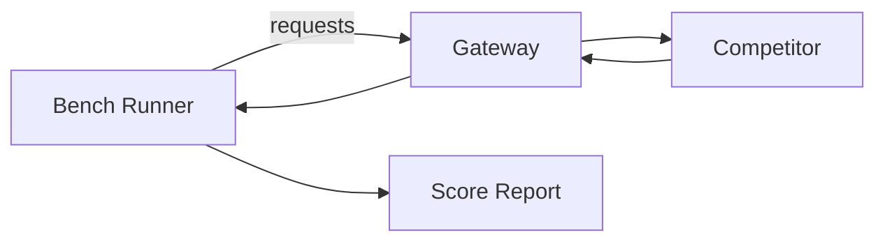

# Benchmarking and Scoring (PoC)

## Context / Why
We need a minimal evaluation harness that reuses `chutes-bench-runner` patterns but is
simple enough for PoC. The goal is to produce a composite score that compares competitors.

## Goals
- Define a minimal suite (public train/dev + private test stubs).
- Measure speed, cost, quality, streaming continuity, and modality handling.
- Provide a CLI workflow for local evaluation.
 - Integrate benchmarks into `chutes-bench-runner` patterns.

## Non-goals
- Full-scale benchmark coverage or large datasets.
- External judge services beyond simple LLM scoring.

## Functional requirements
- **Bench suites**:
  - `public/train` (visible data for iteration)
  - `public/dev` (visible, scored)
  - `private/test` (hidden stubs for future)
- **Task types**:
  - Simple chat quality (short Q&A)
  - Research correctness (small set)
  - Coding correctness (small set)
  - Streaming continuity (gap checks)
  - Multimodal handling (text + image)
- **CLI**:
  - `janus-bench run --target <gateway-url> --suite public/dev`
  - Output JSON results + summary table
 - **Bench-runner integration**:
   - Add a Janus benchmark module in `chutes-bench-runner` backend/worker.
   - Use the same run/result schema and export patterns (JSON + signed bundle optional).

## Non-functional requirements
- Bench runs must be reproducible (seeded sampling).
- Scores should be computed deterministically.

## API/contracts
- Bench runner calls the gateway’s `/v1/chat/completions` endpoint.
- Streaming metrics measured from SSE timestamps.

## Data flow

## Scoring (PoC)
Composite score (0-100):
- **Quality**: 45%
- **Speed** (P50 latency, TTFT): 20%
- **Cost** (token + sandbox seconds): 15%
- **Streaming continuity** (max gap, keep-alives): 10%
- **Multimodal handling**: 10%

## Acceptance criteria
- Bench runner can execute a small suite and output a composite score.
- Streaming continuity checks report max gap and TTFT.
- Results are stored in a structured JSON file.
- A smoke test runs against the gateway locally and via a Render deployment.

## Open questions / risks
- Should quality be judged via static references or LLM judges in PoC?
- How to ensure private test data cannot leak into competitor containers?
