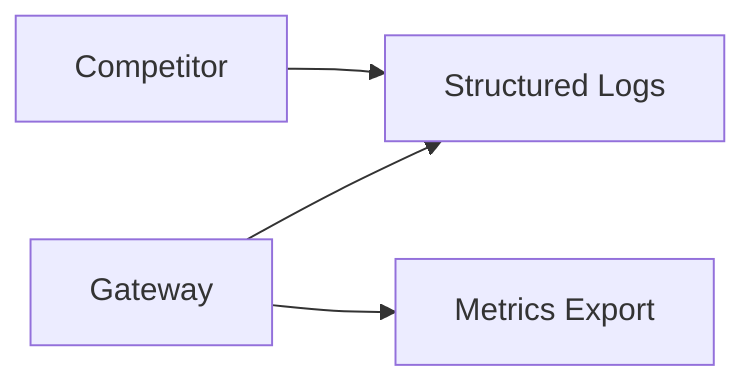

# Ops and Observability

## Context / Why
The PoC should be debuggable and measurable. Logs, metrics, and a small set of operator
commands will keep development efficient and enable future production hardening.

## Goals
- Define baseline logging and metrics for gateway and competitors.
- Provide a minimal runbook for debugging.
- Specify developer automation commands (slash-command style).

## Non-goals
- Full distributed tracing with production-grade APM.
- Multi-tenant alerting.

## Functional requirements
- **Gateway logs**: request ID, competitor ID, latency, status, bytes streamed.
- **Competitor logs**: tool events, sandbox lifecycle, errors.
- **Metrics**: request count, error rate, TTFT, max gap, sandbox usage.
- **Health checks**: `/health` for gateway and competitors.
 - **Deployment visibility**: capture Render deploy logs and post-deploy health checks.
 - **Environment parity**: env vars align with existing repos (`sandy`, `chutes-bench-runner`,
   `chutes-knowledge-agent`, `chutes-search`).

## Non-functional requirements
- Logs are JSON-structured and line-delimited.
- Metrics can be scraped or emitted in JSON for PoC.
 - Log volume should be sufficient for replaying the request timeline (tool calls, gaps, errors).

## API/contracts
- `GET /metrics` (optional) returns JSON or Prometheus format.
- `GET /health` returns `{ "status": "ok" }` and version info.

## Data flow

## Operator workflow (slash-command style)
Define scripts in the repo root that map to the following commands:
- `/autonomous` -> run the full local pipeline (gateway + UI + baseline)
- `/test-all` -> run unit, integration, and smoke tests
- `/visual-test` -> run browser automation click tests
- `/verify-complete` -> run lint + tests + type checks + contract validation
- `/deploy-watch` -> tail deploy logs and health checks
- `/notify-telegram` -> send a short status update
- `/audio-telegram` -> send an audio status update

These should be implemented as shell scripts or `make` targets in a future build. For PoC
specs, define expected inputs/outputs and error behavior.

## Validation checklist (agent-friendly)
- Run unit tests, integration tests, and smoke tests (local + deployed).
- Verify SSE streaming gaps and TTFT from logs or timestamps.
- Use Playwright/MCP browser tests to validate UI flows.
- Run the build locally and confirm a production build succeeds.
- Deploy via Render MCP and monitor deploy logs until health checks pass.
- Confirm env vars by diffing against known projects in `/home/flori/Dev/chutes/*`.

## Acceptance criteria
- Logs and metrics fields are defined and consistent across components.
- A minimal set of operator commands is documented.
- A test plan exists that can be executed by an AI agent (unit/integration/smoke/UI).
 - Env var names are documented and match existing conventions in other Chutes repos.

## Open questions / risks
- Should we standardize on OpenTelemetry in PoC or defer to later?
- Where should metrics be persisted in local dev?
