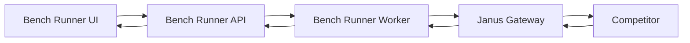

# Bench Runner Integration

## Status: COMPLETE

> **Note**: The core benchmark functionality is implemented in the standalone `janus-bench` CLI tool
> (see `bench/`). Integration into `chutes-bench-runner` is deferred to that repository.

## Context / Why
Janus benchmarking should reuse the existing `chutes-bench-runner` architecture so we can
leverage its worker orchestration, run metadata, exports, and UI patterns. This spec
defines how Janus benchmarks are added to the bench-runner codebase.

## Goals
- Integrate Janus benchmarks as a first-class suite in `chutes-bench-runner`.
- Reuse runner data models, exports, and scoring patterns.
- Provide an agent-friendly path to validate locally and on Render.

## Non-goals
- Full UI redesign of bench-runner.
- Large-scale datasets or gated benchmarks.

## Functional requirements
- Add a **Janus** benchmark module in `chutes-bench-runner/backend`.
- Use existing run/result schemas and export formats.
- Add a minimal CLI entry or script that can trigger Janus runs locally.
- Store benchmark prompts and expected outputs under a Janus-specific dataset directory.
- Provide JSON output that includes streaming metrics (TTFT, max gap).

## Non-functional requirements
- Deterministic sampling and scoring.
- Runs must be reproducible across machines.
- The integration should not break existing benchmark suites.

## API/contracts
- Bench runner calls Janus Gateway `/v1/chat/completions`.
- Results include `usage` and streaming metrics fields.

## Data flow

## Implementation notes (aligned with chutes-bench-runner)
- Follow patterns in `chutes-bench-runner/backend/app/benchmarks/*`.
- Add a Janus benchmark registry entry for selection and scoring.
- Reuse the existing worker queue and run model in `backend/app/worker/*`.
- Add JSON schema for Janus tasks (prompt, expected answer, type, multimodal inputs).
- Record per-item metrics: latency, TTFT, max gap, usage tokens, sandbox seconds.

## Acceptance criteria
- A unit test verifies that the Janus benchmark suite registers successfully.
- An integration test triggers a Janus run and stores results in the DB.
- A smoke test runs Janus via the bench-runner UI or API and produces a JSON export.
- Streaming metrics appear in per-item results and in the aggregate report.

## Open questions / risks
- Should Janus benchmarks reuse the existing export signing flow in PoC?
- Is a separate worker needed for long-running Janus tasks?
