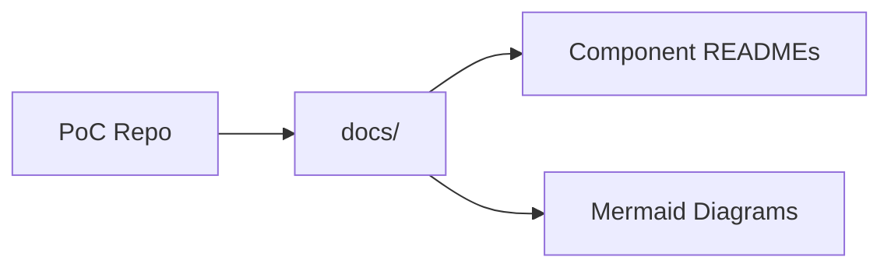

# Documentation and Diagrams

## Context / Why
The PoC must be easy to understand and reproducible. We require explicit documentation
and diagrams that explain what was built, how to run it, and how to validate it.

## Goals
- Produce implementation README files per component.
- Generate architecture and flow diagrams (Mermaid).
- Document validation steps and deployment notes.

## Non-goals
- Full user-facing marketing documentation.
- Interactive docs portal.

## Functional requirements
- Create a top-level `README.md` for the PoC repo (already present, expand post-implementation).
- Add component READMEs:
  - `gateway/README.md`
  - `ui/README.md`
  - `baseline/README.md`
- Add a `docs/` folder with:
  - `architecture.md` (diagrams + narrative)
  - `runbook.md` (ops checklist and troubleshooting)
- Include Mermaid diagrams for:
  - UI -> Gateway -> Competitor -> Sandbox flow
  - Artifact retrieval flow
  - Benchmarking flow

## Non-functional requirements
- Docs must be kept in sync with the code and configs.
- Diagrams must render in GitHub Markdown without syntax errors.

## API/contracts
- Not applicable.

## Data flow

## Acceptance criteria
- Each component README includes: install, run, test, env vars, and health-check steps.
- `docs/architecture.md` includes at least three Mermaid diagrams.
- A documentation check script validates that required files exist.
- An AI agent can follow the README to run the system locally and on Render.

## Open questions / risks
- Should docs be auto-generated from source annotations in a later phase?
