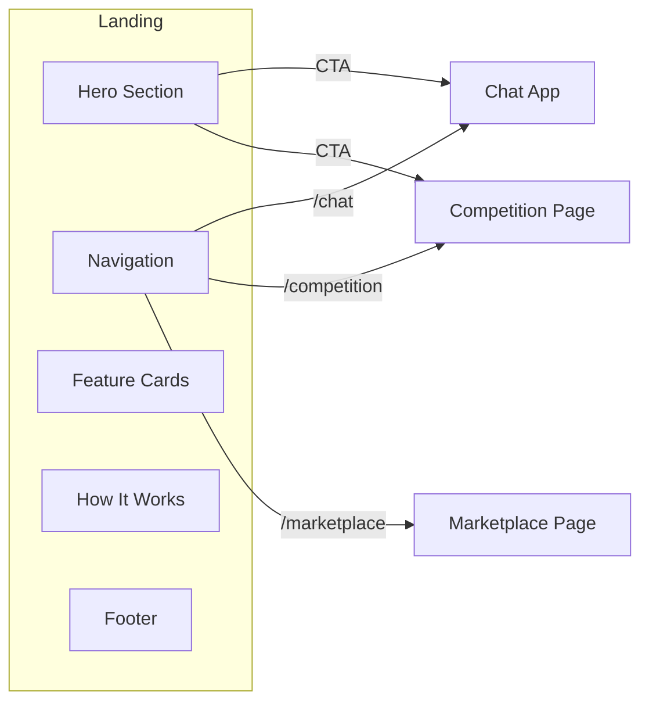

# Landing Page (janus.rodeo)

## Status: COMPLETE

## Context / Why

The Janus PoC needs a striking landing page that introduces the project, establishes the brand identity, and provides navigation to the main sections: the Chat App ("Manus"), the Competition page, and the Marketplace. The landing page should evoke the spirit of the domain **janus.rodeo** — the Roman god Janus riding a bull, symbolizing duality (past/future, input/output) and the crypto-bullish miner competition.

## Goals

- Create a visually stunning dark-mode landing page following the Chutes style guide
- Showcase the hero image (Janus riding an iridescent bull with lasso)
- Provide clear navigation to Chat, Competition, and Marketplace sections
- Communicate the value proposition: "Open ChatGPT/Claude/Gemini — anything in, anything out"
- Establish premium, futuristic brand identity with aurora gradients and glass morphism

## Non-goals

- Full feature documentation (that's in the Competition page)
- User authentication (Phase 2)
- Complex animations that hurt performance

## Functional Requirements

### Hero Section

- **Hero Image**: Display `/hero-img.png` (Janus on iridescent bull) prominently
- **Headline**: Gradient text headline with tagline:
  - Primary: "JANUS" (large, gradient)
  - Tagline: "The Open Intelligence Rodeo" or "Anything In. Anything Out."
- **Subheadline**: Brief description of what Janus is
- **CTA Buttons**:
  - Primary (moss green): "Try Manus Chat" → navigates to `/chat`
  - Secondary (outline): "Join the Competition" → navigates to `/competition`

### Navigation Header

- Sticky header with glass morphism effect
- Logo: Janus wordmark or icon
- Nav links:
  - Home (current)
  - Chat (`/chat`)
  - Competition (`/competition`)
  - Marketplace (`/marketplace`)
  - Docs (external link to specs or docs)
- "Get Started" CTA button (moss green pill)

### Feature Cards Section

Three glass morphism cards highlighting key aspects:

1. **Universal Intelligence**
   - Icon: Brain/Neural network
   - Title: "Anything In, Anything Out"
   - Description: Multimodal input (text, images, files) and multimodal output (text, code, images, artifacts)

2. **Open Competition**
   - Icon: Trophy/Medal
   - Title: "Miner Rodeo"
   - Description: Compete to build the best agent. Score on quality, speed, cost, and streaming.

3. **Component Marketplace**
   - Icon: Puzzle/Blocks
   - Title: "Build & Earn"
   - Description: Submit reusable components and earn rewards when other miners use them.

### "How It Works" Section

Visual flow diagram or stepped cards:

1. **Submit** — Miners submit Docker containers with OpenAI-compatible API
2. **Compete** — Benchmarks score implementations on composite metrics
3. **Win** — Top performers earn rewards and recognition

### Powered By Section

Horizontal scrolling ticker or logo grid showing:
- Chutes (primary)
- Bittensor Subnet 64
- OpenAI API Compatible
- Sandy Sandboxes

### Footer

- Links: Home, Chat, Competition, Marketplace, Docs, GitHub
- "Powered by Chutes" with logo
- Social links (Twitter/X)
- Copyright

## Non-functional Requirements

### Design System Compliance

Must follow the Chutes style guide (`/home/flori/Dev/chutes/style/chutes_style.md`):

- **Background**: `#0B0F14` (bg-ink-900) with aurora gradient overlays
- **Typography**: Tomato Grotesk (headings), Power Grotesk (buttons)
- **Colors**:
  - Primary accent: `#63D297` (moss green)
  - Text: `#F3F4F6` (primary), `#D1D5DB` (secondary), `#9CA3AF` (muted)
  - Borders: `#1F2937`
- **Effects**:
  - Glass morphism cards with backdrop-blur
  - Aurora borealis gradient in bottom-right corner
  - Holographic/iridescent accents on hero elements
  - Smooth 200-300ms transitions

### Responsive Design

- **Desktop** (1280px+): Full layout with side-by-side hero
- **Tablet** (768px-1279px): Stacked hero, 2-column feature cards
- **Mobile** (<768px): Single column, hamburger nav, optimized hero image

### Performance

- Hero image optimized (WebP with PNG fallback)
- Fonts preloaded from CDN
- Above-the-fold content renders in <1s
- Lazy load below-fold sections

## Data Flow



## UI Component Breakdown

### Header Component

```tsx
// components/Header.tsx
- Logo (SVG or image)
- NavLinks array with active state
- MobileMenu with hamburger toggle
- CTAButton (moss green pill)
```

### HeroSection Component

```tsx
// components/HeroSection.tsx
- HeroImage (next/image with priority)
- GradientHeadline (CSS gradient text)
- Tagline (muted text)
- CTAButtonGroup (primary + secondary)
- AuroraBackground (positioned gradient overlay)
```

### FeatureCard Component

```tsx
// components/FeatureCard.tsx
- Icon (Lucide or custom SVG)
- Title (card-title class)
- Description (body-text class)
- Glass morphism styling
- Hover lift effect
```

### HowItWorks Component

```tsx
// components/HowItWorks.tsx
- StepCard x3 with numbered badges
- Connecting line or arrows
- Icons for each step
```

### Footer Component

```tsx
// components/Footer.tsx
- FooterLinks columns
- PoweredBy section
- SocialLinks
- Copyright
```

## Page Structure

```
/app
  /page.tsx          → Landing page (this spec)
  /chat
    /page.tsx        → Chat app (existing, spec 11)
  /competition
    /page.tsx        → Competition page (spec 19)
  /marketplace
    /page.tsx        → Marketplace page (spec 20)
```

## Acceptance Criteria

1. **Visual**: Landing page matches Chutes style guide with aurora gradients, glass morphism, and Tomato Grotesk typography
2. **Hero**: Hero image (Janus on bull) displays correctly with gradient headline and CTAs
3. **Navigation**: All nav links work and route to correct pages
4. **Responsive**: Page renders correctly on desktop (1920px), tablet (768px), and mobile (375px)
5. **Performance**: Lighthouse performance score >80 on mobile
6. **Accessibility**: Color contrast meets WCAG AA, focus states visible
7. **Smoke Test**: Playwright test navigates to landing, clicks "Try Manus Chat" CTA, arrives at `/chat`

## Design Mockup Reference

The landing page should feel like the Chutes homepage but with Janus branding:
- Similar aurora gradient background treatment
- Hero with prominent visual (the Janus bull image instead of 3D cube)
- Glass morphism feature cards
- Clean, premium dark mode aesthetic

## Open Questions / Risks

- Should we animate the hero image (subtle parallax or glow pulse)?
- Need final copy for tagline and descriptions
- Should "Manus" be the official name for the chat app, or just "Janus Chat"?
- Consider adding a "Live Demo" video or GIF showing streaming in action
