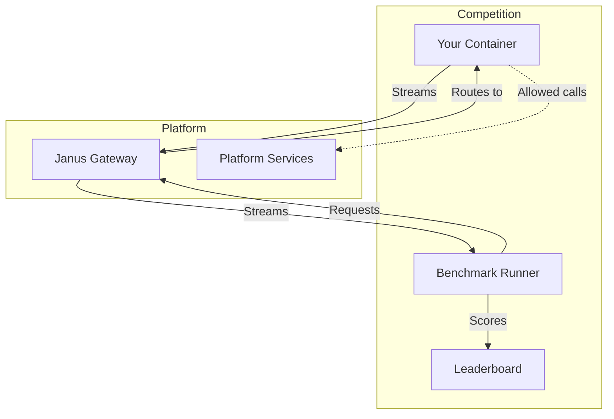
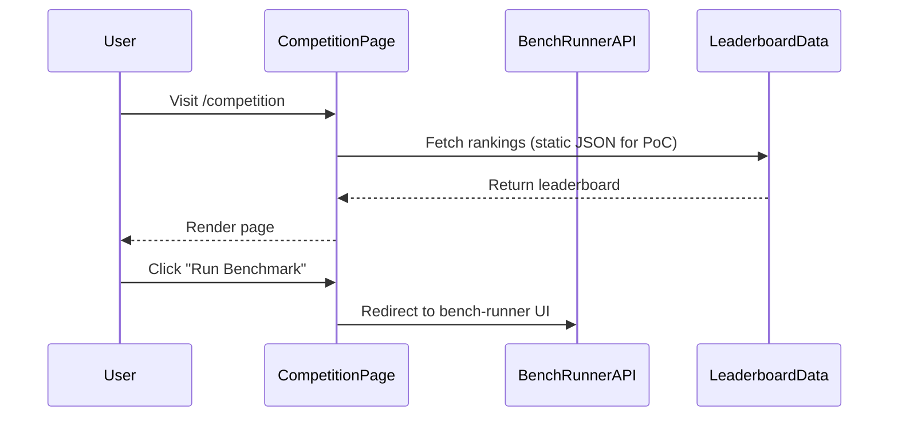

# Competition Page

## Status: COMPLETE

## Context / Why

The Janus competition is the core mechanism for driving innovation in the platform. Miners (competitors) submit Docker containers that implement an OpenAI-compatible chat completions API, and these are scored on a composite metric covering quality, speed, cost, streaming continuity, and modality handling. This page serves as the hub for everything competition-related: explaining the rules, showing the leaderboard, providing participation instructions, and linking to evaluation tools.

## Goals

- Explain the Janus miner competition clearly and compellingly
- Display a live leaderboard of competitor rankings
- Provide step-by-step instructions for participation
- Explain the architecture and technical requirements
- Show the scoring methodology and metrics
- Link to the bench-runner for self-evaluation

## Non-goals

- Actual submission infrastructure (Phase 2 — manual review for now)
- Payment/reward distribution UI
- Real-time competition management dashboard

## Functional Requirements

### Hero Section

- **Headline**: "The Janus Rodeo" or "Compete to Build the Best Intelligence"
- **Subheadline**: Brief explanation of the competition
- **Stats Row**: Quick metrics (e.g., "12 Competitors • $50K Prize Pool • 847 Benchmark Runs")
- **CTA**: "Start Competing" button (scrolls to instructions section)

### Leaderboard Section

Glass morphism card displaying competitor rankings:

| Rank | Competitor | Score | Quality | Speed | Cost | Streaming | Modality |
|------|------------|-------|---------|-------|------|-----------|----------|
| 🥇 1 | baseline-v1 | 78.4 | 82.1 | 71.2 | 85.0 | 76.3 | 70.8 |
| 🥈 2 | miner-alpha | 75.2 | ... | ... | ... | ... | ... |
| 🥉 3 | agent-x | 72.8 | ... | ... | ... | ... | ... |

Features:
- Sortable columns
- Expandable rows showing detailed metrics
- "Last updated" timestamp
- Link to full benchmark results

**Data Source**: Initially placeholder/static data. Future: API endpoint from bench-runner.

### How It Works Section

Four-step visual flow with icons and descriptions:

1. **Build Your Agent**
   - Create a Docker container exposing `/v1/chat/completions`
   - Use any technology: CLI agents, workflows, custom code
   - Stream continuously with `reasoning_content` for intermediate steps

2. **Test Locally**
   - Use our bench CLI to run the public dev suite
   - `janus-bench run --target http://localhost:8001 --suite public/dev`
   - Iterate until your scores improve

3. **Submit for Review**
   - Push your container to a registry (Docker Hub, GHCR)
   - Fill out the submission form with container URL and metadata
   - Our team reviews for security and compliance

4. **Compete & Earn**
   - Your agent runs against private benchmarks
   - Scores update on the leaderboard
   - Top performers earn rewards from the prize pool

### Scoring Breakdown Section

Detailed explanation of the composite score:

```
Composite Score = (Quality × 0.45) + (Speed × 0.20) + (Cost × 0.15)
                + (Streaming × 0.10) + (Modality × 0.10)
```

**Quality (45%)**
- Correctness of responses (LLM-judged or reference-matched)
- Task categories: simple chat, research, coding
- Measured against curated benchmark suite

**Speed (20%)**
- Time-to-first-token (TTFT)
- P50 and P95 latency
- End-to-end response time

**Cost (15%)**
- Token usage (input + output)
- Model calls (if self-reported)
- Sandbox/compute time

**Streaming Continuity (10%)**
- Maximum gap between chunks
- Keep-alive frequency
- Reasoning token density

**Modality Handling (10%)**
- Image input processing
- Artifact output generation
- Multi-modal task completion

### Architecture Overview Section

Visual diagram explaining the system:



Explanation of:
- The competitor container contract (see spec 10)
- Platform services available (web proxy, search, sandbox, Chutes inference)
- Network restrictions and guardrails

### Technical Requirements Section

Collapsible accordion or tabbed interface:

**API Contract**
- Must expose `POST /v1/chat/completions` (OpenAI-compatible)
- Must expose `GET /health` (fast response)
- Optional: `GET /metrics`, `GET /debug`

**Streaming Requirements**
- Support `"stream": true` parameter
- Stream `reasoning_content` for intermediate steps
- Stream `content` for final output
- Maximum 10-second gap between chunks

**Resource Limits**
- Container: 4 vCPU, 8GB RAM, 20GB disk
- Request timeout: 5 minutes
- Network: Whitelist egress only (platform services)

**Security**
- No hardcoded API keys
- No external paid API calls
- Container runs in TEE isolation

### Bench Runner Integration Section

Card linking to the bench-runner:

- **Title**: "Test Your Implementation"
- **Description**: Use our benchmark runner to evaluate your agent before submission
- **Links**:
  - [Bench Runner UI](https://chutes-bench-runner-ui.onrender.com)
  - [Bench Runner API](https://chutes-bench-runner-api-v2.onrender.com)
  - [CLI Documentation](./bench/README.md)
- **Quick Start Code Block**:
```bash
# Install the CLI
pip install janus-bench

# Run against your local implementation
janus-bench run --target http://localhost:8001 --suite public/dev

# View results
janus-bench report --format table
```

### Submission Form Section (Placeholder)

For PoC, a simple form that collects:
- Competitor name
- Contact email
- Container image URL (e.g., `docker.io/user/janus-agent:v1`)
- Brief description of approach
- Checkbox: "I agree to the competition rules"

**Note**: Submissions are manually reviewed. No automated deployment yet.

### FAQ Section

Collapsible accordion with common questions:

- **What technology can I use?**
  Any! CLI agents, n8n workflows, custom Python/Node, etc. We only enforce the API contract.

- **How do I stream intermediate steps?**
  Use the `reasoning_content` field in your SSE chunks. See streaming spec (05) for details.

- **What models can I call?**
  Use the Chutes inference proxy for any public Chutes model. External model APIs are blocked.

- **How often is the leaderboard updated?**
  Daily for public benchmarks. Real-time after automated submission pipeline (Phase 2).

- **What are the prizes?**
  Prize pool details TBD. Top 3 competitors earn rewards each epoch.

## Non-functional Requirements

### Design System Compliance

Follow Chutes style guide:
- Dark background (`#0B0F14`) with aurora gradient
- Glass morphism cards with backdrop-blur
- Tomato Grotesk typography
- Moss green (`#63D297`) for CTAs and highlights
- Table styling with subtle borders and hover states

### Responsive Design

- Desktop: Full leaderboard table, side-by-side architecture diagram
- Tablet: Scrollable table, stacked sections
- Mobile: Card-based leaderboard (rank cards instead of table), collapsed FAQ

### Performance

- Leaderboard data cached/static for PoC (no real-time API)
- Code blocks syntax highlighted with minimal JS
- Lazy load architecture diagram

## Data Flow



## Page Structure

```
/app/competition
  /page.tsx              → Competition page (this spec)
  /components
    /Leaderboard.tsx     → Leaderboard table component
    /ScoringBreakdown.tsx → Scoring explanation
    /HowItWorks.tsx      → Step-by-step flow
    /TechRequirements.tsx → Accordion with specs
    /SubmissionForm.tsx  → Placeholder form
    /FAQ.tsx             → Collapsible FAQ
```

## Acceptance Criteria

1. **Leaderboard**: Displays sortable table with at least baseline competitor
2. **How It Works**: Four-step visual flow renders correctly
3. **Scoring**: Composite score formula and breakdown explained
4. **Architecture**: Mermaid diagram renders and is readable
5. **Tech Requirements**: All API/streaming/resource requirements documented
6. **Bench Runner**: Links to bench-runner UI and API work
7. **FAQ**: At least 5 questions with collapsible answers
8. **Responsive**: Page renders correctly on mobile (375px width)
9. **Smoke Test**: Playwright test visits `/competition`, verifies leaderboard visible, clicks FAQ item

## Open Questions / Risks

- How to fetch real leaderboard data? For PoC, use static JSON. Phase 2: bench-runner API.
- Should we show historical score trends (charts)?
- What's the exact submission process before automated pipeline exists?
- Prize pool amounts and distribution schedule TBD
- Consider adding a "Compare Competitors" feature for side-by-side analysis
