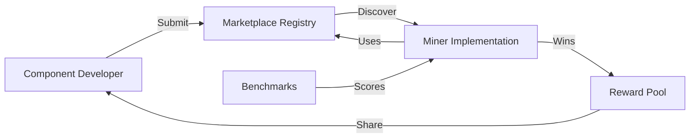
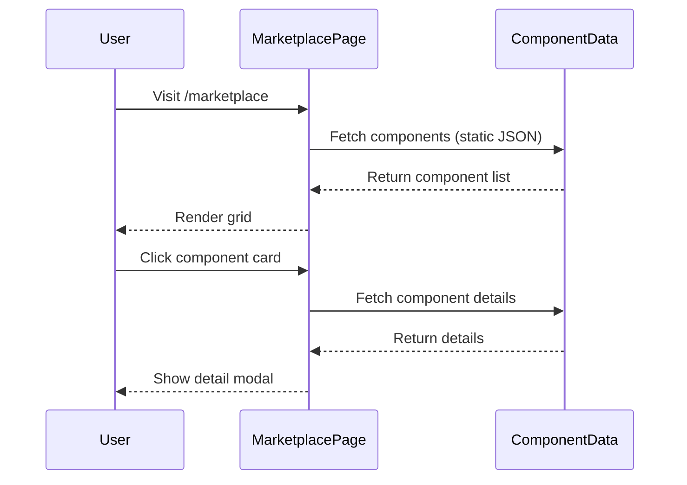

# Marketplace Page

## Status: COMPLETE

## Context / Why

The Janus Marketplace is where the ecosystem thrives. Component developers can submit reusable building blocks (research nodes, coding assistants, tool integrations, memory systems) that miners can incorporate into their implementations. When a miner uses a component, the component developer earns a share of rewards. This creates a virtuous cycle of innovation and collaboration.

For the PoC, this page showcases the concept with placeholder components and explains how the marketplace will work. Actual submission and integration infrastructure is Phase 2.

## Goals

- Showcase the marketplace concept with attractive component cards
- Explain how component submission and reward sharing works
- Display available components (placeholder data for PoC)
- Provide component detail views with integration instructions
- Establish the visual language for the marketplace UI

## Non-goals

- Actual component submission workflow (Phase 2)
- Payment/payout infrastructure
- Component versioning and dependency management UI
- Real-time usage analytics

## Functional Requirements

### Hero Section

- **Headline**: "Component Marketplace" or "Build Once, Earn Forever"
- **Subheadline**: "Submit reusable components. Earn rewards when miners use them."
- **Stats Row**: "47 Components • 12 Developers • $8.2K Distributed" (placeholder)
- **CTA**: "Submit a Component" (links to submission placeholder)

### Component Grid Section

Responsive grid of component cards (model-card style from Chutes):

Each card shows:
- **Icon/Thumbnail**: Visual representation of component type
- **Name**: e.g., "Deep Research Agent"
- **Author**: Developer name/handle
- **Category Badge**: e.g., "Research", "Coding", "Memory", "Tools"
- **Usage Count**: "Used by 8 miners"
- **Rating**: Star rating or score (placeholder)
- **Brief Description**: One-line summary

**Categories** (filter pills):
- All
- Research (web search, deep research)
- Coding (sandbox, code execution)
- Memory (vector store, conversation history)
- Tools (MCP integrations, APIs)
- Models (routing, fallback chains)

**Sort Options**:
- Most Popular
- Newest
- Highest Rated
- Most Earnings

### Placeholder Components

For PoC, display these conceptual components:

1. **Web Search Agent**
   - Category: Research
   - Description: "Brave/Google search integration with result parsing"
   - Author: "Chutes Team"
   - Status: Available

2. **Deep Research Node**
   - Category: Research
   - Description: "Multi-step research with source synthesis"
   - Author: "Chutes Team"
   - Status: Available

3. **Code Sandbox**
   - Category: Coding
   - Description: "Secure code execution in Firecracker VMs via Sandy"
   - Author: "Chutes Team"
   - Status: Available

4. **Browser Automation**
   - Category: Tools
   - Description: "Headless browser for web interaction (Puppeteer/Playwright)"
   - Author: "Chutes Team"
   - Status: Available

5. **Vector Memory**
   - Category: Memory
   - Description: "Persistent vector store for conversation context"
   - Author: "Community"
   - Status: Coming Soon

6. **Model Router**
   - Category: Models
   - Description: "Intelligent routing between Chutes models based on task"
   - Author: "Community"
   - Status: Coming Soon

7. **YouTube Downloader**
   - Category: Tools
   - Description: "Download and transcribe YouTube videos"
   - Author: "Squad API"
   - Status: Available (from Squad)

8. **Twitter/X Poster**
   - Category: Tools
   - Description: "Post to Twitter/X (requires API key)"
   - Author: "Squad API"
   - Status: Available (from Squad)

### Component Detail Modal/Page

When clicking a component card, show detailed view:

- **Header**: Icon, name, author, category, rating
- **Description**: Full description with use cases
- **Integration Guide**: Code snippet showing how to use
- **API Contract**: OpenAPI spec or MCP tool definition
- **Usage Stats**: Miners using, total calls, earnings generated
- **Version History**: List of versions (placeholder)
- **Reviews/Comments**: Placeholder for future

**Integration Example**:
```json
{
  "id": "cmp.research.web-search",
  "version": "0.1.0",
  "entrypoint": "https://components.janus.local/web-search",
  "contract": {
    "type": "mcp",
    "tools": ["search_web", "get_page_content"]
  }
}
```

**Usage in Competitor**:
```python
# In your Janus implementation
from janus_components import WebSearchComponent

search = WebSearchComponent()
results = await search.search_web("latest AI news")
```

### How It Works Section

Visual explanation of the marketplace model:



**Step 1: Submit**
Developers submit components with manifest, API contract, and documentation.

**Step 2: Review**
Components are reviewed for security, quality, and compliance.

**Step 3: Publish**
Approved components appear in the marketplace.

**Step 4: Integrate**
Miners discover and integrate components into their implementations.

**Step 5: Earn**
When a miner using your component wins rewards, you get a share.

### Submission Section (Placeholder)

For PoC, a placeholder explaining the submission process:

- **Title**: "Submit Your Component"
- **Description**: "Share your building blocks with the Janus community"
- **Requirements List**:
  - Component manifest (JSON)
  - API contract (OpenAPI or MCP tool schema)
  - Documentation and examples
  - Docker container or hosted endpoint
  - License (open source preferred)
- **CTA**: "Coming Soon" button (disabled) or "Contact Us" link

### Inspiration Section

Card highlighting the Squad API as inspiration:

- **Title**: "Standing on Giants"
- **Description**: "The Janus marketplace is inspired by the incredible tooling from Squad API"
- **Link**: GitHub repo link
- **Features from Squad**:
  - Memory and storage systems
  - Web search and browser tools
  - YouTube, Twitter integrations
  - Dangerzone (sandboxed execution)

### FAQ Section

- **How do rewards work?**
  When a miner using your component earns rewards, a percentage is distributed to component developers based on usage attribution.

- **What makes a good component?**
  Clear API contract, good documentation, reliable performance, and security compliance.

- **Can I use external APIs?**
  Yes, but they must be whitelisted and comply with security guardrails. Components with external dependencies need approval.

- **How is usage tracked?**
  Miners declare component dependencies in their submission. The platform tracks invocations during benchmark runs.

- **What's the revenue share?**
  TBD. Initial proposal: 10-20% of miner rewards distributed to component developers.

## Non-functional Requirements

### Design System Compliance

Follow Chutes style guide:
- Model card grid layout (see chutes_style.md)
- Glass morphism cards with hover glow
- Category badges with color coding
- Dark background with aurora accents
- Moss green for primary CTAs

### Card Design

```css
.component-card {
  background: linear-gradient(180deg, rgba(17, 23, 38, 0.8) 0%, rgba(17, 23, 38, 0.6) 100%);
  backdrop-filter: blur(16px);
  border: 1px solid rgba(31, 41, 55, 0.5);
  border-radius: 16px;
  transition: all 0.3s ease;
}

.component-card:hover {
  border-color: rgba(99, 210, 151, 0.3);
  transform: translateY(-2px);
  box-shadow: 0 0 0 1px rgba(99, 210, 151, 0.1),
              0 20px 40px -15px rgba(0, 0, 0, 0.5);
}
```

### Responsive Design

- Desktop: 3-4 column grid
- Tablet: 2 column grid
- Mobile: Single column, card-based

### Performance

- Static component data for PoC (JSON file)
- Lazy load component images/icons
- Modal/detail view loads on demand

## Data Flow



## Page Structure

```
/app/marketplace
  /page.tsx                → Marketplace page (this spec)
  /[componentId]
    /page.tsx              → Component detail page (optional)
  /components
    /ComponentGrid.tsx     → Grid of component cards
    /ComponentCard.tsx     → Individual card
    /ComponentDetail.tsx   → Detail modal/page
    /CategoryFilter.tsx    → Filter pills
    /SearchBar.tsx         → Search input
```

## Data Model

```typescript
interface Component {
  id: string;                    // e.g., "cmp.research.web-search"
  name: string;                  // "Web Search Agent"
  description: string;           // Short description
  longDescription?: string;      // Full description for detail view
  author: string;                // Developer name/handle
  authorUrl?: string;            // Link to author profile
  category: 'research' | 'coding' | 'memory' | 'tools' | 'models';
  icon?: string;                 // Icon URL or emoji
  thumbnail?: string;            // Card thumbnail URL
  status: 'available' | 'coming_soon' | 'deprecated';
  version: string;               // Semver
  usageCount: number;            // Miners using
  rating?: number;               // 0-5 stars
  contract: {
    type: 'openapi' | 'mcp';
    url?: string;                // URL to contract spec
  };
  integrationExample?: string;   // Code snippet
  tags: string[];                // Searchable tags
  createdAt: string;             // ISO date
  updatedAt: string;             // ISO date
}
```

## Acceptance Criteria

1. **Grid**: Component grid displays at least 6 placeholder components
2. **Cards**: Cards show name, author, category badge, usage count
3. **Filters**: Category filter pills work (All, Research, Coding, etc.)
4. **Detail**: Clicking a card shows detail modal/view with integration guide
5. **How It Works**: Flow diagram explains marketplace model
6. **FAQ**: At least 4 questions with answers
7. **Responsive**: Grid adapts from 4-col (desktop) to 1-col (mobile)
8. **Styling**: Cards have glass morphism effect and hover states
9. **Smoke Test**: Playwright test visits `/marketplace`, filters by category, opens component detail

## Open Questions / Risks

- How to handle component versioning in the UI?
- Should components have a "Try It" sandbox for testing before integration?
- What's the approval process for community components?
- How to prevent malicious components (code review, sandboxing)?
- Should we show earnings per component (privacy concerns)?
- Consider a "Featured" or "Staff Picks" section for highlighting quality components
