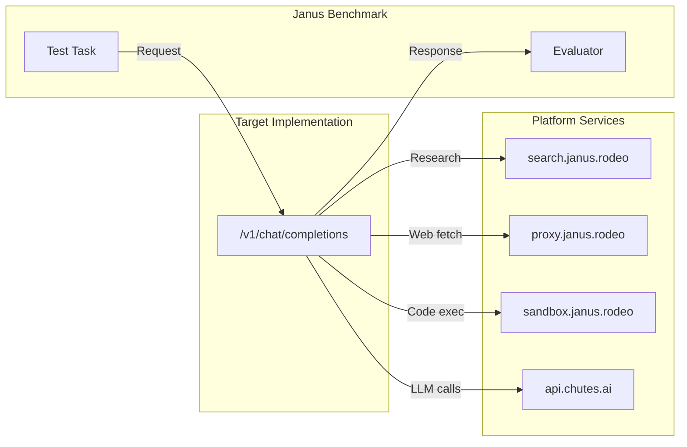

# Spec 30: Janus Benchmark Integration Overview

## Status: DRAFT

## Context / Why

The Janus competition requires a comprehensive benchmarking system to evaluate intelligence implementations across multiple dimensions. While chutes-bench-runner has existing benchmarks for core LLM capabilities (MMLU-Pro, GPQA, HumanEval, etc.), Janus needs additional benchmarks that measure:

1. **Research capabilities** - Web search, synthesis, fact verification
2. **Tool use** - Function calling, API integration
3. **Multimodal** - Image generation, vision tasks, audio
4. **Streaming quality** - TTFT, TPS, continuity
5. **Cost efficiency** - Token usage optimization

These Janus-specific benchmarks should appear as a new "Janus Intelligence" section in the chutes-bench-runner UI.

## Goals

- Define the complete Janus benchmark suite
- Integrate with existing chutes-bench-runner infrastructure
- Add "Janus Intelligence" category in bench-runner UI
- Support both local testing and competition evaluation
- Enable composite scoring as defined in competition specs

## Non-Goals

- Replacing existing core benchmarks (MMLU, HumanEval, etc.)
- Implementing custom scoring UI (uses existing bench-runner)
- On-chain verification (future phase)

## Functional Requirements

### FR-1: Janus Benchmark Suite

The complete Janus benchmark suite consists of:

| Benchmark | Category | Items | Description |
|-----------|----------|-------|-------------|
| `janus_research` | Janus Intelligence | 100 | Web search and synthesis tasks |
| `janus_tool_use` | Janus Intelligence | 80 | Function calling and tool integration |
| `janus_multimodal` | Janus Intelligence | 60 | Image generation and vision tasks |
| `janus_streaming` | Janus Intelligence | 50 | Streaming quality metrics |
| `janus_cost` | Janus Intelligence | 40 | Token efficiency evaluation |

### FR-2: Scoring Categories Alignment

Map Janus benchmarks to competition scoring categories:

```python
JANUS_SCORING_CATEGORIES = {
    "quality": {
        "weight": 0.40,
        "benchmarks": ["janus_research", "janus_tool_use"],
        "description": "Overall response quality and correctness"
    },
    "speed": {
        "weight": 0.20,
        "benchmarks": ["janus_streaming"],
        "metrics": ["ttft_ms", "tps"]
    },
    "cost": {
        "weight": 0.15,
        "benchmarks": ["janus_cost"],
        "metrics": ["tokens_per_task", "cost_per_task"]
    },
    "streaming": {
        "weight": 0.15,
        "benchmarks": ["janus_streaming"],
        "metrics": ["continuity_score", "chunk_regularity"]
    },
    "modality": {
        "weight": 0.10,
        "benchmarks": ["janus_multimodal"],
        "description": "Image, audio, and multimodal handling"
    }
}
```

### FR-3: Benchmark Adapter Pattern

All Janus benchmarks follow the chutes-bench-runner adapter pattern:

```python
from app.benchmarks.base import BenchmarkAdapter, ItemResult
from app.benchmarks.registry import register_adapter

@register_adapter("janus_research")
class JanusResearchAdapter(BenchmarkAdapter):
    """Benchmark for web research and synthesis capabilities."""

    def get_name(self) -> str:
        return "janus_research"

    def get_display_name(self) -> str:
        return "Janus Research"

    async def get_total_items(self) -> int:
        return len(self._items)

    async def enumerate_items(self) -> AsyncIterator[str]:
        for item in self._items:
            yield item["id"]

    async def evaluate_item(self, item_id: str) -> ItemResult:
        # Implementation details in spec 31
        pass
```

### FR-4: Composite Score Calculation

Implement composite scoring for Janus leaderboard:

```python
def calculate_janus_composite_score(run_results: dict) -> dict:
    """
    Calculate Janus competition composite score.

    Returns:
        {
            "composite": 0.85,
            "quality": 0.90,
            "speed": 0.82,
            "cost": 0.75,
            "streaming": 0.88,
            "modality": 0.80
        }
    """
    scores = {}

    # Quality (40%)
    research_score = run_results.get("janus_research", {}).get("score", 0)
    tool_score = run_results.get("janus_tool_use", {}).get("score", 0)
    scores["quality"] = (research_score + tool_score) / 2

    # Speed (20%)
    streaming_data = run_results.get("janus_streaming", {})
    ttft_score = normalize_ttft(streaming_data.get("metrics", {}).get("avg_ttft_ms", 5000))
    tps_score = normalize_tps(streaming_data.get("metrics", {}).get("avg_tps", 10))
    scores["speed"] = (ttft_score + tps_score) / 2

    # Cost (15%)
    cost_data = run_results.get("janus_cost", {})
    scores["cost"] = cost_data.get("score", 0)

    # Streaming (15%)
    scores["streaming"] = streaming_data.get("metrics", {}).get("continuity_score", 0)

    # Modality (10%)
    scores["modality"] = run_results.get("janus_multimodal", {}).get("score", 0)

    # Composite
    scores["composite"] = (
        scores["quality"] * 0.40 +
        scores["speed"] * 0.20 +
        scores["cost"] * 0.15 +
        scores["streaming"] * 0.15 +
        scores["modality"] * 0.10
    )

    return scores
```

### FR-5: Test Data Structure

Janus benchmarks use JSON test data:

```json
// janus_research_items.json
{
  "items": [
    {
      "id": "research_001",
      "task_type": "fact_verification",
      "query": "What is the current population of Tokyo?",
      "requires_search": true,
      "expected_facts": ["population", "tokyo", "million"],
      "max_age_days": 365
    },
    {
      "id": "research_002",
      "task_type": "synthesis",
      "query": "Compare the economic policies of the US and EU on AI regulation",
      "requires_search": true,
      "evaluation_criteria": ["mentions_eu_ai_act", "mentions_us_executive_order", "balanced_comparison"]
    }
  ]
}
```

### FR-6: Platform Service Integration

Janus benchmarks test platform service usage:



## Non-Functional Requirements

### NFR-1: Performance

- Individual benchmark items should complete within 5 minutes
- Full benchmark suite should complete within 2 hours
- Results should be reproducible with same seed

### NFR-2: Scalability

- Support subset sampling (1%, 5%, 10%, 25%, 50%, 100%)
- Support deterministic seeding for reproducibility
- Handle concurrent evaluation of multiple submissions

### NFR-3: Transparency

- All benchmark items are public (no hidden tests)
- Evaluation prompts are published
- Scoring formulas are documented

## API / Contracts

### Benchmark Registration API

```python
# In app/benchmarks/adapters/__init__.py
from app.benchmarks.adapters.janus_research import JanusResearchAdapter
from app.benchmarks.adapters.janus_tool_use import JanusToolUseAdapter
from app.benchmarks.adapters.janus_multimodal import JanusMultimodalAdapter
from app.benchmarks.adapters.janus_streaming import JanusStreamingAdapter
from app.benchmarks.adapters.janus_cost import JanusCostAdapter

__all__ = [
    # ... existing adapters ...
    "JanusResearchAdapter",
    "JanusToolUseAdapter",
    "JanusMultimodalAdapter",
    "JanusStreamingAdapter",
    "JanusCostAdapter",
]
```

### Benchmark Metadata API

```python
# GET /api/benchmarks response includes:
{
  "benchmarks": [
    {
      "name": "janus_research",
      "display_name": "Janus Research",
      "category": "Janus Intelligence",
      "total_items": 100,
      "avg_item_latency_ms": 15000,
      "is_enabled": true,
      "default_selected": true,
      "description": "Evaluates web research, search, and synthesis capabilities"
    }
  ]
}
```

## Acceptance Criteria

- [ ] All 5 Janus benchmark adapters implemented
- [ ] Benchmarks appear in "Janus Intelligence" category in UI
- [ ] Subset sampling works correctly (1-100%)
- [ ] Deterministic seeding produces reproducible results
- [ ] Composite score calculation matches spec
- [ ] Integration tests pass for all adapters
- [ ] Documentation updated with benchmark descriptions

## Open Questions / Risks

1. **Test data sources**: Where do we get authoritative test data for research tasks?
2. **Multimodal evaluation**: How do we evaluate generated images? Human review? Automated?
3. **Cost calculation**: How do we track token usage across different model providers?
4. **Streaming measurement**: How do we measure "continuity" objectively?
5. **Versioning**: How do we handle benchmark updates without invalidating old scores?

## Related Specs

- `specs/12_benchmarking_scoring.md` - Original scoring spec
- `specs/competition/02_description_and_scoring.md` - Competition scoring categories
- `specs/16_bench_runner_integration.md` - Integration patterns
- `specs/31_janus_research_benchmark.md` - Research benchmark details
- `specs/32_janus_tool_use_benchmark.md` - Tool use benchmark details
- `specs/33_janus_multimodal_benchmark.md` - Multimodal benchmark details
- `specs/34_janus_streaming_benchmark.md` - Streaming benchmark details
- `specs/35_janus_cost_benchmark.md` - Cost benchmark details
- `specs/36_janus_bench_ui_section.md` - UI integration

## Files to Create/Modify

### In chutes-bench-runner:

```
backend/app/benchmarks/
├── adapters/
│   ├── janus_research.py      # NEW
│   ├── janus_tool_use.py      # NEW
│   ├── janus_multimodal.py    # NEW
│   ├── janus_streaming.py     # NEW
│   ├── janus_cost.py          # NEW
│   └── __init__.py            # MODIFY - add imports
├── data/
│   └── janus/
│       ├── research_items.json    # NEW
│       ├── tool_use_items.json    # NEW
│       ├── multimodal_items.json  # NEW
│       ├── streaming_items.json   # NEW
│       └── cost_items.json        # NEW
└── janus_scoring.py           # NEW - composite score calculation

frontend/
└── components/
    └── benchmark-runner.tsx   # MODIFY - add Janus category
```
