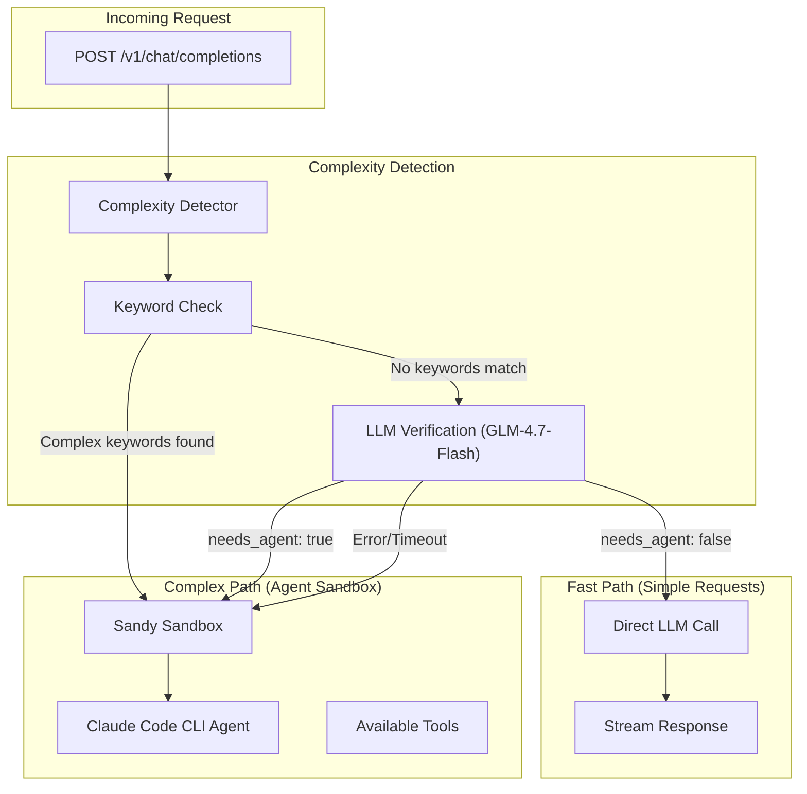

# Spec 71: Complexity Detection Improvements - LLM Verification for Fast Path

## Status: COMPLETE

## Context / Why

The current complexity detection has a flaw in practice. While the code correctly routes keyword-matched complex tasks directly to the agent, tasks that don't match keywords but still need the agent are sometimes incorrectly sent to the fast path.

**Example**: "test https://janus.rodeo in a browser"
- No keywords match ("browser", "test", "playwright" not in keyword list)
- Should route to agent for browser automation
- Currently goes to fast path if LLM check fails/times out

**Current issues**:
1. README diagram shows WRONG flow (LLM check after keywords match, not before fast path)
2. Missing keywords for browser automation, testing, GUI interaction
3. LLM routing prompt doesn't mention browser/automation tasks
4. On LLM check failure, defaults to fast path (should be more conservative)
5. LLM check is optional (`enable_llm_routing`) - should be mandatory for safety

**Desired behavior**:
- Keywords match complex task → Agent directly (confident)
- Keywords don't match → LLM MUST verify it's simple before fast path
- On any doubt or error → Default to agent (safer)

## Goals

1. Fix README diagram to show correct flow
2. Add missing complexity keywords (browser, automation, testing, etc.)
3. Update LLM routing prompt to cover more use cases
4. Make LLM verification mandatory before fast path (remove optional flag)
5. Default to agent on LLM check failure (conservative routing)

## Functional Requirements

### FR-1: Fix README Diagram

Update the Mermaid diagram in README.md to show correct flow:



The key change: Keywords → Complex → Agent (direct), Keywords → Simple → LLM Verify → then decide.

### FR-2: Add Missing Complexity Keywords

Add keywords for browser automation, testing, GUI interaction, and other agent-requiring tasks:

```python
# baseline-agent-cli/janus_baseline_agent_cli/services/complexity.py

COMPLEX_KEYWORDS = [
    # ... existing keywords ...

    # Browser automation / Testing
    "test in browser",
    "test in a browser",
    "open in browser",
    "browser automation",
    "playwright",
    "puppeteer",
    "selenium",
    "click on",
    "navigate to",
    "take screenshot",
    "screenshot of",
    "load the page",
    "open the url",
    "open this url",
    "visit the site",
    "visit this site",
    "check the website",
    "test the website",
    "verify the page",
    "interact with",
    "fill the form",
    "submit the form",
    "automation",
    "automate",

    # GUI / Desktop
    "gui",
    "desktop automation",
    "click the button",
    "type into",
    "keyboard",
    "mouse click",

    # Testing
    "run the test",
    "test this",
    "verify this",
    "check if",
    "validate",
    "smoke test",
    "integration test",
    "e2e test",
    "end-to-end",

    # API / Network
    "call the api",
    "make a request",
    "http request",
    "curl",
    "post to",
    "get from",
    "api endpoint",

    # System operations
    "run command",
    "execute command",
    "terminal",
    "shell",
    "bash",
    "command line",
]
```

### FR-3: Update LLM Routing Prompt

Expand the routing prompt to cover more scenarios:

```python
# baseline-agent-cli/janus_baseline_agent_cli/services/complexity.py

ROUTING_PROMPT = """Analyze this user request and decide if it needs agent sandbox capabilities.

Agent sandbox is REQUIRED for:
- Image/video/audio generation ("generate an image", "create a video", "text to speech")
- Code execution ("run this code", "execute", "test this script")
- Web search ("search for", "find current", "latest news")
- File operations ("download", "save to file", "read file")
- Browser automation ("test in browser", "open URL", "take screenshot", "click on")
- GUI/Desktop interaction ("click button", "type into", "automate")
- API calls ("call the API", "make a request", "curl")
- Testing ("run tests", "verify", "check if working")
- Any task requiring interaction with external systems, URLs, or tools

Direct LLM response is ONLY sufficient for:
- General conversation and chitchat
- Explanations, definitions, and summaries
- Simple math (without needing to run code)
- Writing assistance (text generation without execution)
- Questions that can be answered from knowledge alone

IMPORTANT: When in doubt, choose needs_agent=true. It's better to use the agent unnecessarily than to fail a task that needs tools.

User request: {user_message}

Call the use_agent function with your decision."""
```

### FR-4: Make LLM Verification Mandatory and Conservative

Remove the optional flag and always verify before fast path. On error, default to agent:

```python
# baseline-agent-cli/janus_baseline_agent_cli/services/complexity.py

async def analyze_async(self, messages: list[Message]) -> ComplexityAnalysis:
    """Async analysis with mandatory LLM verification for fast path."""
    # First pass: keyword-based
    first_pass = self.analyze(messages)

    # If keywords indicate complex, go directly to agent (confident)
    if first_pass.is_complex:
        logger.info(
            "complexity_keywords_matched",
            reason=first_pass.reason,
            keywords=first_pass.keywords_matched,
        )
        return first_pass

    # Keywords say simple - MUST verify with LLM before fast path
    last_user_msg = self._get_last_user_message(messages)
    text = self._extract_text(last_user_msg.content) if last_user_msg else ""

    # Skip LLM check only for trivial greetings
    if self._should_skip_llm_check(text):
        logger.info("complexity_trivial_greeting", text_preview=text[:50])
        return first_pass

    # LLM verification is mandatory
    needs_agent, reason = await self._llm_routing_check(text)

    logger.info(
        "complexity_llm_verification",
        needs_agent=needs_agent,
        reason=reason,
        model=self._routing_model,
        text_preview=text[:100],
    )

    # LLM says needs agent OR any error occurred → use agent (conservative)
    if needs_agent or reason.startswith("llm_check_error") or reason == "no_api_key":
        # On error, be conservative and use agent
        if reason.startswith("llm_check_error") or reason == "no_api_key":
            logger.warning(
                "complexity_defaulting_to_agent",
                reason=reason,
                text_preview=text[:100],
            )
            reason = f"conservative_default: {reason}"

        return ComplexityAnalysis(
            is_complex=True,
            reason=f"llm_verification: {reason}",
            keywords_matched=first_pass.keywords_matched,
            multimodal_detected=first_pass.multimodal_detected,
            has_images=first_pass.has_images,
            image_count=first_pass.image_count,
            text_preview=first_pass.text_preview,
        )

    # LLM confirmed this is simple - safe to use fast path
    logger.info(
        "complexity_confirmed_simple",
        reason=reason,
        text_preview=text[:100],
    )
    return first_pass


async def _llm_routing_check(self, text: str) -> tuple[bool, str]:
    """LLM verification for routing decision. Returns (needs_agent, reason)."""
    if not self._settings.openai_api_key:
        # No API key - be conservative, assume needs agent
        return True, "no_api_key"

    try:
        async with httpx.AsyncClient(timeout=self._routing_timeout) as client:
            response = await client.post(
                ROUTING_ENDPOINT,
                headers={
                    "Authorization": f"Bearer {self._settings.openai_api_key}",
                    "Content-Type": "application/json",
                },
                json={
                    "model": self._routing_model,
                    "messages": [
                        {
                            "role": "user",
                            "content": ROUTING_PROMPT.format(user_message=text[:500]),
                        }
                    ],
                    "tools": [USE_AGENT_TOOL],
                    "tool_choice": {
                        "type": "function",
                        "function": {"name": "use_agent"},
                    },
                    "max_tokens": 100,
                    "temperature": 0.0,
                },
            )
            response.raise_for_status()
            data = response.json()

            message = data["choices"][0]["message"]
            tool_calls = message.get("tool_calls") if isinstance(message, dict) else None
            if tool_calls:
                tool_call = tool_calls[0]
                arguments = tool_call.get("function", {}).get("arguments", "{}")
                if isinstance(arguments, dict):
                    args = arguments
                else:
                    args = json.loads(arguments)
                return bool(args.get("needs_agent", False)), str(
                    args.get("reason", "llm_decision")
                )

            # No tool call - be conservative
            return True, "no_tool_call_conservative"

    except httpx.TimeoutException:
        logger.warning("llm_routing_timeout", text_preview=text[:100])
        # Timeout - be conservative, use agent
        return True, "llm_check_error: timeout"

    except Exception as exc:
        logger.warning(
            "llm_routing_error",
            error=str(exc),
            text_preview=text[:100],
        )
        # Error - be conservative, use agent
        return True, f"llm_check_error: {exc}"
```

### FR-5: Update Config to Remove Optional Flag

Remove `enable_llm_routing` since LLM verification is now mandatory:

```python
# baseline-agent-cli/janus_baseline_agent_cli/config.py

class Settings(BaseSettings):
    # ... existing settings ...

    # REMOVED: enable_llm_routing - LLM verification is now mandatory
    # enable_llm_routing: bool = True  # DELETE THIS LINE

    # Keep routing model and timeout settings
    llm_routing_model: str | None = None
    llm_routing_timeout: float = 3.0
```

Update environment variable documentation in README:

```markdown
### Routing Configuration

| Variable | Default | Description |
|----------|---------|-------------|
| `BASELINE_AGENT_CLI_ALWAYS_USE_AGENT` | `false` | Always route requests to the agent path |
| `BASELINE_AGENT_CLI_LLM_ROUTING_MODEL` | `zai-org/GLM-4.7-Flash` | Fast model for routing verification |
| `BASELINE_AGENT_CLI_LLM_ROUTING_TIMEOUT` | `3.0` | Timeout for routing check (seconds) |
| `BASELINE_AGENT_CLI_COMPLEXITY_THRESHOLD` | `100` | Token threshold for complexity detection |

> **Note**: LLM verification is always performed before using the fast path. This ensures tasks like "test https://example.com in a browser" correctly route to the agent even when no keywords match.
```

### FR-6: Add URL Detection

Add detection for URLs that likely need browser/API interaction:

```python
# baseline-agent-cli/janus_baseline_agent_cli/services/complexity.py

import re

URL_PATTERN = re.compile(
    r'https?://[^\s<>"\']+|www\.[^\s<>"\']+',
    re.IGNORECASE
)

class ComplexityDetector:
    # ... existing code ...

    def _contains_url(self, text: str) -> bool:
        """Check if text contains URLs that might need interaction."""
        return bool(URL_PATTERN.search(text))

    def _url_suggests_interaction(self, text: str) -> bool:
        """Check if URL context suggests browser/API interaction."""
        if not self._contains_url(text):
            return False

        # Keywords that suggest URL interaction
        interaction_hints = [
            "test", "check", "visit", "open", "browse", "verify",
            "screenshot", "load", "fetch", "scrape", "interact",
            "click", "submit", "form", "login", "api", "endpoint",
        ]
        text_lower = text.lower()
        return any(hint in text_lower for hint in interaction_hints)

    def analyze(self, messages: list[Message]) -> ComplexityAnalysis:
        # ... existing checks ...

        # Check for URL with interaction hints
        if self._url_suggests_interaction(text):
            return ComplexityAnalysis(
                is_complex=True,
                reason="url_interaction",
                keywords_matched=keywords_matched,
                multimodal_detected=multimodal_detected,
                has_images=has_images,
                image_count=image_count,
                text_preview=text_preview,
            )

        # ... rest of existing logic ...
```

## Testing

### Test Cases

```python
# baseline-agent-cli/tests/test_complexity_improvements.py

import pytest
from janus_baseline_agent_cli.services.complexity import ComplexityDetector
from janus_baseline_agent_cli.models import Message, Role

@pytest.fixture
def detector():
    return ComplexityDetector(get_settings())

class TestBrowserAutomation:
    """Test browser automation detection."""

    @pytest.mark.parametrize("prompt", [
        "test https://janus.rodeo in a browser",
        "open https://example.com and take a screenshot",
        "visit the site and click the login button",
        "use playwright to test the form submission",
        "check if https://api.example.com/health returns 200",
        "automate filling out the registration form",
    ])
    def test_browser_tasks_detected(self, detector, prompt):
        messages = [Message(role=Role.USER, content=prompt)]
        analysis = detector.analyze(messages)
        assert analysis.is_complex, f"Should detect as complex: {prompt}"

    @pytest.mark.parametrize("prompt", [
        "What is the capital of France?",
        "Explain how HTTP works",
        "Write a poem about the ocean",
        "Hello, how are you?",
    ])
    def test_simple_tasks_not_complex(self, detector, prompt):
        messages = [Message(role=Role.USER, content=prompt)]
        analysis = detector.analyze(messages)
        assert not analysis.is_complex, f"Should be simple: {prompt}"


class TestURLDetection:
    """Test URL interaction detection."""

    def test_url_with_test_keyword(self, detector):
        messages = [Message(role=Role.USER, content="test https://example.com")]
        analysis = detector.analyze(messages)
        assert analysis.is_complex
        assert "url_interaction" in analysis.reason

    def test_url_without_interaction(self, detector):
        # Just mentioning a URL shouldn't trigger complex
        messages = [Message(role=Role.USER, content="What is https://example.com?")]
        analysis = detector.analyze(messages)
        # This should go to LLM verification, not be marked complex by keywords


class TestConservativeDefaults:
    """Test conservative defaults on errors."""

    @pytest.mark.asyncio
    async def test_timeout_defaults_to_agent(self, detector, mocker):
        """On timeout, should default to agent."""
        mocker.patch.object(
            detector, '_llm_routing_check',
            return_value=(True, "llm_check_error: timeout")
        )
        messages = [Message(role=Role.USER, content="do something")]
        analysis = await detector.analyze_async(messages)
        assert analysis.is_complex
        assert "conservative_default" in analysis.reason

    @pytest.mark.asyncio
    async def test_no_api_key_defaults_to_agent(self, detector, mocker):
        """Without API key, should default to agent."""
        mocker.patch.object(detector._settings, 'openai_api_key', None)
        messages = [Message(role=Role.USER, content="do something")]
        analysis = await detector.analyze_async(messages)
        assert analysis.is_complex
```

## Acceptance Criteria

- [ ] README diagram shows correct flow (keywords → complex → agent directly)
- [ ] New keywords for browser/automation/testing added
- [ ] LLM routing prompt mentions browser automation
- [ ] LLM verification is mandatory (not optional)
- [ ] Errors/timeouts default to agent (conservative)
- [ ] URL + interaction hint detection works
- [ ] "test https://janus.rodeo in a browser" routes to agent
- [ ] Simple greetings still skip LLM check
- [ ] All existing tests pass
- [ ] New tests for browser automation pass

## Files to Modify

```
baseline-agent-cli/
├── README.md                                    # Fix Mermaid diagram
├── janus_baseline_agent_cli/
│   ├── config.py                               # Remove enable_llm_routing
│   └── services/
│       └── complexity.py                       # Add keywords, update logic
└── tests/
    └── test_complexity_improvements.py         # NEW: Additional tests
```

## Related Specs

- `specs/21_enhanced_baseline.md` - Baseline enhancement
- `specs/24_multimodal_routing.md` - Multimodal routing
- `specs/25_llm_complexity_second_pass.md` - Original LLM routing spec (superseded)

NR_OF_TRIES: 1
