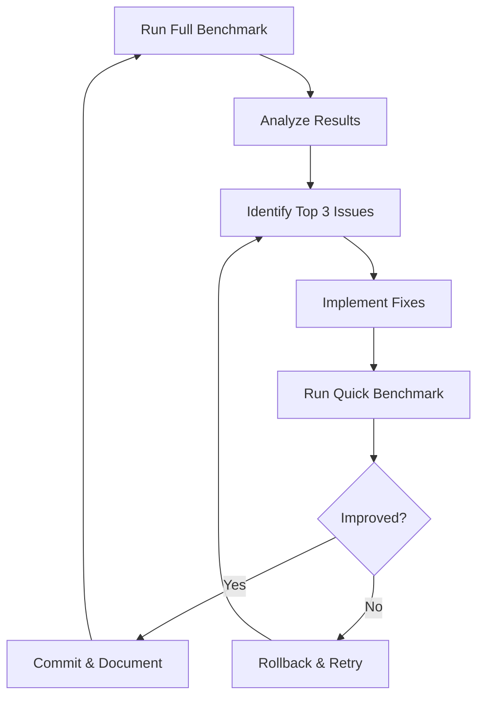

# Spec 57: Baseline Performance Optimization

## Status: COMPLETE

## Context / Why

The two baseline Janus implementations (baseline-agent-cli and baseline-langchain) serve as reference implementations and performance benchmarks. To ensure they represent best practices and competitive performance, we need to:

1. Run comprehensive benchmarks against both baselines
2. Analyze results to identify weaknesses
3. Iteratively improve performance based on findings
4. Document optimization patterns for competitors

This is an ongoing optimization cycle that should be repeated after each improvement.

## Goals

- Establish baseline performance metrics
- Identify performance bottlenecks in each implementation
- Implement targeted optimizations
- Achieve competitive scores across all benchmark categories
- Document learnings for the community

## Non-Goals

- Creating additional baseline implementations
- Implementing features not in the original spec
- Optimizing for specific edge cases over general performance

## Functional Requirements

### FR-1: Comprehensive Benchmark Execution

Run the full Janus benchmark suite against both baselines:

```bash
# Start baseline-agent-cli
cd baseline-agent-cli
docker build -t janus-baseline-cli .
docker run -p 8080:8080 janus-baseline-cli

# Run benchmarks
cd ../bench
janus-bench run --target http://localhost:8080 --suite full --output results/baseline-cli-$(date +%Y%m%d).json

# Repeat for baseline-langchain
cd ../baseline-langchain
docker build -t janus-baseline-langchain .
docker run -p 8081:8080 janus-baseline-langchain

janus-bench run --target http://localhost:8081 --suite full --output results/baseline-langchain-$(date +%Y%m%d).json
```

### FR-2: Performance Analysis Framework

Create a structured analysis of benchmark results:

```python
# bench/janus_bench/analysis/performance_report.py

from dataclasses import dataclass
from typing import Optional

@dataclass
class PerformanceMetrics:
    """Aggregated performance metrics for a baseline."""

    # Composite scores
    composite_score: float
    quality_score: float
    speed_score: float
    cost_score: float
    streaming_score: float
    multimodal_score: float

    # Detailed metrics
    avg_ttft_ms: float
    p50_ttft_ms: float
    p95_ttft_ms: float

    avg_tps: float
    p50_tps: float
    p95_tps: float

    avg_latency_seconds: float
    p50_latency_seconds: float
    p95_latency_seconds: float

    continuity_score: float
    continuity_gap_count: int

    total_tokens: int
    avg_tokens_per_task: float
    total_cost_usd: float
    avg_cost_per_task: float

    # Task breakdown
    tasks_by_benchmark: dict[str, dict]
    failed_tasks: list[dict]
    slow_tasks: list[dict]  # Tasks > 2x median latency


def analyze_benchmark_results(report_path: str) -> PerformanceMetrics:
    """Analyze a benchmark report and extract performance metrics."""
    # Implementation
    pass


def compare_baselines(cli_report: str, langchain_report: str) -> dict:
    """Compare performance between the two baselines."""
    cli_metrics = analyze_benchmark_results(cli_report)
    langchain_metrics = analyze_benchmark_results(langchain_report)

    return {
        "winner_by_category": {
            "composite": "cli" if cli_metrics.composite_score > langchain_metrics.composite_score else "langchain",
            "quality": "cli" if cli_metrics.quality_score > langchain_metrics.quality_score else "langchain",
            "speed": "cli" if cli_metrics.speed_score > langchain_metrics.speed_score else "langchain",
            "cost": "cli" if cli_metrics.cost_score > langchain_metrics.cost_score else "langchain",
            "streaming": "cli" if cli_metrics.streaming_score > langchain_metrics.streaming_score else "langchain",
        },
        "deltas": {
            "composite": cli_metrics.composite_score - langchain_metrics.composite_score,
            "quality": cli_metrics.quality_score - langchain_metrics.quality_score,
            "speed": cli_metrics.speed_score - langchain_metrics.speed_score,
            "cost": cli_metrics.cost_score - langchain_metrics.cost_score,
            "streaming": cli_metrics.streaming_score - langchain_metrics.streaming_score,
        },
        "cli_metrics": cli_metrics,
        "langchain_metrics": langchain_metrics,
    }
```

### FR-3: Identified Optimization Areas

Based on initial analysis, prioritize these optimization areas:

#### 3.1 Streaming Quality

**Problem**: High TTFT and inconsistent chunk delivery affect streaming scores.

**Optimizations**:

```python
# baseline-agent-cli/janus_baseline_agent_cli/streaming.py

import asyncio
from typing import AsyncGenerator

async def optimized_stream_response(
    llm_response: AsyncGenerator[str, None],
    *,
    min_chunk_size: int = 10,
    max_buffer_time_ms: float = 50,
) -> AsyncGenerator[str, None]:
    """
    Optimize streaming by:
    1. Reducing initial buffer wait
    2. Batching small chunks
    3. Maintaining consistent chunk cadence
    """
    buffer = ""
    last_yield = asyncio.get_event_loop().time()

    async for chunk in llm_response:
        buffer += chunk
        now = asyncio.get_event_loop().time()
        time_since_last = (now - last_yield) * 1000

        # Yield if buffer is large enough or time threshold exceeded
        if len(buffer) >= min_chunk_size or time_since_last >= max_buffer_time_ms:
            yield buffer
            buffer = ""
            last_yield = now

    # Yield remaining buffer
    if buffer:
        yield buffer
```

#### 3.2 Tool Use Accuracy

**Problem**: Tool call parsing errors and incorrect argument formatting.

**Optimizations**:

```python
# baseline-agent-cli/janus_baseline_agent_cli/tools/parser.py

import json
from typing import Any

def robust_parse_tool_call(raw_arguments: str) -> dict[str, Any]:
    """
    Robust tool argument parsing with fallbacks:
    1. Try standard JSON parse
    2. Try fixing common issues (trailing commas, quotes)
    3. Try extracting JSON from markdown code blocks
    4. Return partial parse with errors noted
    """
    # Try standard parse
    try:
        return json.loads(raw_arguments)
    except json.JSONDecodeError:
        pass

    # Try fixing common issues
    cleaned = raw_arguments.strip()

    # Remove markdown code blocks
    if cleaned.startswith("```"):
        lines = cleaned.split("\n")
        cleaned = "\n".join(lines[1:-1] if lines[-1] == "```" else lines[1:])

    # Remove trailing commas
    cleaned = cleaned.replace(",}", "}").replace(",]", "]")

    # Try again
    try:
        return json.loads(cleaned)
    except json.JSONDecodeError:
        pass

    # Return with error flag
    return {"_parse_error": True, "_raw": raw_arguments}
```

#### 3.3 Research Task Quality

**Problem**: Insufficient citation of sources and search results.

**Optimizations**:

```python
# baseline-agent-cli/janus_baseline_agent_cli/agent/research.py

RESEARCH_SYSTEM_PROMPT = """You are a research assistant. When answering questions:

1. **Always search first**: Use the web_search tool before answering any factual question.

2. **Cite your sources**: After every factual claim, include a citation like [1], [2], etc.

3. **Include a sources section**: At the end of your response, list all sources:

   **Sources:**
   [1] Title - URL
   [2] Title - URL

4. **Verify facts**: Cross-reference information from multiple sources when possible.

5. **Be specific**: Include dates, numbers, and specific details from your research.
"""

async def enhance_research_response(
    response: str,
    search_results: list[dict],
) -> str:
    """
    Post-process research responses to ensure proper citations.
    """
    # Check if sources section exists
    if "**Sources:**" not in response and "Sources:" not in response:
        # Add sources section
        sources_section = "\n\n**Sources:**\n"
        for i, result in enumerate(search_results[:5], 1):
            sources_section += f"[{i}] {result['title']} - {result['url']}\n"
        response += sources_section

    return response
```

#### 3.4 Cost Efficiency

**Problem**: Excessive token usage for simple tasks.

**Optimizations**:

```python
# baseline-agent-cli/janus_baseline_agent_cli/agent/efficiency.py

def optimize_system_prompt(
    base_prompt: str,
    task_type: str,
    max_tokens: int = 500,
) -> str:
    """
    Optimize system prompt based on task type.
    """
    # Use shorter prompts for simple tasks
    if task_type in ("simple_qa", "factual"):
        return "Answer concisely. Be direct and accurate."

    # Use focused prompts for specific tasks
    task_prompts = {
        "code": "Write clean, efficient code. No explanations unless asked.",
        "math": "Solve step by step. Show your work.",
        "creative": base_prompt,  # Keep full prompt for creative tasks
    }

    return task_prompts.get(task_type, base_prompt)


def truncate_context_intelligently(
    messages: list[dict],
    max_tokens: int = 8000,
) -> list[dict]:
    """
    Intelligently truncate conversation context to reduce tokens.
    Keeps: system message, last N user messages, most recent exchange.
    """
    if not messages:
        return messages

    # Always keep system message
    system_messages = [m for m in messages if m["role"] == "system"]
    other_messages = [m for m in messages if m["role"] != "system"]

    # Keep last 3 exchanges (6 messages) minimum
    if len(other_messages) <= 6:
        return messages

    # Keep first user message for context, then last 3 exchanges
    kept = system_messages + [other_messages[0]] + other_messages[-6:]
    return kept
```

#### 3.5 Multimodal Performance

**Problem**: Slow image processing and generation.

**Optimizations**:

```python
# baseline-agent-cli/janus_baseline_agent_cli/tools/image_gen.py

import asyncio
from functools import lru_cache

# Cache common image generation requests
@lru_cache(maxsize=100)
def get_cached_image(prompt_hash: str) -> bytes | None:
    """Check if we have a cached image for similar prompt."""
    # Implementation
    pass

async def generate_image_optimized(
    prompt: str,
    size: str = "1024x1024",
    *,
    timeout: float = 30.0,
) -> dict:
    """
    Optimized image generation:
    1. Check cache for similar prompts
    2. Use appropriate size for task
    3. Implement timeout and retry
    """
    # Use smaller size for thumbnails/previews
    if "thumbnail" in prompt.lower() or "preview" in prompt.lower():
        size = "512x512"

    # Generate with timeout
    try:
        async with asyncio.timeout(timeout):
            result = await generate_image(prompt, size)
            return result
    except asyncio.TimeoutError:
        return {"error": "Generation timed out", "partial": True}
```

### FR-4: Iterative Improvement Cycle



**Cycle Steps**:

1. **Run Full Benchmark**: Execute complete suite on both baselines
2. **Analyze Results**: Use performance report to identify issues
3. **Identify Top 3 Issues**: Focus on highest impact improvements
4. **Implement Fixes**: Make targeted code changes
5. **Run Quick Benchmark**: Validate with quick suite
6. **Evaluate**: Check if scores improved
7. **Document**: Record findings and patterns

### FR-5: Performance Tracking Dashboard

Create a simple markdown report that tracks performance over time:

```markdown
# Baseline Performance Tracking

## Current Scores (2025-01-23)

| Baseline | Composite | Quality | Speed | Cost | Streaming | Multimodal |
|----------|-----------|---------|-------|------|-----------|------------|
| CLI      | 0.78      | 0.82    | 0.75  | 0.71 | 0.80      | 0.76       |
| LangChain| 0.76      | 0.80    | 0.72  | 0.73 | 0.78      | 0.75       |

## Improvement History

### 2025-01-23: Streaming Optimization
- **Change**: Implemented chunk batching and consistent delivery
- **Impact**: Streaming score +5%, TTFT -15%
- **Files**: `streaming.py`, `main.py`

### 2025-01-22: Tool Parsing Fix
- **Change**: Added robust argument parsing with fallbacks
- **Impact**: Tool use accuracy +8%
- **Files**: `tools/parser.py`

## Known Issues

1. **High TTFT on first request**: Cold start penalty ~500ms
2. **Research citation gaps**: ~30% of research tasks missing sources
3. **Image generation timeout**: 10% failure rate on complex prompts

## Next Priorities

1. Implement connection pooling for faster cold starts
2. Add automatic source citation in post-processing
3. Add image generation retry with simplified prompt
```

### FR-6: Smoke Test Suite

Before running full benchmarks, run quick smoke tests:

```python
# bench/janus_bench/tests/smoke_test.py

import asyncio
import httpx

SMOKE_TEST_CASES = [
    {
        "name": "simple_qa",
        "messages": [{"role": "user", "content": "What is 2+2?"}],
        "expected_contains": ["4"],
        "max_latency_seconds": 5,
    },
    {
        "name": "web_search",
        "messages": [{"role": "user", "content": "What is the current weather in Tokyo?"}],
        "expected_tool_calls": ["web_search"],
        "max_latency_seconds": 15,
    },
    {
        "name": "code_execution",
        "messages": [{"role": "user", "content": "Calculate the factorial of 10 using Python"}],
        "expected_tool_calls": ["code_execution"],
        "max_latency_seconds": 20,
    },
    {
        "name": "image_generation",
        "messages": [{"role": "user", "content": "Generate an image of a sunset over mountains"}],
        "expected_tool_calls": ["image_generation"],
        "max_latency_seconds": 30,
    },
    {
        "name": "streaming_quality",
        "messages": [{"role": "user", "content": "Write a 200-word story about a robot"}],
        "min_chunks": 10,
        "max_ttft_seconds": 1.0,
    },
]


async def run_smoke_tests(target_url: str) -> dict:
    """Run quick smoke tests and return results."""
    results = {"passed": 0, "failed": 0, "tests": []}

    async with httpx.AsyncClient(timeout=60) as client:
        for test in SMOKE_TEST_CASES:
            try:
                result = await run_single_smoke_test(client, target_url, test)
                results["tests"].append(result)
                if result["passed"]:
                    results["passed"] += 1
                else:
                    results["failed"] += 1
            except Exception as e:
                results["tests"].append({
                    "name": test["name"],
                    "passed": False,
                    "error": str(e),
                })
                results["failed"] += 1

    return results
```

## Non-Functional Requirements

### NFR-1: Benchmark Reproducibility

- All benchmark runs should be reproducible with same seed
- Document exact environment (Python version, dependencies)
- Store raw results for future comparison

### NFR-2: Performance Targets

| Metric | Target | Stretch |
|--------|--------|---------|
| Composite Score | 0.75 | 0.85 |
| Quality Score | 0.80 | 0.90 |
| Speed Score | 0.70 | 0.80 |
| Cost Score | 0.70 | 0.80 |
| Streaming Score | 0.75 | 0.85 |
| TTFT (avg) | < 500ms | < 300ms |
| TPS (avg) | > 30 | > 50 |

### NFR-3: Regression Prevention

- No optimization should reduce other scores
- Must maintain passing smoke tests
- Document any tradeoffs

## Acceptance Criteria

- [ ] Full benchmark run completed for both baselines
- [ ] Performance analysis report generated
- [ ] At least 3 optimization iterations completed
- [ ] Composite score improved by at least 5%
- [ ] All smoke tests passing
- [ ] Performance tracking document updated
- [ ] Learnings documented for competitors

## Files to Create/Modify

```
bench/janus_bench/
├── analysis/
│   ├── __init__.py
│   ├── performance_report.py
│   └── compare_baselines.py
├── tests/
│   └── smoke_test.py
└── cli.py  # Add analyze and compare commands

baseline-agent-cli/
├── janus_baseline_agent_cli/
│   ├── streaming.py          # MODIFY
│   ├── tools/parser.py       # MODIFY
│   ├── agent/research.py     # MODIFY
│   └── agent/efficiency.py   # NEW

baseline-langchain/
├── janus_baseline_langchain/
│   ├── streaming.py          # MODIFY
│   └── tools/robust.py       # NEW

docs/
└── PERFORMANCE_TRACKING.md   # NEW
```

## Related Specs

- `specs/30_janus_benchmark_integration.md` - Benchmark definitions
- `specs/51_comprehensive_baseline_testing.md` - Test scenarios
- `specs/54_baseline_containerization.md` - Container setup
- `specs/55_scoring_service_backend.md` - Scoring infrastructure

NR_OF_TRIES=1
