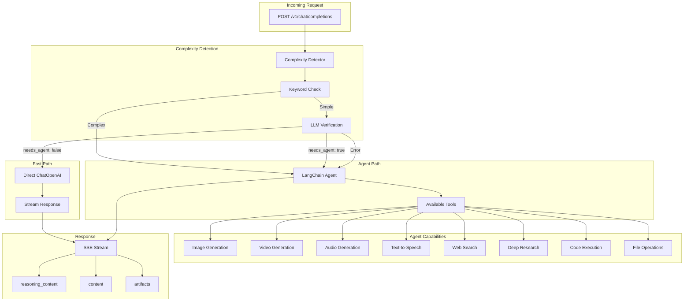

# Spec 79: Baseline LangChain Feature Parity

## Status: COMPLETE
**Priority:** High
**Complexity:** High
**Prerequisites:** Spec 71, Spec 73, Spec 78

---

## Overview

Ensure the baseline-langchain implementation has feature parity with baseline-agent-cli. Currently, the LangChain baseline is simpler and lacks several features from the CLI agent baseline.

---

## Feature Comparison

| Feature | CLI Agent | LangChain | Status |
|---------|-----------|-----------|--------|
| OpenAI-compatible API | Yes | Yes | Equal |
| SSE Streaming | Yes | Yes | Equal |
| Complexity Detection | Yes (keyword + LLM) | No | **Missing** |
| Fast Path (Direct LLM) | Yes | No | **Missing** |
| Agent Execution | Sandy sandbox | In-process | Different (OK) |
| Image Generation | Yes (Chutes) | Yes (Chutes) | Equal |
| TTS Generation | Yes (Chutes) | Yes (Chutes) | Equal |
| Video Generation | Yes (Chutes) | No | **Missing** |
| Audio/Music Generation | Yes (Chutes) | No | **Missing** |
| Web Search | Yes (chutes-search) | Yes (Tavily) | Different |
| Deep Research | Yes (chutes-search) | No | **Missing** |
| Code Execution | Yes (sandbox) | Yes (REPL) | Equal |
| File Operations | Yes (sandbox) | No | **Missing** |
| Artifacts | Yes | No | **Missing** |
| Vision Routing | Yes | Yes | Equal |
| Memory Integration | (Spec 73) | No | **Missing** |
| Generation Flags | (Spec 78) | No | **Missing** |
| reasoning_content | Yes | Yes | Equal |
| Auth Header Passthrough | Yes | No | **Missing** |

---

## Functional Requirements

### FR-1: Complexity Detection

Add dual-path routing: fast path for simple queries, agent for complex ones.

```python
# services/complexity.py (copy from baseline-agent-cli or shared module)

COMPLEX_KEYWORDS = [
    # Same keywords as CLI agent
    "generate image", "create image", "draw",
    "generate video", "create video",
    "generate audio", "create audio", "text to speech",
    "research", "analyze", "investigate",
    "code", "write program", "debug",
    # Browser automation
    "test in browser", "browser automation", "playwright",
    # etc.
]

class ComplexityDetector:
    async def analyze_async(self, messages: list[Message], flags: GenerationFlags | None = None) -> ComplexityAnalysis:
        # Check generation flags first
        # Then keyword check
        # Then LLM verification
        pass
```

### FR-2: Fast Path Implementation

Add direct LLM call for simple queries.

```python
# main.py

async def stream_response(request: ChatCompletionRequest):
    # Complexity analysis
    analysis = await complexity_detector.analyze_async(
        request.messages,
        request.generation_flags,
    )

    if analysis.is_complex:
        # Agent path (existing behavior)
        async for chunk in stream_agent_response(...):
            yield chunk
    else:
        # Fast path (NEW)
        async for chunk in stream_direct_llm(...):
            yield chunk

async def stream_direct_llm(request: ChatCompletionRequest):
    """Direct LLM call for simple queries."""
    llm = ChatOpenAI(
        model=settings.model,
        api_key=settings.openai_api_key,
        base_url=settings.openai_base_url,
        streaming=True,
    )
    async for chunk in llm.astream(messages):
        yield format_chunk(chunk)
```

### FR-3: Deep Research Tool

Add deep research using chutes-search.

```python
# tools/deep_research.py

class DeepResearchTool(BaseTool):
    name: str = "deep_research"
    description: str = (
        "Perform comprehensive research on a topic with citations. "
        "Returns detailed findings with source links. "
        "Use for complex research questions requiring multiple sources."
    )

    async def _arun(self, query: str, mode: str = "max") -> str:
        """Run deep research via chutes-search."""
        async with httpx.AsyncClient() as client:
            response = await client.post(
                f"{settings.chutes_search_url}/api/chat",
                json={
                    "messages": [{"role": "user", "content": query}],
                    "mode": mode,  # "light" or "max"
                },
                timeout=120.0,
            )
            # Extract and format citations
            return format_research_response(response.json())
```

### FR-4: Video Generation Tool

Add video generation using Chutes API.

```python
# tools/video.py

class VideoGenerationTool(BaseTool):
    name: str = "video_generation"
    description: str = (
        "Generate a video from a text prompt using AI. "
        "Returns the URL to the generated video file."
    )

    async def _arun(self, prompt: str) -> str:
        """Generate video via Chutes API."""
        async with httpx.AsyncClient() as client:
            response = await client.post(
                f"{settings.chutes_api_base}/video/generate",
                json={"prompt": prompt},
                headers={"Authorization": f"Bearer {settings.chutes_api_key}"},
                timeout=300.0,  # Videos take time
            )
            data = response.json()
            return f"Video generated: {data['url']}"
```

### FR-5: Audio/Music Generation Tool

Add audio generation using Chutes API.

```python
# tools/audio.py

class AudioGenerationTool(BaseTool):
    name: str = "audio_generation"
    description: str = (
        "Generate audio or music from a text description. "
        "Can create music, sound effects, or spoken audio."
    )

    async def _arun(self, prompt: str, type: str = "music") -> str:
        """Generate audio via Chutes API."""
        # Implementation depends on Chutes audio API
        pass
```

### FR-6: File Operations Tool

Add file operations for artifacts.

```python
# tools/files.py

class FileWriteTool(BaseTool):
    name: str = "write_file"
    description: str = "Write content to a file. Used to create artifacts."

    artifacts_dir: str

    def _run(self, filename: str, content: str) -> str:
        filepath = Path(self.artifacts_dir) / filename
        filepath.write_text(content)
        return f"File written: {filename}"

class FileReadTool(BaseTool):
    name: str = "read_file"
    description: str = "Read content from a file."

    artifacts_dir: str

    def _run(self, filename: str) -> str:
        filepath = Path(self.artifacts_dir) / filename
        if not filepath.exists():
            return f"File not found: {filename}"
        return filepath.read_text()
```

### FR-7: Artifacts Support

Add artifact generation and streaming.

```python
# services/artifacts.py

class ArtifactManager:
    def __init__(self, artifacts_dir: str):
        self.artifacts_dir = Path(artifacts_dir)
        self.artifacts_dir.mkdir(parents=True, exist_ok=True)

    def create_artifact(
        self,
        filename: str,
        content: bytes | str,
        mime_type: str,
    ) -> Artifact:
        filepath = self.artifacts_dir / filename
        if isinstance(content, str):
            filepath.write_text(content)
        else:
            filepath.write_bytes(content)

        return Artifact(
            type="file",
            data=ArtifactData(
                name=filename,
                url=f"/artifacts/{filename}",
                mime_type=mime_type,
            ),
        )
```

### FR-8: Memory Integration

Add memory support (as specified in Spec 73).

```python
# Already specified in Spec 73
# Add user_id, enable_memory to ChatCompletionRequest
# Fetch/inject memories
# Extract memories after response
```

### FR-9: Generation Flags

Add generation flag support (as specified in Spec 78).

```python
# Already specified in Spec 78
# Add generation_flags to ChatCompletionRequest
# Modify complexity detector
# Prepend instructions to prompt
```

### FR-10: Auth Header Passthrough

Support authorization header for user's Chutes token.

```python
@app.post("/v1/chat/completions")
async def chat_completions(
    request: ChatCompletionRequest,
    authorization: str | None = Header(default=None, alias="Authorization"),
):
    auth_token = extract_bearer_token(authorization)
    if auth_token:
        request._auth_token = auth_token
        # Pass to tools that need it
```

### FR-11: Update Mermaid Diagram

Add architecture diagram similar to CLI agent.



---

## Files to Create

| File | Purpose |
|------|---------|
| `baseline-langchain/janus_baseline_langchain/services/complexity.py` | Complexity detector |
| `baseline-langchain/janus_baseline_langchain/services/memory.py` | Memory service client |
| `baseline-langchain/janus_baseline_langchain/services/artifacts.py` | Artifact management |
| `baseline-langchain/janus_baseline_langchain/tools/deep_research.py` | Deep research tool |
| `baseline-langchain/janus_baseline_langchain/tools/video.py` | Video generation tool |
| `baseline-langchain/janus_baseline_langchain/tools/audio.py` | Audio generation tool |
| `baseline-langchain/janus_baseline_langchain/tools/files.py` | File operation tools |

## Files to Modify

| File | Changes |
|------|---------|
| `baseline-langchain/janus_baseline_langchain/main.py` | Add fast path, complexity detection |
| `baseline-langchain/janus_baseline_langchain/config.py` | Add new settings |
| `baseline-langchain/janus_baseline_langchain/models.py` | Add GenerationFlags, memory fields |
| `baseline-langchain/janus_baseline_langchain/agent.py` | Register new tools |
| `baseline-langchain/README.md` | Update with new architecture diagram |

---

## Acceptance Criteria

- [ ] Complexity detection routes simple vs complex queries
- [ ] Fast path works for simple queries
- [ ] Deep research tool returns citations
- [ ] Video generation tool works
- [ ] Audio generation tool works
- [ ] File operations create artifacts
- [ ] Artifacts are returned in SSE stream
- [ ] Memory integration works
- [ ] Generation flags are respected
- [ ] Auth header is passed to tools
- [ ] README has updated Mermaid diagram

---

## Testing Checklist

- [ ] Simple query uses fast path
- [ ] Complex query uses agent path
- [ ] "Generate image" flag routes to agent
- [ ] Deep research returns formatted citations
- [ ] Video generation creates video artifact
- [ ] Audio generation creates audio artifact
- [ ] File write creates artifact
- [ ] Memory context is injected
- [ ] User auth token is used when provided

---

## Notes

- LangChain runs in-process, not in sandbox (this is intentional difference)
- Some tools may need rate limiting
- Consider sharing complexity.py between both baselines
- Web search can remain Tavily or switch to chutes-search
- Artifacts need to be served via endpoint or base64 encoded

NR_OF_TRIES: 1
