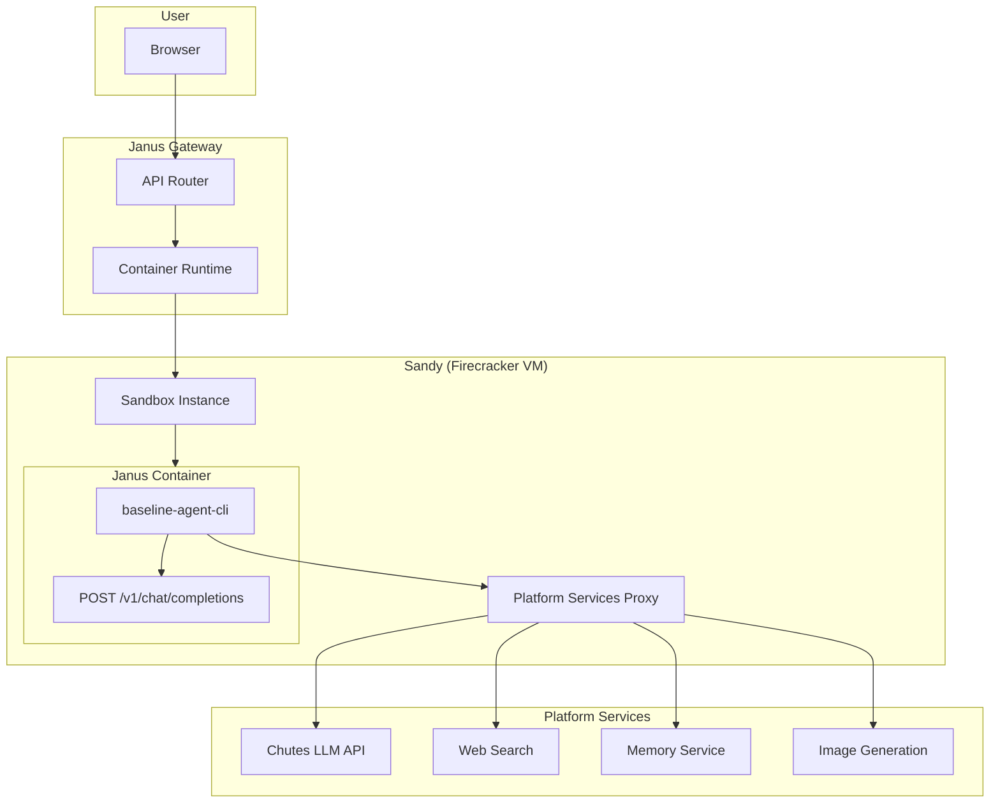

# Spec 95: Self-Contained Docker Baseline Architecture (Future - TEE Deployment)

## Status: COMPLETE (DEFERRED)
**Priority:** Low (Future)
**Complexity:** Very High
**Prerequisites:** Spec 92, Spec 93, Spec 94 (must be complete first)

---

## ⚠️ DEFERRED FOR FUTURE TEE DEPLOYMENT

**This spec is NOT required for the PoC.** The current architecture (baseline services calling Sandy's agent/run API) is simpler, already working, and sufficient for the PoC phase.

This spec should only be implemented when:
1. Chutes CPU TEE Nodes are ready for deployment
2. Miner submission format needs to be standardized
3. Complete isolation of baseline code is required

**For PoC, use the current architecture:**
```
Gateway (Render) → baseline-agent-cli (Render) → Sandy agent/run API → Agent (Claude Code)
```

---

## Overview (Future Reference)

This spec describes how to make baseline implementations comply with the full Janus architecture as defined in `docs/janus-architecture-sketch.png` for eventual TEE deployment:

**Target Architecture:**
- Janus models (baselines, miner submissions) are **self-contained Docker containers**
- These containers expose an **OpenAI Chat Completions compatible endpoint**
- Containers run inside **Chutes CPU TEE Nodes** (Sandy/Firecracker for PoC)
- The **Gateway** routes requests to containers running inside Sandy sandboxes
- Containers access **platform services** (web search, memory, vector DB, other Chutes APIs) via reverse proxy

**Current Architecture (NOT Compliant):**
- Baselines are deployed as **standalone Render services**
- Gateway routes to them via **external HTTP** (Render URLs)
- Baselines call Sandy to run agents, but baselines themselves are NOT inside Sandy
- No TEE-like isolation for the baseline code itself

---

## Architecture Comparison

### Current (Non-Compliant)

```
USER → UI → Gateway (Render) → baseline-agent-cli (Render) → Sandy → Agent
                             → baseline-langchain (Render)
```

Problems:
- Baseline code runs on Render, not in isolated environment
- Not portable to CPU TEE Nodes
- External network calls between components
- No consistent containerization

### Target (Compliant)

```
USER → UI → Gateway → Sandy Sandbox → [Baseline Docker Container] → Platform Services
                                       ↓
                                    OpenAI API endpoint
```

Benefits:
- Baseline is self-contained Docker image
- Runs inside Sandy (Firecracker VM) for isolation
- Same deployment model as miner submissions
- Portable to CPU TEE Nodes when ready
- Consistent interface for benchmarking

---

## Functional Requirements

### FR-1: Docker Image Structure

Each baseline must be packaged as a Docker image with this structure:

```dockerfile
# baseline-agent-cli/Dockerfile
FROM python:3.11-slim

# Install system dependencies for CLI agents
RUN apt-get update && apt-get install -y \
    git curl nodejs npm \
    && rm -rf /var/lib/apt/lists/*

# Install the baseline
WORKDIR /app
COPY . .
RUN pip install -e .

# Expose OpenAI-compatible endpoint
EXPOSE 8080

# Health check
HEALTHCHECK --interval=30s --timeout=10s --start-period=5s --retries=3 \
    CMD curl -f http://localhost:8080/health || exit 1

# Start the service
CMD ["uvicorn", "janus_baseline_agent_cli.main:app", "--host", "0.0.0.0", "--port", "8080"]
```

### FR-2: Standardized Entry Point

All Janus containers must expose:

```yaml
# Container specification
endpoints:
  chat_completions: POST /v1/chat/completions
  health: GET /health
  models: GET /v1/models  # Optional

port: 8080

environment_variables:
  # Platform services (injected by Sandy)
  JANUS_PLATFORM_URL: "http://platform-proxy:8000"
  JANUS_LLM_API_KEY: "${injected}"
  JANUS_MEMORY_URL: "${injected}"
  JANUS_SEARCH_URL: "${injected}"

  # Container config
  JANUS_LOG_LEVEL: "INFO"
  JANUS_TIMEOUT: "300"
```

### FR-3: Sandy Container Runtime

Sandy must support running Janus containers:

```python
# sandy/sandy/api/routes.py

@router.post("/api/sandboxes/{sandbox_id}/container/run")
async def run_janus_container(
    sandbox_id: str,
    request: ContainerRunRequest,
):
    """
    Run a Janus-compatible container inside the sandbox.

    The container must expose POST /v1/chat/completions on port 8080.
    Sandy proxies requests to this endpoint.
    """
    container = await sandbox.run_container(
        image=request.image,  # e.g., "ghcr.io/fstandhartinger/janus-baseline-cli:latest"
        port=8080,
        env={
            "JANUS_PLATFORM_URL": f"http://host.docker.internal:{platform_proxy_port}",
            "JANUS_LLM_API_KEY": request.llm_api_key,
            "JANUS_MEMORY_URL": request.memory_url,
            "JANUS_SEARCH_URL": request.search_url,
        },
        timeout=request.timeout,
    )

    return ContainerRunResponse(
        container_id=container.id,
        endpoint=f"http://localhost:{container.exposed_port}/v1/chat/completions",
    )

@router.post("/api/sandboxes/{sandbox_id}/container/{container_id}/chat")
async def proxy_chat_request(
    sandbox_id: str,
    container_id: str,
    request: ChatCompletionRequest,
):
    """Proxy chat completions request to the container."""
    container = await sandbox.get_container(container_id)

    # Forward request to container's OpenAI endpoint
    async with httpx.AsyncClient() as client:
        response = await client.post(
            f"http://localhost:{container.port}/v1/chat/completions",
            json=request.model_dump(),
            timeout=300.0,
        )

    return StreamingResponse(
        response.aiter_bytes(),
        media_type="text/event-stream",
    )
```

### FR-4: Gateway Integration

Gateway routes to containers inside Sandy:

```python
# gateway/janus_gateway/services/container_runtime.py

class ContainerRuntime:
    """Manages Janus containers running in Sandy sandboxes."""

    async def get_or_create_container(
        self,
        model: str,  # e.g., "baseline-agent-cli"
    ) -> ContainerInstance:
        """Get existing container or create new one."""

        # Map model name to container image
        image = self._get_image_for_model(model)

        # Check for warm container
        container = await self._get_warm_container(model)
        if container:
            return container

        # Create new Sandy sandbox
        sandbox = await self.sandy.create_sandbox(
            image="janus-runtime",  # Base image with container runtime
            timeout=3600,
        )

        # Run the Janus container inside the sandbox
        container = await self.sandy.run_container(
            sandbox_id=sandbox.id,
            image=image,
            env=self._get_platform_env(),
        )

        return ContainerInstance(
            sandbox_id=sandbox.id,
            container_id=container.id,
            endpoint=container.endpoint,
        )

    def _get_image_for_model(self, model: str) -> str:
        """Map model name to Docker image."""
        images = {
            "baseline-agent-cli": "ghcr.io/fstandhartinger/janus-baseline-cli:latest",
            "baseline-langchain": "ghcr.io/fstandhartinger/janus-baseline-langchain:latest",
            # Miner submissions would be added dynamically
        }
        return images.get(model, model)  # Assume model is image name if not found
```

### FR-5: Platform Services Proxy

Inside Sandy, provide a proxy for platform services:

```python
# Platform services available to containers
PLATFORM_SERVICES = {
    # LLM API (Chutes)
    "/v1/chat/completions": "https://llm.chutes.ai/v1/chat/completions",
    "/v1/embeddings": "https://llm.chutes.ai/v1/embeddings",

    # Web Search
    "/search": "https://chutes-search.onrender.com/api/search",
    "/research": "https://chutes-search.onrender.com/api/chat",

    # Memory Service
    "/memory/query": "https://janus-gateway.onrender.com/api/memory/query",
    "/memory/store": "https://janus-gateway.onrender.com/api/memory/store",

    # Image Generation
    "/images/generate": "https://api.chutes.ai/v1/images/generate",

    # TTS
    "/audio/speech": "https://api.chutes.ai/v1/audio/speech",

    # Code Execution (nested sandbox)
    "/sandbox/exec": "internal://sandbox/exec",
}
```

### FR-6: Container Lifecycle

```python
# Container lifecycle management

class ContainerLifecycle:
    """Manage container lifecycle for benchmarking and production."""

    async def warm_pool(self, model: str, count: int = 2):
        """Pre-warm containers for faster response."""
        pass

    async def health_check(self, container: ContainerInstance) -> bool:
        """Check if container is healthy."""
        try:
            async with httpx.AsyncClient() as client:
                response = await client.get(
                    f"{container.endpoint.replace('/v1/chat/completions', '/health')}",
                    timeout=5.0,
                )
                return response.status_code == 200
        except:
            return False

    async def terminate(self, container: ContainerInstance):
        """Terminate container and cleanup."""
        await self.sandy.terminate_sandbox(container.sandbox_id)
```

### FR-7: Build and Registry

```yaml
# .github/workflows/build-baselines.yml

name: Build Baseline Docker Images

on:
  push:
    branches: [main]
    paths:
      - 'baseline-agent-cli/**'
      - 'baseline-langchain/**'

jobs:
  build-cli:
    runs-on: ubuntu-latest
    steps:
      - uses: actions/checkout@v4

      - name: Build and push baseline-agent-cli
        uses: docker/build-push-action@v5
        with:
          context: ./baseline-agent-cli
          push: true
          tags: |
            ghcr.io/fstandhartinger/janus-baseline-cli:latest
            ghcr.io/fstandhartinger/janus-baseline-cli:${{ github.sha }}

  build-langchain:
    runs-on: ubuntu-latest
    steps:
      - uses: actions/checkout@v4

      - name: Build and push baseline-langchain
        uses: docker/build-push-action@v5
        with:
          context: ./baseline-langchain
          push: true
          tags: |
            ghcr.io/fstandhartinger/janus-baseline-langchain:latest
            ghcr.io/fstandhartinger/janus-baseline-langchain:${{ github.sha }}
```

---

## Migration Path

### Phase 1: Containerization (Current State → Docker Images)

1. Add Dockerfiles to both baselines
2. Test containers locally with `docker run`
3. Verify OpenAI endpoint works from inside container
4. Push to GitHub Container Registry

### Phase 2: Sandy Container Support

1. Add container runtime support to Sandy
2. Implement `/api/sandboxes/{id}/container/run` endpoint
3. Implement platform services proxy
4. Test running baseline containers inside Sandy locally

### Phase 3: Gateway Integration

1. Update Gateway to use ContainerRuntime
2. Route requests through Sandy → Container
3. Implement container warm pool
4. Test end-to-end flow

### Phase 4: Deprecate Direct Deployment

1. Remove Render deployments of baselines
2. All baseline traffic goes through Sandy containers
3. Update documentation and benchmarking

---

## Testing Requirements

### Container Tests

```python
# tests/container/test_baseline_container.py

class TestBaselineContainer:
    """Test baseline running as Docker container."""

    @pytest.fixture
    async def container(self):
        """Start baseline container for testing."""
        proc = await asyncio.create_subprocess_exec(
            "docker", "run", "-d", "-p", "8080:8080",
            "-e", "JANUS_PLATFORM_URL=http://host.docker.internal:9000",
            "janus-baseline-cli:latest",
        )
        container_id = (await proc.stdout.read()).decode().strip()

        # Wait for health
        await self._wait_for_health("http://localhost:8080/health")

        yield ContainerHandle(id=container_id, port=8080)

        # Cleanup
        await asyncio.create_subprocess_exec("docker", "stop", container_id)

    async def test_chat_completions_endpoint(self, container):
        """Container exposes working chat completions endpoint."""
        async with httpx.AsyncClient() as client:
            response = await client.post(
                f"http://localhost:{container.port}/v1/chat/completions",
                json={
                    "model": "test",
                    "messages": [{"role": "user", "content": "Say hello"}],
                },
            )
            assert response.status_code == 200
            data = response.json()
            assert "choices" in data

    async def test_streaming(self, container):
        """Container supports SSE streaming."""
        async with httpx.AsyncClient() as client:
            async with client.stream(
                "POST",
                f"http://localhost:{container.port}/v1/chat/completions",
                json={
                    "model": "test",
                    "messages": [{"role": "user", "content": "Count to 3"}],
                    "stream": True,
                },
            ) as response:
                events = []
                async for line in response.aiter_lines():
                    if line.startswith("data: "):
                        events.append(line)

                assert len(events) > 1
                assert events[-1] == "data: [DONE]"

    async def test_health_endpoint(self, container):
        """Container has working health endpoint."""
        async with httpx.AsyncClient() as client:
            response = await client.get(
                f"http://localhost:{container.port}/health"
            )
            assert response.status_code == 200

    async def test_platform_services_access(self, container):
        """Container can access platform services."""
        # This requires a mock platform proxy
        pass
```

### Sandy Integration Tests

```python
# tests/integration/test_sandy_containers.py

class TestSandyContainers:
    """Test containers running inside Sandy sandboxes."""

    async def test_run_baseline_in_sandy(self):
        """Can run baseline container inside Sandy."""
        async with httpx.AsyncClient() as client:
            # Create sandbox
            sandbox = await client.post(
                f"{SANDY_URL}/api/sandboxes",
                json={"image": "janus-runtime"},
            )
            sandbox_id = sandbox.json()["id"]

            # Run baseline container
            container = await client.post(
                f"{SANDY_URL}/api/sandboxes/{sandbox_id}/container/run",
                json={
                    "image": "janus-baseline-cli:latest",
                    "env": {"JANUS_PLATFORM_URL": "http://platform:8000"},
                },
            )

            # Test chat completions through Sandy proxy
            response = await client.post(
                f"{SANDY_URL}/api/sandboxes/{sandbox_id}/container/{container.json()['id']}/chat",
                json={
                    "model": "test",
                    "messages": [{"role": "user", "content": "Hello"}],
                },
            )

            assert response.status_code == 200
```

---

## Acceptance Criteria

### Containerization
- [ ] baseline-agent-cli has working Dockerfile
- [ ] baseline-langchain has working Dockerfile
- [ ] Containers expose /v1/chat/completions on port 8080
- [ ] Containers expose /health endpoint
- [ ] Containers build and run locally
- [ ] Images pushed to GitHub Container Registry

### Sandy Integration
- [ ] Sandy supports running Janus containers
- [ ] Sandy proxies requests to containers
- [ ] Platform services proxy works
- [ ] Container lifecycle (create, health, terminate) works

### Gateway Integration
- [ ] Gateway routes to containers via Sandy
- [ ] Streaming works through the proxy chain
- [ ] Container warm pool reduces latency
- [ ] Fallback to direct deployment during migration

### E2E Verification
- [ ] Complex tasks work (git clone, web search, etc.)
- [ ] Multiple models work
- [ ] SSE streaming preserved through all layers
- [ ] Logging visible at all layers

---

## Files to Create

| File | Purpose |
|------|---------|
| `baseline-agent-cli/Dockerfile` | Container image definition |
| `baseline-langchain/Dockerfile` | Container image definition |
| `baseline-agent-cli/docker-compose.yml` | Local testing |
| `baseline-langchain/docker-compose.yml` | Local testing |
| `sandy/sandy/api/container_routes.py` | Container runtime API |
| `sandy/sandy/services/container_runtime.py` | Container management |
| `gateway/janus_gateway/services/container_runtime.py` | Gateway container routing |
| `.github/workflows/build-baselines.yml` | CI/CD for images |

## Files to Modify

| File | Changes |
|------|---------|
| `sandy/sandy/api/routes.py` | Mount container routes |
| `gateway/janus_gateway/routers/chat.py` | Use container runtime |
| `gateway/janus_gateway/config.py` | Container runtime settings |

---

## Architecture Diagram



---

## Notes

- **DEFERRED** - This spec is for future TEE deployment, not PoC
- The current architecture (baseline on Render → Sandy agent/run API) is simpler and working
- Only implement this when CPU TEE Nodes are ready
- Container startup time is critical - consider pre-warming
- Platform services must be accessible from inside container
- Security: containers should have limited network access (only platform proxy)

---

## Why This Is Deferred

The current PoC architecture has these advantages:
1. **Simpler** - No nested container layers
2. **Working** - Sandy's agent/run API already handles agents correctly
3. **Debuggable** - Each component is separate and loggable
4. **Fast iteration** - Changes deploy instantly to Render

The Docker architecture adds value only when:
1. CPU TEE Nodes need standardized container format
2. Miners need to submit arbitrary containers
3. Complete code isolation is required (beyond Sandy's VM isolation)

---

## Related Specs

- Spec 55: Baseline Containerization (original containerization spec - also consider deferring)
- Spec 92: Baseline Agent CLI E2E Verification (focus on this first)
- Spec 93: Comprehensive Logging & Observability (focus on this first)
- Spec 94: Baseline LangChain E2E Verification (focus on this first)

NR_OF_TRIES: 0
