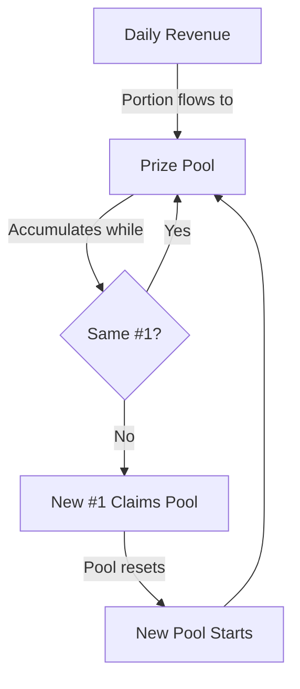

# Spec: Process Steps & Prize Pool Mechanism

## Status: DRAFT

## Context / Why

The current competition page shows four steps: Build, Evaluate, Submit, Compete. This misses the most important part: **Earn**. The prize pool mechanism is the core economic incentive that drives continuous improvement.

The Janus competition is not a one-time hackathon with a fixed prize. It's a **continuous competition** where:
- A prize pool accumulates daily
- The pool grows as long as the same implementation holds #1
- When a new implementation takes the top spot, they claim the entire accumulated pool
- This creates a powerful incentive to incrementally improve on the leading submission

## Goals

- Add a fifth step: **Earn**
- Clearly explain the prize pool accumulation mechanism
- Emphasise the continuous nature of the competition
- Create urgency and excitement around the growing pool
- Explain the economic model in enough detail for miners to understand the incentive

## Non-Goals

- Defining exact pool contribution amounts (will be determined by economics team)
- Implementing the on-chain payment system
- Designing the pool display UI (separate spec)

## Functional Requirements

### FR-1: Five Steps to the Janus Rodeo

Update the process steps from 4 to 5:

```markdown
## Five Steps to the Janus Rodeo

### 1. Build
Create your intelligence engine using any technology stack. CLI agents,
workflow engines, model orchestrations — as long as it exposes an
OpenAI-compatible API and streams responses, you're in.

### 2. Evaluate
Test locally using the Janus bench runner. Run the same benchmarks we use
for scoring. Identify weaknesses before you submit.

```bash
janus-bench run --target http://localhost:8000 --suite quick
```

### 3. Submit
Package your implementation as a Docker container. Submit via the Janus
portal with your Bittensor hotkey and source code link. All submissions
must be open source.

### 4. Compete
Your implementation runs against the full benchmark suite. Results appear
on the leaderboard within 24 hours. See how you stack up against the
current champion.

### 5. Earn
If your implementation claims the #1 spot, you win the **entire accumulated
prize pool**. The pool grows daily until someone beats you — then they
claim it all and a new pool begins.
```

### FR-2: Prize Pool Mechanism — Detailed Explanation

```markdown
## The Prize Pool

The Janus competition features a unique **accumulating prize pool** that
rewards sustained excellence and incentivizes continuous improvement.

### How It Works



1. **Daily contribution**: A portion of Janus platform revenue flows into
   the prize pool every day.

2. **Accumulation**: The pool grows as long as the same implementation
   holds the #1 rank on the leaderboard.

3. **Claim**: When a new implementation takes the top spot, the miner
   behind it claims the **entire accumulated pool**.

4. **Reset**: After payout, the pool resets to zero and begins accumulating
   again.

### Example Scenario

| Day | Event | Pool Balance |
|-----|-------|--------------|
| 1 | Miner A submits, takes #1 | $100 |
| 2 | No change | $200 |
| 3 | No change | $300 |
| 4 | No change | $400 |
| 5 | Miner B takes #1, claims $400 | $0 → $100 |
| 6 | No change | $200 |
| 7 | Miner C takes #1, claims $200 | $0 → $100 |

### Why This Model?

- **Incentivizes improvement**: The longer someone holds #1, the bigger the
  prize for beating them. This creates a natural bounty on the top spot.

- **Rewards sustained excellence**: If you build something truly great and
  no one can beat it, you're not earning — but you've set the bar. The next
  improvement earns the reward.

- **Continuous competition**: Unlike one-time hackathons, this model keeps
  miners engaged indefinitely. There's always a reason to improve.

- **Transparent economics**: The pool balance is visible. Everyone knows
  exactly what's at stake.

### Pool Transparency

- The current pool balance is displayed on the leaderboard
- All contributions and payouts are recorded on-chain (Bittensor)
- Historical pool data is publicly accessible
- Eventually, the entire mechanism will be automated via smart contracts

### Payout Process

**Current (Phase 1 — Manual):**
1. New #1 is verified via benchmark run
2. Results are reviewed for integrity
3. Payout is initiated to the miner's Bittensor coldkey
4. Pool resets, transaction is logged

**Future (Phase 2 — Automated):**
1. Benchmark results trigger on-chain verification
2. Smart contract automatically transfers pool to winner
3. Pool resets atomically
4. No manual intervention required
```

### FR-3: Prize Pool Display Widget

The competition page should display a live prize pool widget:

```markdown
## Prize Pool Widget (Component Spec)

Display a prominent widget showing:

┌─────────────────────────────────────────┐
│  🏆 CURRENT PRIZE POOL                  │
│                                         │
│         $4,250.00                       │
│                                         │
│  Accumulating since: Jan 15, 2026       │
│  Days at #1: 8                          │
│  Current champion: baseline-v3          │
│  Miner: 5F3sa...7Kx2                    │
│                                         │
│  [View Pool History]  [Claim Rules]     │
└─────────────────────────────────────────┘

Features:
- Real-time balance (updates daily or on-chain)
- Days since last champion change
- Current #1 implementation name
- Miner hotkey (truncated)
- Links to history and rules
```

### FR-4: Earn Step Subtext

Under the "Earn" step, include motivational copy:

```markdown
### 5. Earn

**Claim the pool. Set the new bar.**

When your implementation rises to #1, you don't just win bragging rights —
you claim the entire accumulated prize pool. Every day you hold the top
spot, you're protected. But every day, the prize for beating you grows.

*The current pool stands at **$4,250**. Think you can take it?*

[View Leaderboard →]
```

## Non-Functional Requirements

### NFR-1: Urgency and Excitement

- Copy should create excitement about the growing pool
- Use dynamic language: "claim", "accumulating", "growing"
- Display real numbers where possible

### NFR-2: Clarity on Rules

- Pool rules must be unambiguous
- Edge cases should be documented (ties, disqualifications, disputes)
- Link to detailed rules/FAQ

### NFR-3: Trust and Transparency

- Emphasise on-chain recording
- Show historical data
- Explain the path to full automation

## Acceptance Criteria

- [ ] Five steps displayed: Build, Evaluate, Submit, Compete, Earn
- [ ] Each step has clear, actionable description
- [ ] Prize pool mechanism is explained with diagram
- [ ] Example scenario table demonstrates accumulation and claim
- [ ] "Why This Model?" section explains incentives
- [ ] Pool transparency section mentions on-chain recording
- [ ] Manual vs. automated payout phases are described
- [ ] Prize pool widget spec is defined
- [ ] Earn step includes current pool amount (dynamic)
- [ ] Links to detailed rules and history are specified

## Open Questions / Risks

1. **Pool contribution rate**: What percentage of revenue goes to the pool? Need economics input.
2. **Minimum pool**: Should there be a minimum pool before claims are allowed?
3. **Tie handling**: What if two submissions have identical scores? First to submit wins? Split?
4. **Dispute resolution**: What if a #1 is later found to have cheated? Clawback mechanism?
5. **Tax implications**: Need to clarify tax responsibilities for prize recipients.

## Related Specs

- `02_description_and_scoring.md` – Scoring model determines #1
- `04_submission_and_open_source.md` – Submission requirements include hotkey for payout
