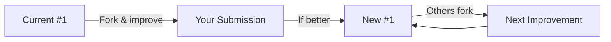

# Spec: Submission Process & Open Source Requirements

## Status: DRAFT

## Context / Why

The current submission documentation is unclear about what exactly is being submitted and why. Participants need to understand that:

1. They are submitting a **Janus implementation** — a Docker container that exposes an OpenAI-compatible API
2. Submissions are typically **incremental improvements** over the current leading implementation
3. All submissions must be **open source** so the community can build upon them
4. Each submission requires a **Bittensor hotkey** for attribution and prize payout

The open source requirement is fundamental to the Janus ethos: intelligence should be a public good, not a proprietary moat. By requiring open source, we ensure that innovations benefit everyone and that the competition drives collective progress.

## Goals

- Clarify exactly what a "submission" is (Docker container + API)
- Establish open source as a mandatory requirement
- Define the submission form fields (including hotkey and repo link)
- Explain the review process (manual now, decentralized later)
- Encourage incremental improvement on existing implementations

## Non-Goals

- Defining the Docker registry or hosting infrastructure
- Implementing the submission portal UI
- Specifying the decentralized judging mechanism (future scope)

## Functional Requirements

### FR-1: What is a Janus Submission?

```markdown
## What You're Submitting

A Janus submission is a **Docker container** that implements an
OpenAI-compatible Chat Completions API. Behind that API, your implementation
can use any technology to generate responses.

**Key points:**

1. **It's not "an agent"** — it's an implementation of intelligence
2. **It's not "a miner"** — the miner is you; the submission is your creation
3. **It's a Docker container** — portable, reproducible, isolated
4. **It exposes a standard API** — POST `/v1/chat/completions`, GET `/health`

### What Happens to Your Submission

1. Your container is pulled and deployed to a **Chutes CPU TEE node**
2. It's connected to platform services (web proxy, search, sandbox, inference)
3. Benchmarks are run against it via the same API users would call
4. Results are published to the leaderboard
```

### FR-2: Incremental Improvement Model

```markdown
## Build on What Exists

The Janus competition encourages **incremental improvement**. You don't have
to start from scratch — in fact, we encourage you to start from the current
leading implementation and make it better.

**The improvement cycle:**



### Why Incremental?

- **Lower barrier**: You don't need to solve everything, just improve something
- **Faster progress**: Small improvements compound into major advances
- **Community learning**: Each submission teaches something new
- **Reduced risk**: If your change doesn't help, the delta is small

### How to Start

1. **Fork the baseline**: `git clone https://github.com/chutesai/janus-baseline`
2. **Study the leader**: Review the current #1's source code (all submissions are open source)
3. **Identify a weakness**: Use the benchmark breakdown to find areas to improve
4. **Make your improvement**: Better prompts, smarter routing, new capabilities
5. **Test locally**: Run `janus-bench` to verify your improvement
6. **Submit**: Package and submit your enhanced version
```

### FR-3: Open Source Requirement

```markdown
## Open Source Requirement

**All Janus submissions must be open source.**

This is non-negotiable. Here's why:

### Rationale

1. **Community progress**: When implementations are open, everyone learns.
   The next competitor builds on your work, and you build on theirs.

2. **Transparency**: Users should be able to inspect how their requests are
   handled. Open source enables trust.

3. **Security**: Open code can be audited. Closed code cannot be fully trusted
   in a decentralized system.

4. **Bittensor ethos**: The network is built on openness. Janus inherits this
   principle.

### Acceptable Licenses

Your submission must use an OSI-approved open source license:

| License | Allowed | Notes |
|---------|---------|-------|
| MIT | ✅ Yes | Recommended |
| Apache 2.0 | ✅ Yes | Recommended |
| GPL v3 | ✅ Yes | Note: Derivative works must also be GPL |
| BSD 3-Clause | ✅ Yes | |
| AGPL v3 | ✅ Yes | Network use triggers copyleft |
| Proprietary | ❌ No | Not allowed |
| No license | ❌ No | Defaults to proprietary |

### What Must Be Open

- **Source code**: All code that runs inside the container
- **Prompts**: System prompts, few-shot examples, prompt templates
- **Configuration**: Model selection logic, routing rules
- **Dependencies**: List of all dependencies (Dockerfile, requirements.txt)

### What Can Remain Private

- **API keys**: Use environment variables, not hardcoded values
- **Training data**: If you fine-tuned a model, the data can be private
- **Proprietary models**: You can call external APIs (OpenAI, Chutes, etc.)
```

### FR-4: Bittensor Hotkey Requirement

```markdown
## Bittensor Hotkey

Every submission must include the miner's **Bittensor hotkey** (SS58 address).

### Why Hotkey?

1. **Attribution**: Your hotkey identifies you on the Bittensor network
2. **Prize payout**: Pool winnings are sent to the coldkey associated with
   your hotkey
3. **Reputation**: Your competition history is tied to your hotkey
4. **Subnet integration**: Future integration with Subnet 64 will use hotkeys

### Hotkey Format

- SS58 address format (starts with `5`)
- Example: `5FHneW46xGXgs5mUiveU4sbTyGBzmstUspZC92UhjJM694ty`

### Validation

- Hotkey format is validated on submission
- Hotkey must be registered on Bittensor (mainnet or testnet depending on phase)
- One hotkey can have multiple submissions (latest active submission counts)
```

### FR-5: Submission Form Fields

```markdown
## Submission Form

| Field | Required | Description |
|-------|----------|-------------|
| **Implementation Name** | Yes | Unique identifier (e.g., "turbo-reasoner-v2") |
| **Docker Image** | Yes | Full image reference (e.g., `ghcr.io/user/janus-impl:v2`) |
| **Bittensor Hotkey** | Yes | SS58 address for attribution and payout |
| **Source Code URL** | Yes | Link to public repository (GitHub, GitLab, etc.) |
| **License** | Yes | OSI-approved license identifier (e.g., "MIT") |
| **Description** | Yes | Brief description of your approach (100-500 chars) |
| **Changelog** | No | What's different from previous version or baseline |
| **Contact** | No | Discord handle or email for review communication |

### Example Submission

```yaml
name: "turbo-reasoner-v2"
image: "ghcr.io/alice/janus-turbo:2.0.1"
hotkey: "5FHneW46xGXgs5mUiveU4sbTyGBzmstUspZC92UhjJM694ty"
source: "https://github.com/alice/janus-turbo"
license: "MIT"
description: "Enhanced reasoning via chain-of-thought decomposition and parallel tool execution. Improves on baseline-v3 with 15% better GSM8K scores."
changelog: "Added CoT decomposition, parallel tool calls, improved code generation prompts"
contact: "alice#1234"
```
```

### FR-6: Submission Review Process

```markdown
## Review Process

### Current Phase: Manual Review

All submissions undergo manual review before being added to the competition.

**Review checklist:**

- [ ] **Docker image accessible**: Can be pulled from specified registry
- [ ] **API compliance**: Responds correctly to `/v1/chat/completions` and `/health`
- [ ] **Source code available**: Repository is public and matches the image
- [ ] **License valid**: OSI-approved license file present
- [ ] **No malicious code**: Basic security review (no obvious backdoors, data exfil)
- [ ] **No unapproved egress**: Only calls whitelisted services
- [ ] **Hotkey valid**: Registered on Bittensor network
- [ ] **Builds from source**: Dockerfile can reproduce the image

**Timeline:**
- Submission received → Review begins within 24 hours
- Review complete → Benchmarks run within 48 hours
- Results published → Leaderboard updated within 72 hours

### Future Phase: Decentralized Review

The goal is to replace manual review with a **decentralized judging panel**:

1. **Validator set**: Trusted community members stake to become reviewers
2. **Randomized assignment**: Submissions are assigned to random reviewers
3. **Consensus**: Majority approval required to pass
4. **Slashing**: Malicious reviewers lose stake
5. **Appeals**: Rejected submissions can appeal to broader panel

This is Phase 2 scope and will be specified separately.
```

### FR-7: Technical Requirements

```markdown
## Technical Requirements

Your submission must meet these technical requirements:

### API Endpoints

| Endpoint | Method | Required |
|----------|--------|----------|
| `/v1/chat/completions` | POST | Yes |
| `/health` | GET | Yes |
| `/v1/models` | GET | No (recommended) |

### Streaming Requirements

- **Must support streaming**: `stream: true` in request
- **Continuous output**: Tokens should flow continuously, not in batches
- **Reasoning tokens**: Use `reasoning_content` field for thinking/planning
- **Finish reason**: Always include `finish_reason` in final chunk

### Resource Limits

| Resource | Limit |
|----------|-------|
| Memory | 16 GB |
| CPU | 4 cores |
| Disk | 50 GB |
| Network | Whitelisted egress only |
| Timeout | 5 minutes per request |

### Whitelisted Egress

Your container can only reach these services:

- `api.chutes.ai` — Chutes inference API
- `proxy.janus.rodeo` — Web proxy for research
- `search.janus.rodeo` — Search API
- `sandbox.janus.rodeo` — Code execution sandbox
- `vector.janus.rodeo` — Vector database

All other outbound connections are blocked.
```

## Non-Functional Requirements

### NFR-1: Security

- Submissions are sandboxed in TEE environment
- Network egress is strictly controlled
- Code review checks for obvious security issues
- Runtime monitoring for anomalous behavior

### NFR-2: Reproducibility

- Docker image must be reproducible from source
- Dockerfile should use pinned versions
- Build should be deterministic where possible

### NFR-3: Documentation

- README should explain how to run locally
- API behavior should be documented
- Changelog should explain improvements

## Acceptance Criteria

- [ ] "What You're Submitting" section clarifies Docker container + API
- [ ] Incremental improvement model is explained with diagram
- [ ] Open source requirement is clearly stated as mandatory
- [ ] Acceptable licenses are listed
- [ ] Bittensor hotkey requirement is explained
- [ ] Submission form fields are defined with examples
- [ ] Review checklist is documented
- [ ] Manual vs. decentralized review phases are described
- [ ] Technical requirements table (endpoints, resources, egress) is complete
- [ ] Whitelisted egress endpoints are listed

## Open Questions / Risks

1. **License enforcement**: How do we verify that source matches image? Reproducible builds?
2. **Hotkey verification**: How do we prove the submitter controls the hotkey?
3. **Decentralized review timeline**: When can we realistically implement this?
4. **Resource limits**: Are 16GB/4 cores sufficient? May need tiers.
5. **Egress expansion**: How do we add new whitelisted services?

## Related Specs

- `03_steps_and_prize_pool.md` – Hotkey used for prize payout
- `05_architecture_overview.md` – Where containers run
