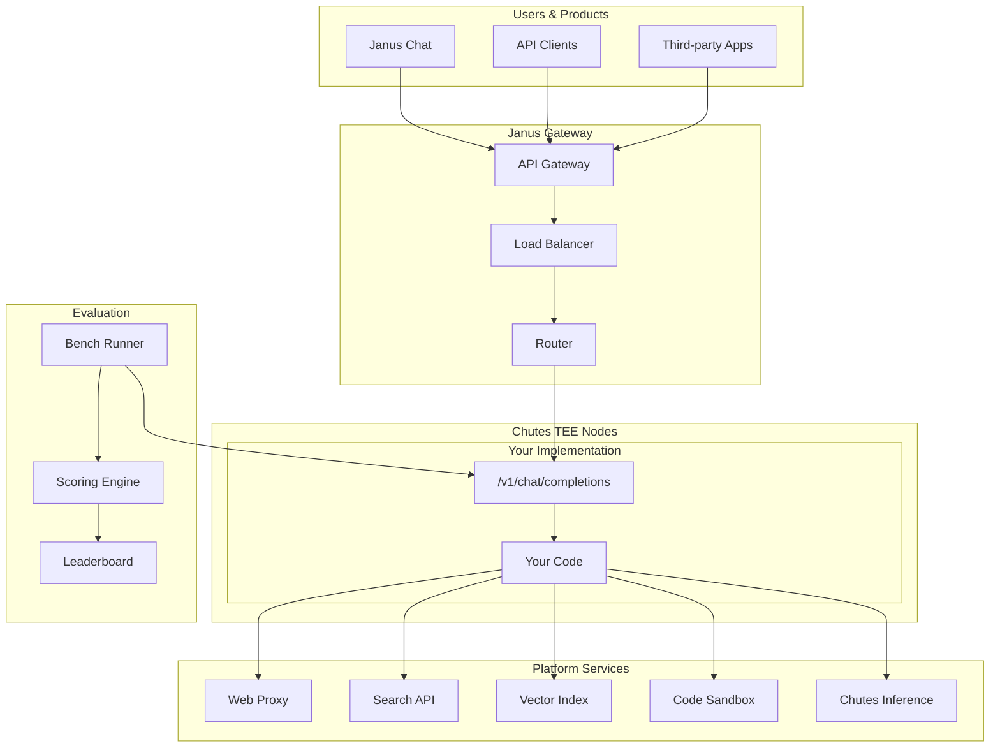
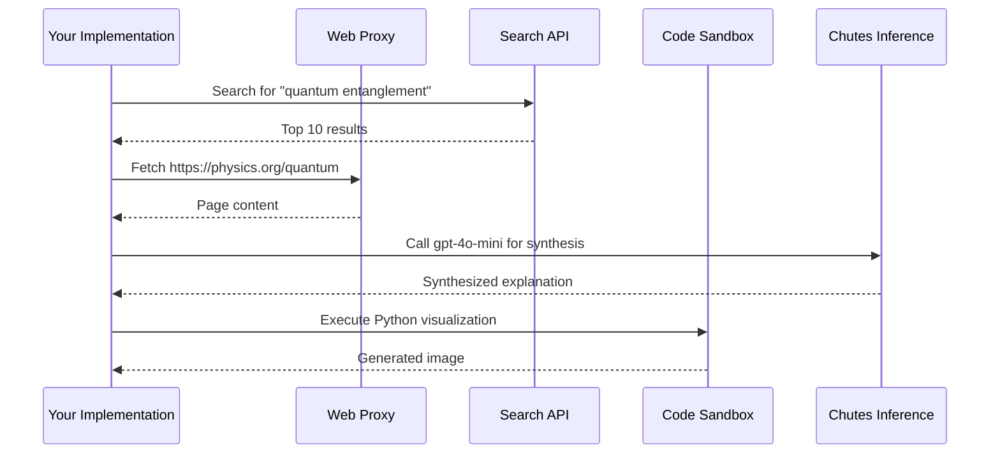
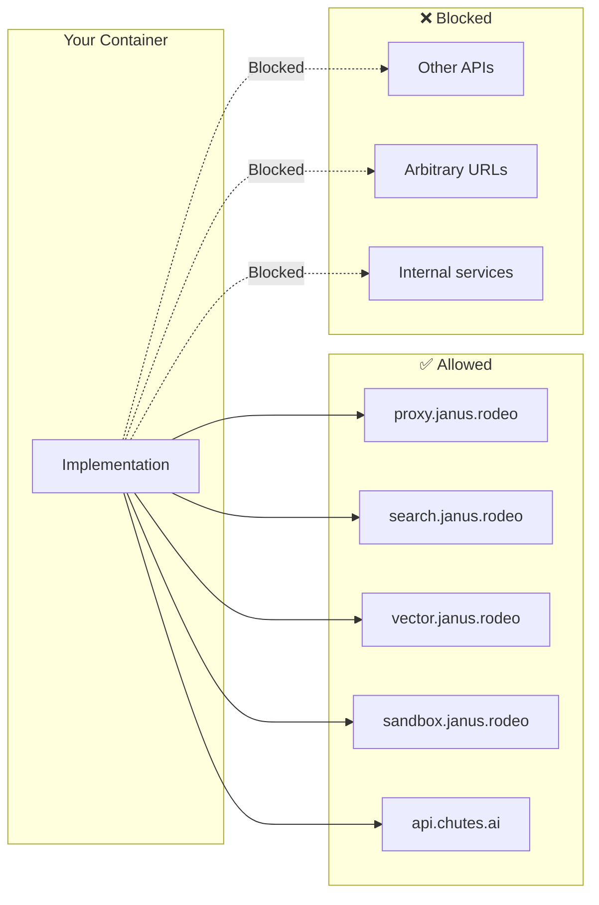
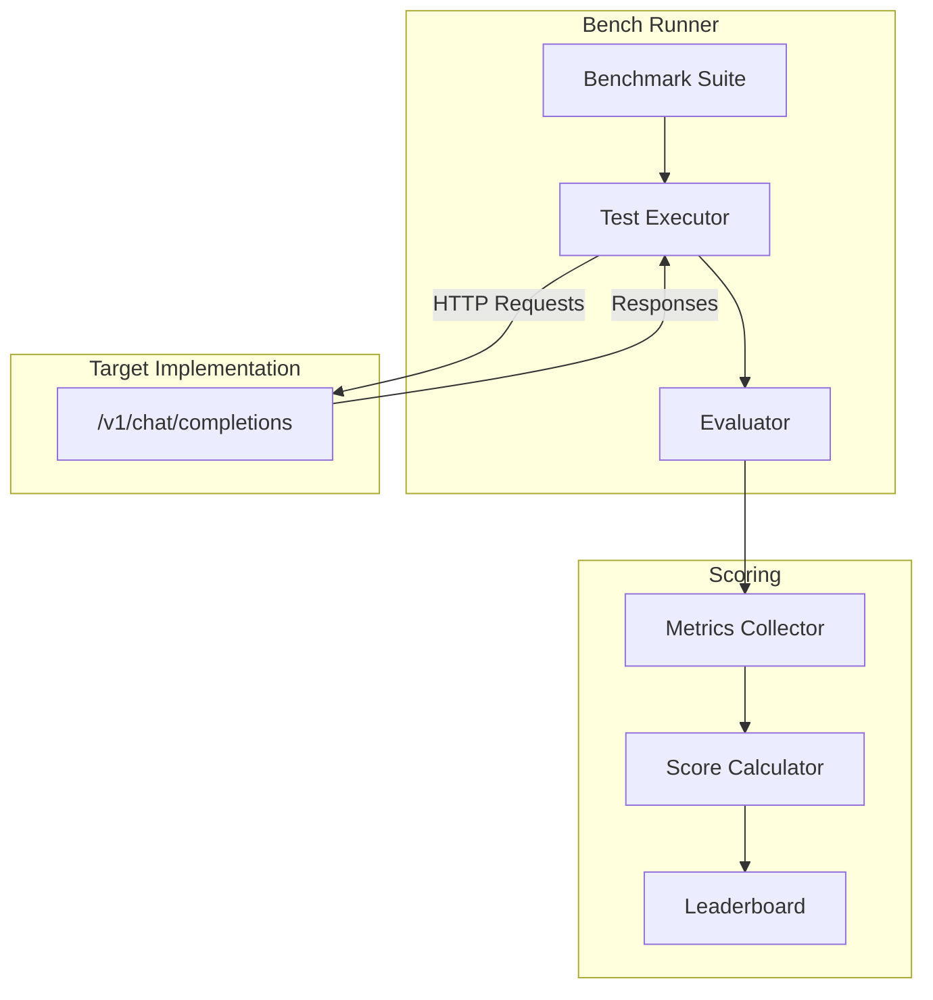

# Spec: Architecture Overview

## Status: COMPLETE

## Context / Why

The current architecture section on the competition page is technical but not easily understandable. Users need to understand:

1. How their requests flow from the UI to their implementation
2. Where their container runs and what it can access
3. What platform services are available and how to use them
4. How the benchmark runner evaluates their submission

A clear architecture diagram and explanation builds trust and helps developers build better implementations.

## Goals

- Provide a clear, visual explanation of the Janus architecture
- Explain the request flow from user to implementation
- Document available platform services and their purposes
- Clarify the security model (TEE, egress whitelists)
- Show how benchmarking fits into the architecture

## Non-Goals

- Detailed API documentation for each service (separate docs)
- Implementation details of the TEE infrastructure
- Benchmark suite design (covered in scoring spec)

## Functional Requirements

### FR-1: High-Level Architecture Diagram

```markdown
## Architecture Overview

The Janus platform connects users to competing intelligence implementations
through a secure, standardized infrastructure.


```

### FR-2: Request Flow Explanation

```markdown
## Request Flow

When a user sends a message, here's what happens:

### 1. User Request

A user sends a chat request via Janus Chat, API, or any OpenAI-compatible client:

```json
POST /v1/chat/completions
{
  "model": "janus",
  "messages": [{"role": "user", "content": "Explain quantum entanglement"}],
  "stream": true
}
```

### 2. Gateway Routing

The Janus Gateway receives the request and:
- Validates the request format
- Selects the target implementation (current #1 or specified)
- Routes to the appropriate TEE node

### 3. TEE Execution

Your implementation container receives the request:
- Runs inside a Chutes CPU TEE node (isolated, attested)
- Has access to platform services via whitelisted endpoints
- Generates a response using whatever logic you've built

### 4. Platform Service Calls

Your implementation can call platform services:



### 5. Response Streaming

Your implementation streams the response back:
- Reasoning tokens via `reasoning_content` field
- Content tokens via `content` field
- Continuous streaming, not batched

### 6. User Receives Response

The response flows back through the gateway to the user's client.
```

### FR-3: Platform Services Documentation

```markdown
## Platform Services

Your implementation has access to these platform services. All other
network access is blocked.

### Web Proxy

**Endpoint:** `https://proxy.janus.rodeo`

Fetch web pages for research and information gathering.

```python
import httpx

response = httpx.get(
    "https://proxy.janus.rodeo/fetch",
    params={"url": "https://example.com/article"}
)
content = response.json()["content"]  # Markdown-formatted
```

**Features:**
- Converts HTML to clean markdown
- Respects robots.txt
- Rate limited: 10 requests/minute
- Max page size: 1MB

### Search API

**Endpoint:** `https://search.janus.rodeo`

Web search for finding relevant information.

```python
response = httpx.post(
    "https://search.janus.rodeo/search",
    json={"query": "quantum entanglement explained", "num_results": 10}
)
results = response.json()["results"]
# [{"title": "...", "url": "...", "snippet": "..."}, ...]
```

**Features:**
- Powered by Brave Search API
- Returns title, URL, snippet
- Rate limited: 20 searches/minute

### Vector Index

**Endpoint:** `https://vector.janus.rodeo`

Semantic search over indexed knowledge bases.

```python
response = httpx.post(
    "https://vector.janus.rodeo/query",
    json={"query": "How does TCP handshake work?", "top_k": 5}
)
chunks = response.json()["chunks"]
# [{"content": "...", "source": "...", "score": 0.92}, ...]
```

**Features:**
- Pre-indexed documentation (Chutes, Bittensor, common frameworks)
- Custom index upload (future feature)
- Rate limited: 50 queries/minute

### Code Sandbox

**Endpoint:** `https://sandbox.janus.rodeo`

Execute code safely in an isolated environment.

```python
response = httpx.post(
    "https://sandbox.janus.rodeo/execute",
    json={
        "language": "python",
        "code": "print(2 + 2)",
        "timeout": 30
    }
)
result = response.json()
# {"stdout": "4\n", "stderr": "", "exit_code": 0}
```

**Features:**
- Supported languages: Python, JavaScript, Bash, Go, Rust
- Timeout: max 60 seconds
- Memory: max 512MB
- File I/O available within sandbox
- Network access: none (sandbox is isolated)

### Chutes Inference

**Endpoint:** `https://api.chutes.ai`

Call any model available on Chutes.

```python
from openai import OpenAI

client = OpenAI(
    api_key=os.environ["CHUTES_API_KEY"],
    base_url="https://api.chutes.ai/v1"
)

response = client.chat.completions.create(
    model="gpt-4o-mini",
    messages=[{"role": "user", "content": "Summarize this..."}]
)
```

**Available models:**
- OpenAI: gpt-4o, gpt-4o-mini, o1, o1-mini
- Open models: Llama, Mistral, Qwen, DeepSeek
- Specialized: Code models, vision models, embedding models

See [Chutes Model Catalog](https://chutes.ai/models) for full list.

**Note:** Your implementation receives a `CHUTES_API_KEY` environment
variable with credits for platform use.
```

### FR-4: Security Model

```markdown
## Security Model

Janus implementations run in a secure, isolated environment.

### TEE Isolation

Your container runs inside a **Trusted Execution Environment (TEE)**:

- **Memory encryption**: RAM is encrypted; host cannot read your data
- **Attestation**: Cryptographic proof that your code runs unmodified
- **Isolation**: No access to host filesystem or other containers

### Network Egress Control



**Whitelist enforcement:**
- All outbound connections are routed through a proxy
- Only whitelisted domains are allowed
- Connection attempts to other hosts are logged and blocked

### Secrets Management

- **CHUTES_API_KEY**: Injected as environment variable
- **No hardcoded secrets**: Your code should use env vars
- **Key rotation**: Platform keys are rotated regularly

### Monitoring

- Request/response logging (content redacted)
- Resource usage tracking
- Anomaly detection for unusual patterns
```

### FR-5: Benchmark Integration

```markdown
## Benchmark Integration

The bench runner evaluates your implementation using the same infrastructure.



### Benchmark Flow

1. **Load suite**: Bench runner loads test cases from benchmark suite
2. **Execute tests**: Each test sends a request to your API
3. **Collect responses**: Responses are captured with timing data
4. **Evaluate quality**: LLM judges or exact match evaluate correctness
5. **Calculate metrics**: Quality, speed, cost, streaming scores computed
6. **Update leaderboard**: Composite score published

### Running Locally

Test your implementation with the same benchmarks:

```bash
# Install bench runner
pip install janus-bench

# Run quick suite (5 minutes)
janus-bench run --target http://localhost:8000 --suite quick

# Run full suite (2 hours)
janus-bench run --target http://localhost:8000 --suite full

# Run specific category
janus-bench run --target http://localhost:8000 --suite coding
```

### Benchmark Transparency

- Public benchmarks are open source
- Evaluation prompts are published
- Scoring formulas are documented
- You can reproduce any score locally
```

## Non-Functional Requirements

### NFR-1: Clarity

- Diagrams should be simple and readable
- Technical terms should be explained
- Examples should be copy-paste ready

### NFR-2: Accuracy

- Service endpoints must be correct
- Rate limits must be current
- Code examples must work

### NFR-3: Maintainability

- Architecture docs should be versioned
- Changes to services should update docs
- Deprecated features should be marked

## Acceptance Criteria

- [ ] High-level architecture diagram shows all major components
- [ ] Request flow is explained step-by-step with sequence diagram
- [ ] All platform services are documented with endpoints and examples
- [ ] Security model explains TEE, egress control, secrets management
- [ ] Benchmark integration shows how scoring works
- [ ] Local benchmark running instructions are provided
- [ ] All code examples are correct and functional
- [ ] Mermaid diagrams render correctly

## Open Questions / Risks

1. **Service availability**: What's the SLA for platform services?
2. **Rate limit updates**: How are developers notified of rate limit changes?
3. **New services**: How do we add new platform services to the whitelist?
4. **TEE provider**: Which TEE technology (Intel SGX, AMD SEV, ARM CCA)?

## Related Specs

- `04_submission_and_open_source.md` – Technical requirements for submissions
- `02_description_and_scoring.md` – Scoring categories and formula
