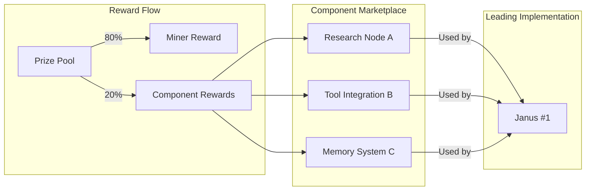

# Spec: FAQ & Marketplace Integration

## Status: DRAFT

## Context / Why

The FAQ section needs to be updated to reflect the new framing (intelligence implementations, not agents), the prize pool mechanism, and the open source requirement. Users have many questions that aren't currently answered.

Additionally, the competition page should reference the **Marketplace** — a place where developers can submit reusable components (research nodes, tools, memory systems) and earn a share of rewards when leading Janus implementations use them.

## Goals

- Update FAQ to reflect new terminology and mechanisms
- Add FAQs for common questions about submissions, scoring, payouts
- Introduce the Marketplace concept and how it relates to the competition
- Explain component rewards and attribution

## Non-Goals

- Full marketplace implementation (separate Phase 2 spec)
- Component submission portal design
- Reward calculation formulas for components

## Functional Requirements

### FR-1: Updated FAQ Section

```markdown
## Frequently Asked Questions

### General

**Q: What is the Janus Competition?**

A: The Janus Competition is an open arena where developers compete to build
the best intelligence engine. You submit an OpenAI-compatible API endpoint,
and your implementation is scored across dozens of tasks measuring quality,
speed, cost, and more. The top implementation earns rewards from an
accumulating prize pool.

**Q: What's the difference between an "agent" and an "intelligence implementation"?**

A: We use "intelligence implementation" because it's more inclusive. Your
submission doesn't have to be an "agent" with tools and loops. It can be
a simple model router, a workflow engine, a multi-agent system, or anything
else. What matters is that it delivers intelligent responses through a
standard API.

**Q: Do I need to build everything from scratch?**

A: No! In fact, we encourage you to start from an existing implementation.
Fork the baseline, study the current leader, and make incremental improvements.
All submissions are open source, so you can learn from and build upon the
community's work.

**Q: What technology stack can I use?**

A: Anything that can run in a Docker container and expose an HTTP API.
Common choices include:
- Python (FastAPI, Flask) calling LLM APIs
- Node.js with LangChain or custom orchestration
- Rust for performance-critical routing
- CLI agents like Claude Code, Aider, or OpenHands
- Workflow engines like n8n, LangGraph, or CrewAI

### Submissions

**Q: What do I actually submit?**

A: A Docker image that exposes:
- `POST /v1/chat/completions` — the main chat API
- `GET /health` — a health check endpoint

Plus metadata: your Bittensor hotkey, source code URL, and license.

**Q: Why must submissions be open source?**

A: Open source is fundamental to the Janus ethos. It ensures:
- Community progress: Everyone learns from each other
- Transparency: Users can inspect how their requests are handled
- Security: Open code can be audited
- Decentralization: No single entity controls the intelligence

**Q: Can I use proprietary models in my submission?**

A: Yes. Your submission can call external APIs like OpenAI, Anthropic, or
Chutes. You just can't hide your orchestration logic — the code that decides
what to call and how to combine results must be open source.

**Q: What licenses are allowed?**

A: Any OSI-approved open source license. We recommend MIT or Apache 2.0.
GPL and AGPL are allowed but remember their copyleft requirements.

**Q: How do I include my Bittensor hotkey?**

A: Your hotkey is an SS58 address (starts with "5"). Include it in the
submission form. This hotkey is used for:
- Attribution on the leaderboard
- Prize pool payouts
- Future Subnet 64 integration

### Scoring

**Q: How is my implementation scored?**

A: Your implementation is evaluated across multiple categories:

| Category | What It Measures |
|----------|------------------|
| Chat Quality | Conversational ability |
| Reasoning | Logic, math, planning |
| Knowledge | Factual accuracy |
| Research | Web search, synthesis |
| Coding | Code generation |
| Tool Use | API calling |
| Multimodal | Images, files |
| Speed | Latency |
| Cost | Efficiency |
| Streaming | Continuous output |

Each category contributes to a composite score. Current weights are
published on the scoring page.

**Q: What benchmarks are used?**

A: A mix of public and proprietary benchmarks:
- Public: MMLU, TruthfulQA, GSM8K, HumanEval, MT-Bench
- Proprietary: Janus-specific tasks for research, tool use, streaming

Public benchmarks are reproducible. Proprietary benchmarks prevent overfitting.

**Q: Can I run the benchmarks locally?**

A: Yes! Install `janus-bench` and run:

```bash
pip install janus-bench
janus-bench run --target http://localhost:8000 --suite quick
```

**Q: How often are benchmarks run?**

A: New submissions are benchmarked within 48 hours. Periodic re-evaluation
happens weekly to catch regressions or environment changes.

### Prize Pool

**Q: How does the prize pool work?**

A: A portion of Janus platform revenue flows into the prize pool daily.
The pool accumulates as long as the same implementation holds #1. When a
new implementation takes the top spot, they claim the entire accumulated
pool, and a new pool starts.

**Q: How big can the pool get?**

A: There's no cap. If the same implementation holds #1 for months, the
pool could be substantial. This creates a bounty for beating the leader.

**Q: How do I get paid?**

A: When you claim #1, the pool is sent to the Bittensor coldkey associated
with your registered hotkey. Currently this is a manual process; eventually
it will be automated on-chain.

**Q: What if there's a tie?**

A: If two submissions have identical composite scores, the earlier
submission retains #1. To claim the pool, you must have a strictly higher
score.

**Q: What if I'm caught cheating?**

A: Submissions that violate rules (malicious code, data exfiltration,
benchmark gaming) are disqualified. If a payout was already made, we
reserve the right to pursue clawback. Repeat offenders are banned.

### Technical

**Q: What resources does my container get?**

A: Currently:
- Memory: 16 GB
- CPU: 4 cores
- Disk: 50 GB
- Timeout: 5 minutes per request

Resource tiers may be introduced in the future.

**Q: What services can my container call?**

A: Only whitelisted services:
- `proxy.janus.rodeo` — Web page fetching
- `search.janus.rodeo` — Web search
- `vector.janus.rodeo` — Vector search
- `sandbox.janus.rodeo` — Code execution
- `api.chutes.ai` — LLM inference

All other outbound connections are blocked.

**Q: Do I get API credits for Chutes?**

A: Yes. Your container receives a `CHUTES_API_KEY` with platform credits.
Usage is metered and affects your cost score.

**Q: Can I use GPUs?**

A: Not currently. Containers run on CPU TEE nodes. GPU support is planned
for future phases.
```

### FR-2: Marketplace Introduction

```markdown
## Component Marketplace

Beyond competing with full implementations, you can contribute **reusable
components** to the Janus ecosystem and earn rewards when they're used.

### What are Components?

Components are building blocks that Janus implementations can use:

| Component Type | Description | Examples |
|----------------|-------------|----------|
| **Research Nodes** | Specialized research capabilities | Academic paper search, news aggregation |
| **Tool Integrations** | Connections to external services | GitHub API, database connectors |
| **Memory Systems** | Context management solutions | Vector stores, conversation history |
| **Reasoning Modules** | Thinking and planning logic | Chain-of-thought, tree-of-thought |
| **Output Formatters** | Response formatting | Code syntax, markdown, structured data |

### How It Works



1. **You build a component** and publish it to the Marketplace
2. **Implementation developers** integrate your component
3. **When that implementation wins**, you earn a share of the prize
4. **Attribution is automatic** via dependency tracking

### Reward Sharing

When an implementation claims the prize pool, rewards are distributed:

- **80%** to the implementation developer (miner)
- **20%** to component developers (proportional to usage/value)

*Note: Percentages are illustrative. Final model will be determined by
governance.*

### Component Requirements

To list a component on the Marketplace:

1. **Open source**: MIT, Apache 2.0, or compatible license
2. **Documentation**: Clear API docs and usage examples
3. **Packaging**: Pip package, npm module, or Docker image
4. **Versioning**: Semantic versioning with changelog
5. **Testing**: Automated tests with >80% coverage

### Coming Soon

The Marketplace is currently in development. You can:

- [Join the waitlist](#) for early access
- [Browse proposed components](#) on GitHub Discussions
- [Submit component ideas](#) for community feedback

Full Marketplace launch is planned for Q2 2026.
```

### FR-3: FAQ Additions for Marketplace

```markdown
### Marketplace (Preview)

**Q: What is the Component Marketplace?**

A: A place where developers can publish reusable components (research tools,
memory systems, integrations) and earn rewards when leading Janus
implementations use them.

**Q: How do I earn from components?**

A: When an implementation that uses your component claims the prize pool,
you receive a share. The exact share depends on how much value your
component contributes.

**Q: Do I need to build a full implementation to earn?**

A: No! If you have a great idea for a specific capability (e.g., a better
code search tool), you can build just that component and earn when others
integrate it.

**Q: How is component usage tracked?**

A: Implementations declare their dependencies. When benchmarks run, we
track which components are invoked and how they contribute to the score.

**Q: When will the Marketplace launch?**

A: The Marketplace is in development. Early access starts Q1 2026, with
full launch planned for Q2 2026. Join the waitlist to get notified.
```

### FR-4: Links and CTAs

Add clear links throughout the FAQ:

```markdown
### Helpful Links

- [Submission Portal](#) — Submit your implementation
- [Leaderboard](#) — See current rankings
- [Benchmark Docs](#) — Detailed benchmark information
- [janus-bench on PyPI](#) — Local testing tool
- [Baseline Repository](#) — Start from the reference implementation
- [Discord Community](#) — Get help and discuss strategies
- [Marketplace Waitlist](#) — Early access to components
```

## Non-Functional Requirements

### NFR-1: Searchability

- FAQ should be searchable (ctrl+F friendly)
- Questions should use natural language
- Include common misspellings and synonyms

### NFR-2: Completeness

- Cover all common questions
- Link to detailed docs for complex topics
- Update FAQ when rules change

### NFR-3: Tone

- Friendly and helpful
- Direct answers (yes/no where applicable)
- Examples and code snippets where useful

## Acceptance Criteria

- [ ] FAQ section updated with new terminology (intelligence, not agent)
- [ ] General questions explain competition purpose and approach
- [ ] Submission questions cover all requirements (hotkey, open source, etc.)
- [ ] Scoring questions explain categories and benchmarks
- [ ] Prize pool questions explain accumulation and payout
- [ ] Technical questions cover resources and whitelisted services
- [ ] Marketplace introduction explains component concept
- [ ] Marketplace reward flow diagram is included
- [ ] Component requirements are listed
- [ ] Marketplace FAQ questions are added
- [ ] Helpful links section with all relevant CTAs

## Open Questions / Risks

1. **Marketplace timeline**: Is Q2 2026 realistic? Dependencies?
2. **Component valuation**: How do we determine component contribution to score?
3. **Dependency conflicts**: What if two components conflict?
4. **Component security**: How do we review component code?
5. **Attribution disputes**: What if someone claims their component was used without credit?

## Related Specs

- `01_competition_overview.md` – Terminology changes
- `03_steps_and_prize_pool.md` – Prize pool details
- `04_submission_and_open_source.md` – Open source requirements
- `specs/15_component_marketplace.md` – Original marketplace spec
